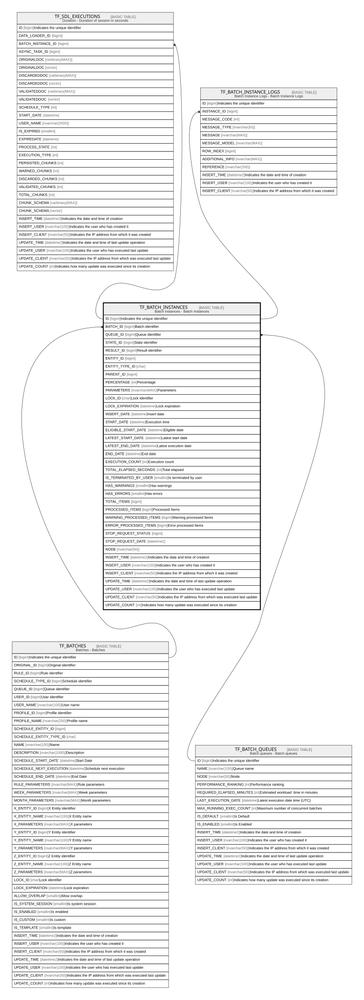

# TF_BATCH_INSTANCES

## Description

Batch instances - Batch Instances  

## Columns

| Name | Type | Default | Nullable | Children | Parents | Comment |
| ---- | ---- | ------- | -------- | -------- | ------- | ------- |
| ID | bigint |  | false | [TF_SDL_EXECUTIONS](TF_SDL_EXECUTIONS.md) [TF_BATCH_INSTANCE_LOGS](TF_BATCH_INSTANCE_LOGS.md) |  | Indicates the unique identifier |
| BATCH_ID | bigint |  | false |  | [TF_BATCHES](TF_BATCHES.md) | Batch identifier |
| QUEUE_ID | bigint |  | true |  | [TF_BATCH_QUEUES](TF_BATCH_QUEUES.md) | Queue identifier |
| STATE_ID | bigint |  | false |  |  | State identifier |
| RESULT_ID | bigint |  | false |  |  | Result identifier |
| ENTITY_ID | bigint |  | true |  |  |  |
| ENTITY_TYPE_ID | char |  | true |  |  |  |
| PARENT_ID | bigint |  | true |  |  |  |
| PERCENTAGE | int |  | false |  |  | Percentage |
| PARAMETERS | nvarchar(MAX) |  | true |  |  | Parameters |
| LOCK_ID | char |  | true |  |  | Lock identifier |
| LOCK_EXPIRATION | datetime |  | true |  |  | Lock expiration |
| INSERT_DATE | datetime |  | false |  |  | Insert date |
| START_DATE | datetime |  | true |  |  | Execution time |
| ELIGIBLE_START_DATE | datetime |  | true |  |  | Eligible date |
| LATEST_START_DATE | datetime |  | true |  |  | Latest start date |
| LATEST_END_DATE | datetime |  | true |  |  | Latest execution date |
| END_DATE | datetime |  | true |  |  | End date |
| EXECUTION_COUNT | int | ((0)) | false |  |  | Execution count |
| TOTAL_ELAPSED_SECONDS | int | ((0)) | false |  |  | Total elapsed |
| IS_TERMINATED_BY_USER | smallint | ((0)) | false |  |  | Is terminated by user |
| HAS_WARNINGS | smallint | ((0)) | false |  |  | Has warnings |
| HAS_ERRORS | smallint | ((0)) | false |  |  | Has errors |
| TOTAL_ITEMS | bigint | ((0)) | true |  |  |  |
| PROCESSED_ITEMS | bigint | ((0)) | true |  |  | Processed Items |
| WARNING_PROCESSED_ITEMS | bigint | ((0)) | true |  |  | Warning processed Items |
| ERROR_PROCESSED_ITEMS | bigint | ((0)) | true |  |  | Error processed Items |
| STOP_REQUEST_STATUS | bigint | ((0)) | true |  |  |  |
| STOP_REQUEST_DATE | datetime2 |  | true |  |  |  |
| NODE | nvarchar(50) |  | true |  |  |  |
| INSERT_TIME | datetime2 | (sysutcdatetime()) | false |  |  | Indicates the date and time of creation |
| INSERT_USER | nvarchar(100) | (N'MAIN') | false |  |  | Indicates the user who has created it |
| INSERT_CLIENT | nvarchar(50) | (N'localhost') | false |  |  | Indicates the IP address from which it was created |
| UPDATE_TIME | datetime2 | (sysutcdatetime()) | false |  |  | Indicates the date and time of last update operation |
| UPDATE_USER | nvarchar(100) | (N'MAIN') | false |  |  | Indicates the user who has executed last update |
| UPDATE_CLIENT | nvarchar(50) | (N'localhost') | false |  |  | Indicates the IP address from which was executed last update |
| UPDATE_COUNT | int | ((0)) | false |  |  | Indicates how many update was executed since its creation |

## Constraints

| Name | Type | Definition |
| ---- | ---- | ---------- |
| PK_BATCH_INSTANCES | PRIMARY KEY | CLUSTERED, unique, part of a PRIMARY KEY constraint, [ ID ] |
| FK_BATCH_INSTANCES_BATCHES | FOREIGN KEY | FOREIGN KEY(BATCH_ID) REFERENCES TF_BATCHES(ID) ON UPDATE NO_ACTION ON DELETE NO_ACTION |
| FK_BATCH_INSTANCES_QUEUES | FOREIGN KEY | FOREIGN KEY(QUEUE_ID) REFERENCES TF_BATCH_QUEUES(ID) ON UPDATE NO_ACTION ON DELETE NO_ACTION |

## Indexes

| Name | Definition |
| ---- | ---------- |
| PK_BATCH_INSTANCES | CLUSTERED, unique, part of a PRIMARY KEY constraint, [ ID ] |
| IDX_BATCH_INSTANCES | NONCLUSTERED, [ ELIGIBLE_START_DATE ] |

## Relations

---

> Generated by [tbls](https://github.com/k1LoW/tbls)
