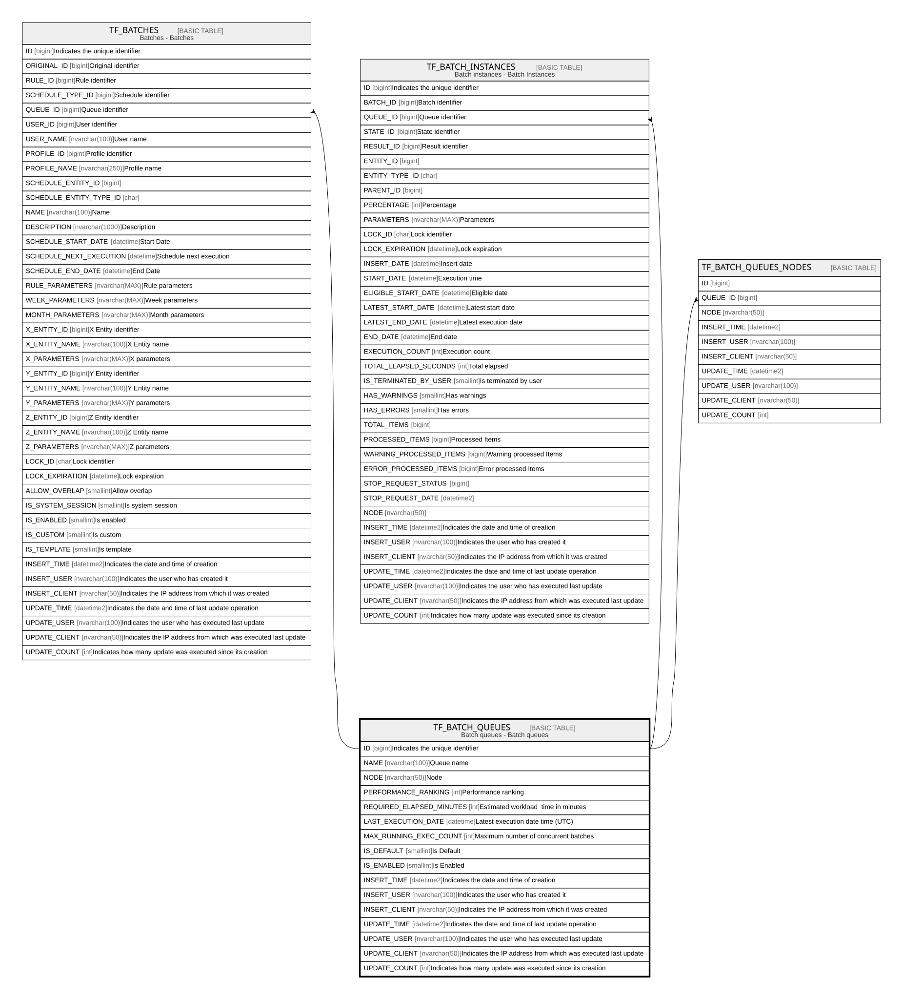

# TF_BATCH_QUEUES

## Description

Batch queues - Batch queues  

## Columns

| Name | Type | Default | Nullable | Children | Comment |
| ---- | ---- | ------- | -------- | -------- | ------- |
| ID | bigint |  | false | [TF_BATCHES](TF_BATCHES.md) [TF_BATCH_INSTANCES](TF_BATCH_INSTANCES.md) [TF_BATCH_QUEUES_NODES](TF_BATCH_QUEUES_NODES.md) | Indicates the unique identifier |
| NAME | nvarchar(100) |  | false |  | Queue name |
| NODE | nvarchar(50) |  | true |  | Node |
| PERFORMANCE_RANKING | int | ((0)) | false |  | Performance ranking |
| REQUIRED_ELAPSED_MINUTES | int |  | true |  | Estimated workload  time in minutes |
| LAST_EXECUTION_DATE | datetime |  | true |  | Latest execution date time (UTC) |
| MAX_RUNNING_EXEC_COUNT | int |  | true |  | Maximum number of concurrent batches |
| IS_DEFAULT | smallint | ((0)) | false |  | Is Default |
| IS_ENABLED | smallint | ((1)) | false |  | Is Enabled |
| INSERT_TIME | datetime2 | (sysutcdatetime()) | false |  | Indicates the date and time of creation |
| INSERT_USER | nvarchar(100) | (N'MAIN') | false |  | Indicates the user who has created it |
| INSERT_CLIENT | nvarchar(50) | (N'localhost') | false |  | Indicates the IP address from which it was created |
| UPDATE_TIME | datetime2 | (sysutcdatetime()) | false |  | Indicates the date and time of last update operation |
| UPDATE_USER | nvarchar(100) | (N'MAIN') | false |  | Indicates the user who has executed last update |
| UPDATE_CLIENT | nvarchar(50) | (N'localhost') | false |  | Indicates the IP address from which was executed last update |
| UPDATE_COUNT | int | ((0)) | false |  | Indicates how many update was executed since its creation |

## Constraints

| Name | Type | Definition |
| ---- | ---- | ---------- |
| PK_BATCH_QUEUES | PRIMARY KEY | CLUSTERED, unique, part of a PRIMARY KEY constraint, [ ID ] |
| UQ_BATCH_QUEUES | UNIQUE | NONCLUSTERED, unique, part of a UNIQUE constraint, [ NAME ] |

## Indexes

| Name | Definition |
| ---- | ---------- |
| PK_BATCH_QUEUES | CLUSTERED, unique, part of a PRIMARY KEY constraint, [ ID ] |
| UQ_BATCH_QUEUES | NONCLUSTERED, unique, part of a UNIQUE constraint, [ NAME ] |

## Relations

---

> Generated by [tbls](https://github.com/k1LoW/tbls)
