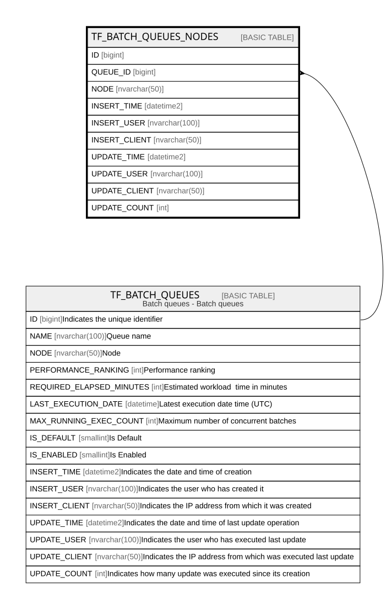

# TF_BATCH_QUEUES_NODES

## Columns

| Name | Type | Default | Nullable | Parents | Comment |
| ---- | ---- | ------- | -------- | ------- | ------- |
| ID | bigint |  | false |  |  |
| QUEUE_ID | bigint |  | false | [TF_BATCH_QUEUES](TF_BATCH_QUEUES.md) |  |
| NODE | nvarchar(50) |  | false |  |  |
| INSERT_TIME | datetime2 | (sysutcdatetime()) | false |  |  |
| INSERT_USER | nvarchar(100) | (N'MAIN') | false |  |  |
| INSERT_CLIENT | nvarchar(50) | (N'localhost') | false |  |  |
| UPDATE_TIME | datetime2 | (sysutcdatetime()) | false |  |  |
| UPDATE_USER | nvarchar(100) | (N'MAIN') | false |  |  |
| UPDATE_CLIENT | nvarchar(50) | (N'localhost') | false |  |  |
| UPDATE_COUNT | int | ((0)) | false |  |  |

## Constraints

| Name | Type | Definition |
| ---- | ---- | ---------- |
| PK_BATCH_QUEUES_NODES | PRIMARY KEY | CLUSTERED, unique, part of a PRIMARY KEY constraint, [ ID ] |
| FK_BATCHES_QUEUES | FOREIGN KEY | FOREIGN KEY(QUEUE_ID) REFERENCES TF_BATCH_QUEUES(ID) ON UPDATE NO_ACTION ON DELETE NO_ACTION |

## Indexes

| Name | Definition |
| ---- | ---------- |
| PK_BATCH_QUEUES_NODES | CLUSTERED, unique, part of a PRIMARY KEY constraint, [ ID ] |
| IDX_BATCH_QUEUES_NODES | NONCLUSTERED, [ NODE ] |

## Relations

---

> Generated by [tbls](https://github.com/k1LoW/tbls)
