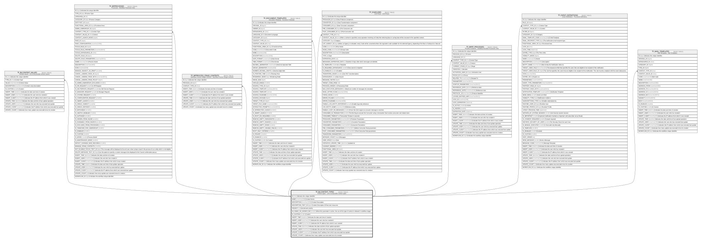

# TF_BLCONTEXT_TYPES

## Description

Context types - List of all possible context types  

## Columns

| Name | Type | Default | Nullable | Children | Comment |
| ---- | ---- | ------- | -------- | -------- | ------- |
| ID | char |  | false | [TF_BLCONTEXT_VALUES](TF_BLCONTEXT_VALUES.md) [TF_WFPROCESSES](TF_WFPROCESSES.md) [TF_WFPROCESS_STAGE_CONTEXTS](TF_WFPROCESS_STAGE_CONTEXTS.md) [TF_DOCUMENT_TEMPLATES](TF_DOCUMENT_TEMPLATES.md) [TF_SOAFLOWS](TF_SOAFLOWS.md) [TF_WFRT_PROCESSES](TF_WFRT_PROCESSES.md) [TF_EVENT_DEFINITIONS](TF_EVENT_DEFINITIONS.md) [TF_MAIL_TEMPLATES](TF_MAIL_TEMPLATES.md) | Indicates the unique identifier |
| NAME | nvarchar(100) |  | false |  | Context Name |
| DESCRIPTION | nvarchar(1000) |  | true |  | Context Description |
| DESCRIPTION_TEXT_ID | bigint |  | true |  | Context Description ID from text resources |
| PRIORITY | int | ((0)) | false |  | Set element priority |
| ALLOWED_ON_WORKFLOW | smallint | ((0)) | false |  | When this parameter is active, the use of this type of context is allowed in workflow stages. |
| IS_CUSTOM | smallint | ((1)) | false |  | Custom |
| INSERT_TIME | datetime2 | (sysutcdatetime()) | false |  | Indicates the date and time of creation |
| INSERT_USER | nvarchar(100) | (N'MAIN') | false |  | Indicates the user who has created it |
| INSERT_CLIENT | nvarchar(50) | (N'localhost') | false |  | Indicates the IP address from which it was created |
| UPDATE_TIME | datetime2 | (sysutcdatetime()) | false |  | Indicates the date and time of last update operation |
| UPDATE_USER | nvarchar(100) | (N'MAIN') | false |  | Indicates the user who has executed last update |
| UPDATE_CLIENT | nvarchar(50) | (N'localhost') | false |  | Indicates the IP address from which was executed last update |
| UPDATE_COUNT | int | ((0)) | false |  | Indicates how many update was executed since its creation |

## Constraints

| Name | Type | Definition |
| ---- | ---- | ---------- |
| PK_BLCONTEXT_TYPES | PRIMARY KEY | CLUSTERED, unique, part of a PRIMARY KEY constraint, [ ID ] |
| UQ_BLCONTEXT_TYPES_NAME | UNIQUE | NONCLUSTERED, unique, part of a UNIQUE constraint, [ NAME ] |

## Indexes

| Name | Definition |
| ---- | ---------- |
| PK_BLCONTEXT_TYPES | CLUSTERED, unique, part of a PRIMARY KEY constraint, [ ID ] |
| UQ_BLCONTEXT_TYPES_NAME | NONCLUSTERED, unique, part of a UNIQUE constraint, [ NAME ] |

## Relations

---

> Generated by [tbls](https://github.com/k1LoW/tbls)
