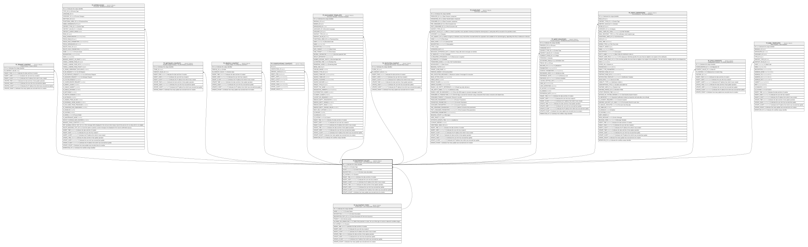

# TF_BLCONTEXT_VALUES

## Description

Context values - List of all possible context values  

## Columns

| Name | Type | Default | Nullable | Children | Parents | Comment |
| ---- | ---- | ------- | -------- | -------- | ------- | ------- |
| ID | char |  | false | [TF_TENANT_CONTEXT](TF_TENANT_CONTEXT.md) [TF_WFPROCESSES](TF_WFPROCESSES.md) [TF_WFSTAGES_CONTEXTS](TF_WFSTAGES_CONTEXTS.md) [TF_PROFILE_CONTEXT](TF_PROFILE_CONTEXT.md) [TF_CODIFICATIONS_CONTEXTS](TF_CODIFICATIONS_CONTEXTS.md) [TF_DOCUMENT_TEMPLATES](TF_DOCUMENT_TEMPLATES.md) [TF_SECFILTER_CONTEXT](TF_SECFILTER_CONTEXT.md) [TF_SOAFLOWS](TF_SOAFLOWS.md) [TF_WFRT_PROCESSES](TF_WFRT_PROCESSES.md) [TF_EVENT_DEFINITIONS](TF_EVENT_DEFINITIONS.md) [TF_CFGS_CONTEXTS](TF_CFGS_CONTEXTS.md) [TF_MAIL_TEMPLATES](TF_MAIL_TEMPLATES.md) |  | Indicates the unique identifier |
| TYPE_ID | char |  | false |  | [TF_BLCONTEXT_TYPES](TF_BLCONTEXT_TYPES.md) | Context Type |
| VALUE | nvarchar(100) |  | false |  |  | Context Value |
| DESCRIPTION | nvarchar(1000) |  | true |  |  | Context value description  |
| IS_CUSTOM | smallint | ((1)) | false |  |  | Custom |
| INSERT_TIME | datetime2 | (sysutcdatetime()) | false |  |  | Indicates the date and time of creation |
| INSERT_USER | nvarchar(100) | (N'MAIN') | false |  |  | Indicates the user who has created it |
| INSERT_CLIENT | nvarchar(50) | (N'localhost') | false |  |  | Indicates the IP address from which it was created |
| UPDATE_TIME | datetime2 | (sysutcdatetime()) | false |  |  | Indicates the date and time of last update operation |
| UPDATE_USER | nvarchar(100) | (N'MAIN') | false |  |  | Indicates the user who has executed last update |
| UPDATE_CLIENT | nvarchar(50) | (N'localhost') | false |  |  | Indicates the IP address from which was executed last update |
| UPDATE_COUNT | int | ((0)) | false |  |  | Indicates how many update was executed since its creation |

## Constraints

| Name | Type | Definition |
| ---- | ---- | ---------- |
| PK_BLCONTEXT_VALUES | PRIMARY KEY | CLUSTERED, unique, part of a PRIMARY KEY constraint, [ ID ] |
| FK_BLCONTEXT_VALUES_TYPES | FOREIGN KEY | FOREIGN KEY(TYPE_ID) REFERENCES TF_BLCONTEXT_TYPES(ID) ON UPDATE NO_ACTION ON DELETE CASCADE |

## Indexes

| Name | Definition |
| ---- | ---------- |
| PK_BLCONTEXT_VALUES | CLUSTERED, unique, part of a PRIMARY KEY constraint, [ ID ] |

## Relations

---

> Generated by [tbls](https://github.com/k1LoW/tbls)
