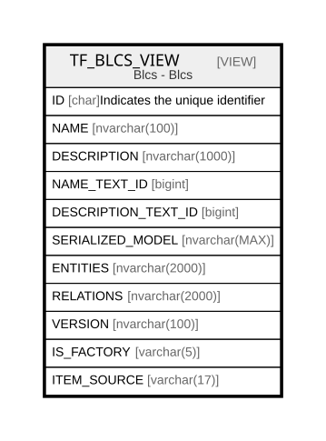

# TF_BLCS_VIEW

## Description

Blcs - Blcs  


<details>
<summary><strong>Table Definition</strong></summary>

```sql
-- Talentia Software - All right reserved
-- Type: VIEW                     Name: TF_BLCS_VIEW
-- Date: 09-04-2026 07:27:59 (UTC)
-- 
-- ChangeLogId: 00000000-0000-0000-0000-000000000000
-- ChangeSetId: 84561c01-17ab-4d10-b527-aa31b0ba2552
-- Original file name: C:\repos\Talentia-Software\hcm-core/DB/ProductDB/EDM\Schema\Views\TF_BLCS_VIEW.xml


CREATE VIEW [TF_BLCS_VIEW]
 AS 
( 
                  SELECT TF_BLCS.ID AS ID,
                  TF_BLCS.NAME AS NAME,
                  TF_BLCS.DESCRIPTION AS DESCRIPTION,
                  TF_BLCS.NAME_TEXT_ID AS NAME_TEXT_ID,
                  TF_BLCS.DESCRIPTION_TEXT_ID AS DESCRIPTION_TEXT_ID,
                  TF_BLCS.SERIALIZED_MODEL AS SERIALIZED_MODEL,
                  TF_BLCS.ENTITIES AS ENTITIES,
                  TF_BLCS.RELATIONS AS RELATIONS,
                  TF_BLCS.VERSION AS VERSION,
                  'True' AS IS_FACTORY,
                  'Vanilla' AS ITEM_SOURCE
                  FROM TF_BLCS
                  WHERE NOT EXISTS (SELECT 1 FROM TF_BLCS_CUSTOM WHERE TF_BLCS.ID = TF_BLCS.ID)
                  UNION ALL
                  SELECT TF_BLCS.ID AS ID,
                  TF_BLCS_CUSTOM.NAME AS NAME,
                  TF_BLCS_CUSTOM.DESCRIPTION AS DESCRIPTION,
                  TF_BLCS_CUSTOM.NAME_TEXT_ID AS NAME_TEXT_ID,
                  TF_BLCS_CUSTOM.DESCRIPTION_TEXT_ID AS DESCRIPTION_TEXT_ID,
                  TF_BLCS_CUSTOM.SERIALIZED_MODEL AS SERIALIZED_MODEL,
                  TF_BLCS_CUSTOM.ENTITIES AS ENTITIES,
                  TF_BLCS_CUSTOM.RELATIONS AS RELATIONS,
                  TF_BLCS_CUSTOM.VERSION AS VERSION,
                  'False' AS IS_FACTORY,
                  CASE WHEN (TF_BLCS.ID IS NOT NULL) THEN 'CustomizedVanilla' ELSE 'CustomizedOnly' END AS ITEM_SOURCE
                  FROM TF_BLCS_CUSTOM
                  LEFT JOIN TF_BLCS ON (TF_BLCS_CUSTOM.ID = TF_BLCS.ID)
                 )

```

</details>

## Columns

| Name | Type | Default | Nullable | Comment |
| ---- | ---- | ------- | -------- | ------- |
| ID | char |  | true | Indicates the unique identifier |
| NAME | nvarchar(100) |  | false |  |
| DESCRIPTION | nvarchar(1000) |  | true |  |
| NAME_TEXT_ID | bigint |  | true |  |
| DESCRIPTION_TEXT_ID | bigint |  | true |  |
| SERIALIZED_MODEL | nvarchar(MAX) |  | true |  |
| ENTITIES | nvarchar(2000) |  | true |  |
| RELATIONS | nvarchar(2000) |  | true |  |
| VERSION | nvarchar(100) |  | false |  |
| IS_FACTORY | varchar(5) |  | false |  |
| ITEM_SOURCE | varchar(17) |  | false |  |

## Referenced Tables

| Name | Columns | Comment | Type |
| ---- | ------- | ------- | ---- |
| [TF_BLCS](TF_BLCS.md) | 16 |  | BASIC TABLE |
| [TF_BLCS_CUSTOM](TF_BLCS_CUSTOM.md) | 16 |  | BASIC TABLE |

## Relations



---

> Generated by [tbls](https://github.com/k1LoW/tbls)
