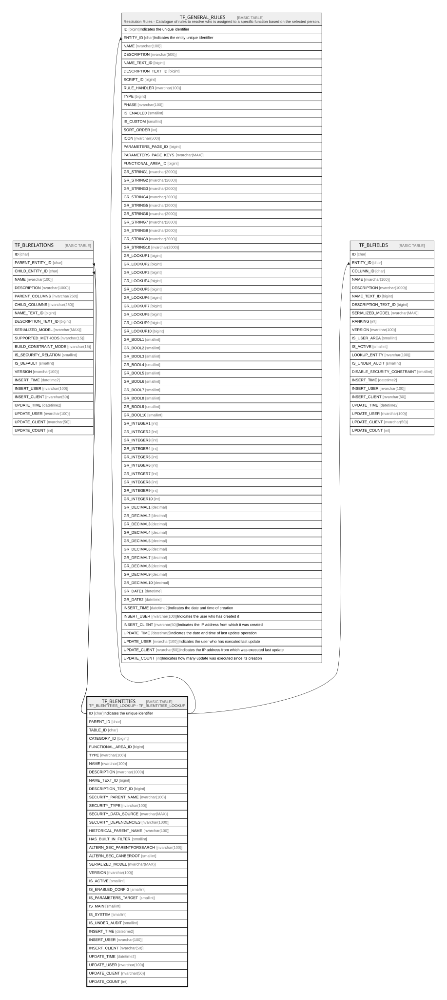

# TF_BLENTITIES

## Description

TF_BLENTITIES_LOOKUP - TF_BLENTITIES_LOOKUP  

## Columns

| Name | Type | Default | Nullable | Children | Comment |
| ---- | ---- | ------- | -------- | -------- | ------- |
| ID | char |  | false | [TF_BLRELATIONS](TF_BLRELATIONS.md) [TF_GENERAL_RULES](TF_GENERAL_RULES.md) [TF_BLFIELDS](TF_BLFIELDS.md) | Indicates the unique identifier |
| PARENT_ID | char |  | true |  |  |
| TABLE_ID | char |  | true |  |  |
| CATEGORY_ID | bigint | ((1)) | false |  |  |
| FUNCTIONAL_AREA_ID | bigint |  | false |  |  |
| TYPE | nvarchar(100) | (N'Standard') | false |  |  |
| NAME | nvarchar(100) |  | false |  |  |
| DESCRIPTION | nvarchar(1000) |  | true |  |  |
| NAME_TEXT_ID | bigint |  | true |  |  |
| DESCRIPTION_TEXT_ID | bigint |  | true |  |  |
| SECURITY_PARENT_NAME | nvarchar(100) |  | true |  |  |
| SECURITY_TYPE | nvarchar(100) | (N'Standard') | false |  |  |
| SECURITY_DATA_SOURCE | nvarchar(MAX) |  | true |  |  |
| SECURITY_DEPENDENCIES | nvarchar(1000) |  | true |  |  |
| HISTORICAL_PARENT_NAME | nvarchar(100) |  | true |  |  |
| HAS_BUILT_IN_FILTER | smallint | ((0)) | false |  |  |
| ALTERN_SEC_PARENTFORSEARCH | nvarchar(100) |  | true |  |  |
| ALTERN_SEC_CANBEROOT | smallint |  | true |  |  |
| SERIALIZED_MODEL | nvarchar(MAX) |  | true |  |  |
| VERSION | nvarchar(100) | (N'1.0.0') | false |  |  |
| IS_ACTIVE | smallint | ((1)) | false |  |  |
| IS_ENABLED_CONFIG | smallint | ((0)) | false |  |  |
| IS_PARAMETERS_TARGET | smallint | ((0)) | false |  |  |
| IS_MAIN | smallint | ((0)) | false |  |  |
| IS_SYSTEM | smallint | ((0)) | false |  |  |
| IS_UNDER_AUDIT | smallint |  | true |  |  |
| INSERT_TIME | datetime2 | (sysutcdatetime()) | false |  |  |
| INSERT_USER | nvarchar(100) | (N'MAIN') | false |  |  |
| INSERT_CLIENT | nvarchar(50) | (N'localhost') | false |  |  |
| UPDATE_TIME | datetime2 | (sysutcdatetime()) | false |  |  |
| UPDATE_USER | nvarchar(100) | (N'MAIN') | false |  |  |
| UPDATE_CLIENT | nvarchar(50) | (N'localhost') | false |  |  |
| UPDATE_COUNT | int | ((0)) | false |  |  |

## Constraints

| Name | Type | Definition |
| ---- | ---- | ---------- |
| PK_BLENTITIES | PRIMARY KEY | CLUSTERED, unique, part of a PRIMARY KEY constraint, [ ID ] |
| UQ_BLENTITIES_NAME | UNIQUE | NONCLUSTERED, unique, part of a UNIQUE constraint, [ NAME ] |

## Indexes

| Name | Definition |
| ---- | ---------- |
| PK_BLENTITIES | CLUSTERED, unique, part of a PRIMARY KEY constraint, [ ID ] |
| UQ_BLENTITIES_NAME | NONCLUSTERED, unique, part of a UNIQUE constraint, [ NAME ] |

## Relations

---

> Generated by [tbls](https://github.com/k1LoW/tbls)
