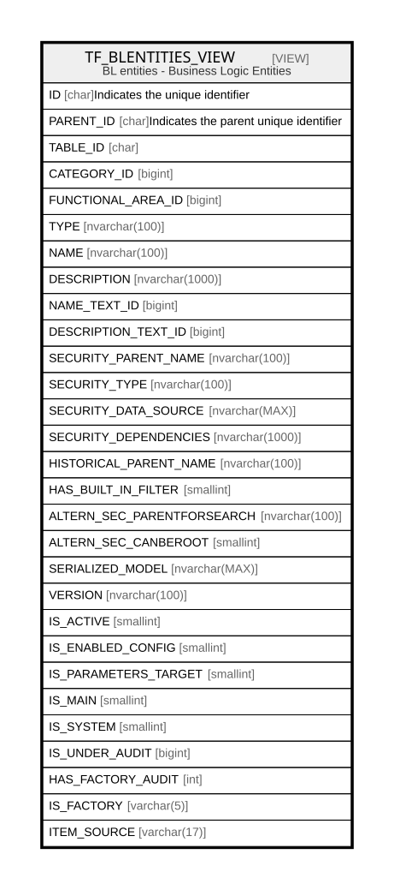

# TF_BLENTITIES_VIEW

## Description

BL entities - Business Logic Entities  


<details>
<summary><strong>Table Definition</strong></summary>

```sql
-- Talentia Software - All right reserved
-- Type: VIEW                     Name: TF_BLENTITIES_VIEW
-- Date: 09-04-2026 07:27:59 (UTC)
-- 
-- ChangeLogId: 00000000-0000-0000-0000-000000000000
-- ChangeSetId: 427f57aa-43fc-4d86-8c95-214c009b711f
-- Original file name: C:\repos\Talentia-Software\hcm-core/DB/ProductDB/EDM\Schema\Views\TF_BLENTITIES_VIEW.xml


CREATE VIEW [TF_BLENTITIES_VIEW]
 AS 
( 
          SELECT TF_BLENTITIES.ID AS ID,
          TF_BLENTITIES.PARENT_ID AS PARENT_ID,
          TF_BLENTITIES.TABLE_ID AS TABLE_ID,
          TF_BLENTITIES.CATEGORY_ID AS CATEGORY_ID,
          TF_BLENTITIES.FUNCTIONAL_AREA_ID AS FUNCTIONAL_AREA_ID,
          TF_BLENTITIES.TYPE AS TYPE,
          TF_BLENTITIES.NAME AS NAME,
          TF_BLENTITIES.DESCRIPTION AS DESCRIPTION,
          TF_BLENTITIES.NAME_TEXT_ID AS NAME_TEXT_ID,
          TF_BLENTITIES.DESCRIPTION_TEXT_ID AS DESCRIPTION_TEXT_ID,
          TF_BLENTITIES.SECURITY_PARENT_NAME AS SECURITY_PARENT_NAME,
          TF_BLENTITIES.SECURITY_TYPE AS SECURITY_TYPE,
          TF_BLENTITIES.SECURITY_DATA_SOURCE AS SECURITY_DATA_SOURCE,
          TF_BLENTITIES.SECURITY_DEPENDENCIES AS SECURITY_DEPENDENCIES,
          TF_BLENTITIES.HISTORICAL_PARENT_NAME AS HISTORICAL_PARENT_NAME,
          TF_BLENTITIES.HAS_BUILT_IN_FILTER AS HAS_BUILT_IN_FILTER,
          TF_BLENTITIES.ALTERN_SEC_PARENTFORSEARCH AS ALTERN_SEC_PARENTFORSEARCH,
          TF_BLENTITIES.ALTERN_SEC_CANBEROOT AS ALTERN_SEC_CANBEROOT,
          TF_BLENTITIES.SERIALIZED_MODEL AS SERIALIZED_MODEL,
          TF_BLENTITIES.VERSION AS VERSION,
          TF_BLENTITIES.IS_ACTIVE AS IS_ACTIVE,
          TF_BLENTITIES.IS_ENABLED_CONFIG AS IS_ENABLED_CONFIG,
          TF_BLENTITIES.IS_PARAMETERS_TARGET AS IS_PARAMETERS_TARGET,
          TF_BLENTITIES.IS_MAIN AS IS_MAIN,
          TF_BLENTITIES.IS_SYSTEM AS IS_SYSTEM,
          COALESCE(PE.NUMERIC_PROPERTY_VALUE, 0) AS IS_UNDER_AUDIT,
          CASE WHEN PE.NUMERIC_PROPERTY_VALUE IS NOT NULL AND PE.IS_CUSTOM = 0 THEN 1 ELSE 0 END AS HAS_FACTORY_AUDIT,
          'True' AS IS_FACTORY,
          'Vanilla' AS ITEM_SOURCE
          FROM TF_BLENTITIES
          LEFT JOIN TF_BLPROPERTY_EXCEPTIONS PE ON PE.TARGET_ID = TF_BLENTITIES.ID AND PE.PROPERTY_ID = 'a2a838bc-d59f-47d2-99b3-0e5592752dad'
          AND ((PE.IS_CUSTOM = 1) OR (PE.IS_CUSTOM = 0 AND PE.ID NOT IN (SELECT ORIGINAL_ID FROM TF_BLPROPERTY_EXCEPTIONS AS FACTORY0 WHERE(ORIGINAL_ID IS NOT NULL))))
          WHERE NOT EXISTS (SELECT 1 FROM TF_BLENTITIES_CUSTOM WHERE TF_BLENTITIES_CUSTOM.ID = TF_BLENTITIES.ID)
          UNION ALL
          SELECT TF_BLENTITIES_CUSTOM.ID AS ID,
          TF_BLENTITIES_CUSTOM.PARENT_ID AS PARENT_ID,
          TF_BLENTITIES_CUSTOM.TABLE_ID AS TABLE_ID,
          TF_BLENTITIES_CUSTOM.CATEGORY_ID AS CATEGORY_ID,
          TF_BLENTITIES_CUSTOM.FUNCTIONAL_AREA_ID AS FUNCTIONAL_AREA_ID,
          TF_BLENTITIES_CUSTOM.TYPE AS TYPE,
          TF_BLENTITIES_CUSTOM.NAME AS NAME,
          TF_BLENTITIES_CUSTOM.DESCRIPTION AS DESCRIPTION,
          TF_BLENTITIES_CUSTOM.NAME_TEXT_ID AS NAME_TEXT_ID,
          TF_BLENTITIES_CUSTOM.DESCRIPTION_TEXT_ID AS DESCRIPTION_TEXT_ID,
          TF_BLENTITIES_CUSTOM.SECURITY_PARENT_NAME AS SECURITY_PARENT_NAME,
          TF_BLENTITIES_CUSTOM.SECURITY_TYPE AS SECURITY_TYPE,
          TF_BLENTITIES_CUSTOM.SECURITY_DATA_SOURCE AS SECURITY_DATA_SOURCE,
          TF_BLENTITIES_CUSTOM.SECURITY_DEPENDENCIES AS SECURITY_DEPENDENCIES,
          TF_BLENTITIES_CUSTOM.HISTORICAL_PARENT_NAME AS HISTORICAL_PARENT_NAME,
          TF_BLENTITIES_CUSTOM.HAS_BUILT_IN_FILTER AS HAS_BUILT_IN_FILTER,
          TF_BLENTITIES_CUSTOM.ALTERN_SEC_PARENTFORSEARCH AS ALTERN_SEC_PARENTFORSEARCH,
          TF_BLENTITIES_CUSTOM.ALTERN_SEC_CANBEROOT AS ALTERN_SEC_CANBEROOT,
          TF_BLENTITIES_CUSTOM.SERIALIZED_MODEL AS SERIALIZED_MODEL,
          TF_BLENTITIES_CUSTOM.VERSION AS VERSION,
          TF_BLENTITIES_CUSTOM.IS_ACTIVE AS IS_ACTIVE,
          TF_BLENTITIES_CUSTOM.IS_ENABLED_CONFIG AS IS_ENABLED_CONFIG,
          TF_BLENTITIES_CUSTOM.IS_PARAMETERS_TARGET AS IS_PARAMETERS_TARGET,
          TF_BLENTITIES_CUSTOM.IS_MAIN AS IS_MAIN,
          TF_BLENTITIES_CUSTOM.IS_SYSTEM AS IS_SYSTEM,
          COALESCE(PE.NUMERIC_PROPERTY_VALUE, 0) AS IS_UNDER_AUDIT,
          CASE WHEN PE.NUMERIC_PROPERTY_VALUE IS NOT NULL AND PE.IS_CUSTOM = 0 THEN 1 ELSE 0 END AS HAS_FACTORY_AUDIT,
          'False' AS IS_FACTORY,
          CASE WHEN (TF_BLENTITIES.ID IS NOT NULL) THEN 'CustomizedVanilla' ELSE 'CustomizedOnly' END AS ITEM_SOURCE
          FROM TF_BLENTITIES_CUSTOM
          LEFT JOIN TF_BLPROPERTY_EXCEPTIONS PE ON PE.TARGET_ID = TF_BLENTITIES_CUSTOM.ID AND PE.PROPERTY_ID = 'a2a838bc-d59f-47d2-99b3-0e5592752dad'
            AND ((PE.IS_CUSTOM = 1) OR (PE.IS_CUSTOM = 0 AND PE.ID NOT IN (SELECT ORIGINAL_ID FROM TF_BLPROPERTY_EXCEPTIONS AS FACTORY0 WHERE(ORIGINAL_ID IS NOT NULL))))
          LEFT JOIN TF_BLENTITIES ON (TF_BLENTITIES_CUSTOM.ID = TF_BLENTITIES.ID)
         )

```

</details>

## Columns

| Name | Type | Default | Nullable | Comment |
| ---- | ---- | ------- | -------- | ------- |
| ID | char |  | false | Indicates the unique identifier |
| PARENT_ID | char |  | true | Indicates the parent unique identifier |
| TABLE_ID | char |  | true |  |
| CATEGORY_ID | bigint |  | false |  |
| FUNCTIONAL_AREA_ID | bigint |  | false |  |
| TYPE | nvarchar(100) |  | false |  |
| NAME | nvarchar(100) |  | false |  |
| DESCRIPTION | nvarchar(1000) |  | true |  |
| NAME_TEXT_ID | bigint |  | true |  |
| DESCRIPTION_TEXT_ID | bigint |  | true |  |
| SECURITY_PARENT_NAME | nvarchar(100) |  | true |  |
| SECURITY_TYPE | nvarchar(100) |  | false |  |
| SECURITY_DATA_SOURCE | nvarchar(MAX) |  | true |  |
| SECURITY_DEPENDENCIES | nvarchar(1000) |  | true |  |
| HISTORICAL_PARENT_NAME | nvarchar(100) |  | true |  |
| HAS_BUILT_IN_FILTER | smallint |  | false |  |
| ALTERN_SEC_PARENTFORSEARCH | nvarchar(100) |  | true |  |
| ALTERN_SEC_CANBEROOT | smallint |  | true |  |
| SERIALIZED_MODEL | nvarchar(MAX) |  | true |  |
| VERSION | nvarchar(100) |  | false |  |
| IS_ACTIVE | smallint |  | false |  |
| IS_ENABLED_CONFIG | smallint |  | false |  |
| IS_PARAMETERS_TARGET | smallint |  | false |  |
| IS_MAIN | smallint |  | false |  |
| IS_SYSTEM | smallint |  | false |  |
| IS_UNDER_AUDIT | bigint |  | true |  |
| HAS_FACTORY_AUDIT | int |  | false |  |
| IS_FACTORY | varchar(5) |  | false |  |
| ITEM_SOURCE | varchar(17) |  | false |  |

## Referenced Tables

| Name | Columns | Comment | Type |
| ---- | ------- | ------- | ---- |
| [TF_BLENTITIES](TF_BLENTITIES.md) | 33 | TF_BLENTITIES_LOOKUP - TF_BLENTITIES_LOOKUP<br /> | BASIC TABLE |
| [TF_BLPROPERTY_EXCEPTIONS](TF_BLPROPERTY_EXCEPTIONS.md) | 13 | Audit Fields - Audit Fields<br /> | BASIC TABLE |
| [TF_BLENTITIES_CUSTOM](TF_BLENTITIES_CUSTOM.md) | 33 |  | BASIC TABLE |

## Relations



---

> Generated by [tbls](https://github.com/k1LoW/tbls)
