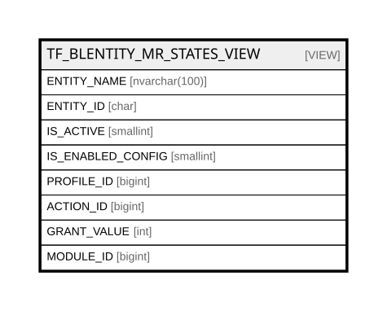

# TF_BLENTITY_MR_STATES_VIEW

## Description

<details>
<summary><strong>Table Definition</strong></summary>

```sql
-- Talentia Software - All right reserved
-- Type: VIEW                     Name: TF_BLENTITY_MR_STATES_VIEW
-- Date: 09-04-2026 07:27:59 (UTC)
-- 
-- ChangeLogId: 00000000-0000-0000-0000-000000000000
-- ChangeSetId: 3195e349-5605-4acc-b7cf-08771fcc5e6f
-- Original file name: C:\repos\Talentia-Software\hcm-core/DB/ProductDB/EDM\Schema\Views\TF_BLENTITY_MR_STATES_VIEW.xml


CREATE VIEW [TF_BLENTITY_MR_STATES_VIEW]
 AS 
( SELECT 
	EN.NAME AS ENTITY_NAME,
	EN.ID AS ENTITY_ID, 
	EN.IS_ACTIVE, 
	EN.IS_ENABLED_CONFIG,
	GRANTLIST.PROFILE_ID,
	CASE
		WHEN (EN.SECURITY_TYPE IN ('ReadOnly','Full') AND GRANTLIST.ACTION_ID IS NULL) THEN 2 --THE ENTITY HAS ALWAYS READ GRANTS
		ELSE GRANTLIST.ACTION_ID
	END ACTION_ID,    
	CASE
		WHEN (EN.SECURITY_TYPE IN ('ReadOnly','Full')) THEN 1 --THE ENTITY HAS ALWAYS READ GRANTS
		WHEN (GRANTLIST.GRANTSUM IS NOT NULL AND GRANTLIST.GRANTSUM>0) THEN 1  --THERE IS AT LEAST A ROLE THAT ASSIGNS THE READ GRANT
		WHEN (GRANTLIST.GRANTSUM IS NOT NULL AND GRANTLIST.GRANTSUM=0) THEN 0  --THERE IS NO ROLE THAT ASSIGNS THE READ GRANT
		ELSE 0 --NO GRANTS DEFINED
	END GRANT_VALUE,
	FA.MODULE_ID AS MODULE_ID
	
FROM 
	TF_BLENTITIES_VIEW EN LEFT JOIN
	TF_FUNCTIONAL_AREA FA ON FA.ID = EN.FUNCTIONAL_AREA_ID LEFT JOIN
	(SELECT 
			PC.ID AS PROFILE_ID,
			RG.TARGET_OBJECT_TYPE_ID, 
			RG.TARGET_OBJECT_ID, 
			RG.ACTION_ID, 
			SUM(RG.GRANT_VALUE) AS GRANTSUM 
	 FROM	TF_PROFILE_CATALOG PC 
			INNER JOIN TF_PROFILE_ROLES PR ON PC.ID = PR.PROFILE_ID 
			INNER JOIN TF_ROLE_CATALOG RC ON PR.ROLE_ID = RC.ID
			INNER JOIN TF_ROLE_GRANTS RG ON RC.ID = RG.ROLE_ID
	 WHERE 
		PC.ALTERNATIVE_SECURITY_SYSTEM = 1 AND RC.ALTERNATIVE_SECURITY_SYSTEM = 1 AND RG.ACTION_ID = 2	 
	 GROUP BY PC.ID,RG.TARGET_OBJECT_TYPE_ID, RG.TARGET_OBJECT_ID, RG.ACTION_ID
	)GRANTLIST on EN.ID = GRANTLIST.TARGET_OBJECT_ID

WHERE
	GRANTLIST.ACTION_ID IS NOT NULL OR EN.SECURITY_TYPE IN ('ReadOnly','Full')
               )

```

</details>

## Columns

| Name | Type | Default | Nullable | Comment |
| ---- | ---- | ------- | -------- | ------- |
| ENTITY_NAME | nvarchar(100) |  | false |  |
| ENTITY_ID | char |  | false |  |
| IS_ACTIVE | smallint |  | false |  |
| IS_ENABLED_CONFIG | smallint |  | false |  |
| PROFILE_ID | bigint |  | true |  |
| ACTION_ID | bigint |  | true |  |
| GRANT_VALUE | int |  | false |  |
| MODULE_ID | bigint |  | true |  |

## Referenced Tables

| Name | Columns | Comment | Type |
| ---- | ------- | ------- | ---- |
| [TF_BLENTITIES_VIEW](TF_BLENTITIES_VIEW.md) | 29 | BL entities - Business Logic Entities<br /> | VIEW |
| [TF_FUNCTIONAL_AREA](TF_FUNCTIONAL_AREA.md) | 16 | Functional Area - Functional area<br /> | BASIC TABLE |
| [TF_PROFILE_CATALOG](TF_PROFILE_CATALOG.md) | 24 | Profile catalog - TF_PROFILE_CATALOG<br /> | BASIC TABLE |
| [TF_PROFILE_ROLES](TF_PROFILE_ROLES.md) | 10 | Profile role - TF_PROFILE_ROLES<br /> | BASIC TABLE |
| [TF_ROLE_CATALOG](TF_ROLE_CATALOG.md) | 14 | Role Catalog - TF_ROLE_CATALOG<br /> | BASIC TABLE |
| [TF_ROLE_GRANTS](TF_ROLE_GRANTS.md) | 18 | Role Grants - Role Grants<br /> | BASIC TABLE |

## Relations



---

> Generated by [tbls](https://github.com/k1LoW/tbls)
