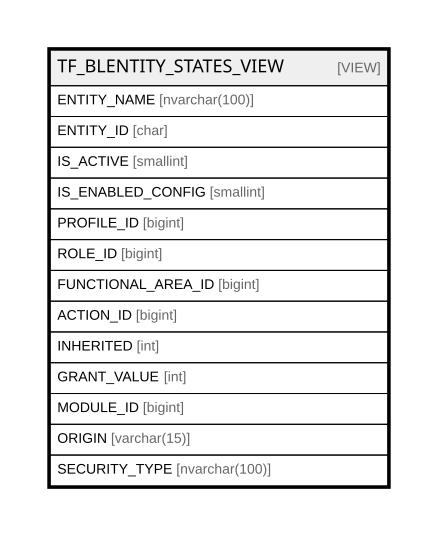

# TF_BLENTITY_STATES_VIEW

## Description

<details>
<summary><strong>Table Definition</strong></summary>

```sql
-- Talentia Software - All right reserved
-- Type: VIEW                     Name: TF_BLENTITY_STATES_VIEW
-- Date: 09-04-2026 07:27:59 (UTC)
-- 
-- ChangeLogId: 00000000-0000-0000-0000-000000000000
-- ChangeSetId: 217aeb71-3e72-43ac-8d8a-4cc164516161
-- Original file name: C:\repos\Talentia-Software\hcm-core/DB/ProductDB/EDM\Schema\Views\TF_BLENTITY_STATES_VIEW.xml


CREATE VIEW [TF_BLENTITY_STATES_VIEW]
 AS 
( 
                SELECT EN.NAME AS ENTITY_NAME, EN.ID AS ENTITY_ID, EN.IS_ACTIVE, EN.IS_ENABLED_CONFIG, GRANTLIST.PROFILE_ID, GRANTLIST.ROLE_ID, EN.FUNCTIONAL_AREA_ID,
                CASE
                WHEN (EN.SECURITY_TYPE IN ('ReadOnly','Full') AND GRANTLIST.ACTION_ID IS NULL) THEN 2 --THE ENTITY HAS ALWAYS READ GRANTS
                ELSE GRANTLIST.ACTION_ID
                END ACTION_ID,
                CASE WHEN (EN.SECURITY_SOURCE_ID = EN.ID) THEN 0 ELSE 1 END AS INHERITED,
                CASE
                WHEN (EN.SECURITY_TYPE IN ('ReadOnly','Full')) THEN 1 --THE ENTITY HAS ALWAYS READ GRANTS
                WHEN (GRANTLIST.PROFILE_GRANT_VALUE IS NOT NULL) THEN GRANTLIST.PROFILE_GRANT_VALUE
                WHEN (CSA.ACCESS_LEVEL = 0) THEN GRANTLIST.ROLE_GRANT_VALUE -- AUTO
                WHEN (CSA.ACCESS_LEVEL = 2 ) THEN 0 -- NO ACCESS
                WHEN (CSA.ACCESS_LEVEL = 1 AND GRANTLIST.ACTION_ID != 2) THEN 0 --READONLY
                WHEN (CSA.ACCESS_LEVEL = 1 AND GRANTLIST.ACTION_ID = 2) THEN COALESCE(GRANTLIST.ROLE_GRANT_VALUE,0) --READONLY
                ELSE GRANTLIST.ROLE_GRANT_VALUE
                END GRANT_VALUE,
                FA.MODULE_ID AS MODULE_ID,
                CASE
                WHEN  (GRANTLIST.PROFILE_GRANT_VALUE IS NOT NULL) THEN 'PROFILE'
                WHEN (CSA.ACCESS_LEVEL = 2 )  THEN 'FUNCTIONAL_AREA'
                WHEN (CSA.ACCESS_LEVEL = 1 AND GRANTLIST.ACTION_ID != 2) THEN 'FUNCTIONAL_AREA' --READONLY
                WHEN (CSA.ACCESS_LEVEL = 1 AND GRANTLIST.ACTION_ID = 2) THEN'ROLE' --READONLY
                WHEN (GRANTLIST.ROLE_GRANT_VALUE IS NOT NULL) THEN 'ROLE'
                ELSE 'NO GRANT'
                END ORIGIN
                ,EN.SECURITY_TYPE
                FROM (SELECT TF_BLENTITIES_VIEW.ID, TF_BLENTITIES_VIEW.NAME,TF_BLENTITIES_VIEW.IS_ACTIVE,TF_BLENTITIES_VIEW.IS_ENABLED_CONFIG,TF_BLENTITIES_VIEW.FUNCTIONAL_AREA_ID,TF_BLENTITIES_VIEW.SECURITY_TYPE, 
				COALESCE( DBO.TF_SECGET_ACTUAL_PARENT_ID(TF_BLENTITIES_VIEW.SECURITY_PARENT_NAME),TF_BLENTITIES_VIEW.ID) AS SECURITY_SOURCE_ID
                FROM TF_BLENTITIES_VIEW ) EN  LEFT OUTER JOIN
                (SELECT COALESCE(RGRANTS.PROFILE_ID,PGRANTS.PROFILE_ID) AS PROFILE_ID, COALESCE(RGRANTS.ROLE_ID,PGRANTS.ROLE_ID) AS ROLE_ID, COALESCE(RGRANTS.ENTITY_ID,PGRANTS.ENTITY_ID) AS ENTITY_ID,
                COALESCE(RGRANTS.ACTION_ID,PGRANTS.ACTION_ID) AS ACTION_ID, PGRANTS.PROFILE_GRANT_VALUE AS PROFILE_GRANT_VALUE, RGRANTS.ROLE_GRANT_VALUE AS ROLE_GRANT_VALUE FROM
                (SELECT PRC.ID AS PROFILE_ID,PRC.ROLE_ID AS ROLE_ID, PRG.TARGET_OBJECT_ID AS ENTITY_ID, PRG.ACTION_ID AS ACTION_ID, PRG.GRANT_VALUE AS PROFILE_GRANT_VALUE
                FROM TF_PROFILE_CATALOG PRC INNER JOIN TF_PROFILE_GRANTS PRG ON PRC.ID = PRG.PROFILE_ID AND PRG.TARGET_OBJECT_TYPE_ID =1 WHERE PRC.ALTERNATIVE_SECURITY_SYSTEM = 0)PGRANTS
                FULL JOIN (SELECT PRC.ID AS PROFILE_ID,PRC.ROLE_ID AS ROLE_ID, ROG.TARGET_OBJECT_ID AS ENTITY_ID, ROG.ACTION_ID AS ACTION_ID, ROG.GRANT_VALUE AS ROLE_GRANT_VALUE
                FROM TF_PROFILE_CATALOG PRC INNER JOIN TF_ROLE_GRANTS ROG ON PRC.ROLE_ID = ROG.ROLE_ID AND ROG.TARGET_OBJECT_TYPE_ID =1 WHERE PRC.ALTERNATIVE_SECURITY_SYSTEM = 0)RGRANTS
                ON PGRANTS.PROFILE_ID = RGRANTS.PROFILE_ID AND PGRANTS.ENTITY_ID = RGRANTS.ENTITY_ID AND PGRANTS.ACTION_ID = RGRANTS.ACTION_ID
                )GRANTLIST ON EN.SECURITY_SOURCE_ID = GRANTLIST.ENTITY_ID AND GRANTLIST.ACTION_ID = 2 AND EN.SECURITY_TYPE NOT IN ('ReadOnly','Full')
                LEFT OUTER JOIN TF_FUNC_AREA_CUSTOM_AUTH CSA ON CSA.PROFILE_ID = GRANTLIST.PROFILE_ID AND CSA.FUNCTIONAL_AREA_ID = EN.FUNCTIONAL_AREA_ID
                LEFT OUTER JOIN TF_FUNCTIONAL_AREA FA ON FA.ID = EN.FUNCTIONAL_AREA_ID
                WHERE GRANTLIST.ACTION_ID IS NOT NULL OR EN.SECURITY_TYPE IN ('ReadOnly','Full')

               )

```

</details>

## Columns

| Name | Type | Default | Nullable | Comment |
| ---- | ---- | ------- | -------- | ------- |
| ENTITY_NAME | nvarchar(100) |  | false |  |
| ENTITY_ID | char |  | false |  |
| IS_ACTIVE | smallint |  | false |  |
| IS_ENABLED_CONFIG | smallint |  | false |  |
| PROFILE_ID | bigint |  | true |  |
| ROLE_ID | bigint |  | true |  |
| FUNCTIONAL_AREA_ID | bigint |  | false |  |
| ACTION_ID | bigint |  | true |  |
| INHERITED | int |  | false |  |
| GRANT_VALUE | int |  | true |  |
| MODULE_ID | bigint |  | true |  |
| ORIGIN | varchar(15) |  | false |  |
| SECURITY_TYPE | nvarchar(100) |  | false |  |

## Referenced Tables

| Name | Columns | Comment | Type |
| ---- | ------- | ------- | ---- |
| [TF_BLENTITIES_VIEW](TF_BLENTITIES_VIEW.md) | 29 | BL entities - Business Logic Entities<br /> | VIEW |
| [TF_PROFILE_CATALOG](TF_PROFILE_CATALOG.md) | 24 | Profile catalog - TF_PROFILE_CATALOG<br /> | BASIC TABLE |
| [TF_PROFILE_GRANTS](TF_PROFILE_GRANTS.md) | 15 | Profile grant - TF_PROFILE_GRANT<br /> | BASIC TABLE |
| [TF_ROLE_GRANTS](TF_ROLE_GRANTS.md) | 18 | Role Grants - Role Grants<br /> | BASIC TABLE |
| [TF_FUNC_AREA_CUSTOM_AUTH](TF_FUNC_AREA_CUSTOM_AUTH.md) | 11 | TF_PROFILE_CUSTOM_AUTH - TF_PROFILE_CUSTOM_AUTH<br /> | BASIC TABLE |
| [TF_FUNCTIONAL_AREA](TF_FUNCTIONAL_AREA.md) | 16 | Functional Area - Functional area<br /> | BASIC TABLE |

## Relations



---

> Generated by [tbls](https://github.com/k1LoW/tbls)
