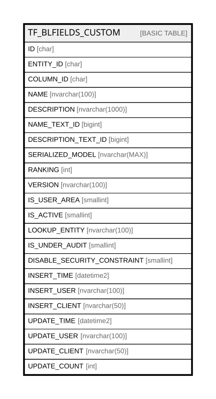

# TF_BLFIELDS_CUSTOM

## Columns

| Name | Type | Default | Nullable | Comment |
| ---- | ---- | ------- | -------- | ------- |
| ID | char |  | false |  |
| ENTITY_ID | char |  | false |  |
| COLUMN_ID | char |  | true |  |
| NAME | nvarchar(100) |  | false |  |
| DESCRIPTION | nvarchar(1000) |  | true |  |
| NAME_TEXT_ID | bigint |  | true |  |
| DESCRIPTION_TEXT_ID | bigint |  | true |  |
| SERIALIZED_MODEL | nvarchar(MAX) |  | true |  |
| RANKING | int | ((0)) | false |  |
| VERSION | nvarchar(100) | (N'1.0.0') | false |  |
| IS_USER_AREA | smallint | ((1)) | false |  |
| IS_ACTIVE | smallint | ((1)) | false |  |
| LOOKUP_ENTITY | nvarchar(100) |  | true |  |
| IS_UNDER_AUDIT | smallint |  | true |  |
| DISABLE_SECURITY_CONSTRAINT | smallint | ((0)) | false |  |
| INSERT_TIME | datetime2 | (sysutcdatetime()) | false |  |
| INSERT_USER | nvarchar(100) | (N'MAIN') | false |  |
| INSERT_CLIENT | nvarchar(50) | (N'localhost') | false |  |
| UPDATE_TIME | datetime2 | (sysutcdatetime()) | false |  |
| UPDATE_USER | nvarchar(100) | (N'MAIN') | false |  |
| UPDATE_CLIENT | nvarchar(50) | (N'localhost') | false |  |
| UPDATE_COUNT | int | ((0)) | false |  |

## Constraints

| Name | Type | Definition |
| ---- | ---- | ---------- |
| PK_BLFIELDS_CUSTOM | PRIMARY KEY | CLUSTERED, unique, part of a PRIMARY KEY constraint, [ ID ] |
| UQ_BLFIELDS_C_ENTITY_NAME | UNIQUE | NONCLUSTERED, unique, part of a UNIQUE constraint, [ ENTITY_ID, NAME ] |

## Indexes

| Name | Definition |
| ---- | ---------- |
| PK_BLFIELDS_CUSTOM | CLUSTERED, unique, part of a PRIMARY KEY constraint, [ ID ] |
| UQ_BLFIELDS_C_ENTITY_NAME | NONCLUSTERED, unique, part of a UNIQUE constraint, [ ENTITY_ID, NAME ] |
| IDX_FIELDS_CUSTOM_RANKING | NONCLUSTERED, [ RANKING ] |

## Triggers

| Name | Definition |
| ---- | ---------- |
| AUDIT_BLFIELDS_CUSTOM | -- Talentia Software - All right reserved -- Type: TRIGGER                  Name: AUDIT_BLFIELDS_CUSTOM -- Date: 09-04-2026 07:27:59 (UTC) --  -- ChangeLogId: 00000000-0000-0000-0000-000000000000 -- ChangeSetId: 93b450bb-6547-4b35-bde2-a23c597ec413 -- Original file name: C:\repos\Talentia-Software\hcm-core/DB/ProductDB/EDM\Schema\Triggers\AUDIT_BLFIELDS_CUSTOM.xml   CREATE TRIGGER AUDIT_BLFIELDS_CUSTOM    ON  TF_BLFIELDS_CUSTOM    AFTER INSERT,DELETE,UPDATE AS  BEGIN 	-- SET NOCOUNT ON added to prevent extra result sets from 	-- interfering with SELECT statements. 	SET NOCOUNT ON; 	 	DECLARE @TableName varchar(100) = 'TF_BLFIELDS_CUSTOM' 	DECLARE @FactoryTableName varchar(100) = 'TF_BLFIELDS' 	DECLARE @TargetObjectType varchar(100) = 'Field'  	DECLARE	@DefAuditPolicyStatus bit = CASE WHEN (SELECT ACTIVE FROM TF_AUDIT_SWITCH WHERE ID = 1) = 1 THEN 1 ELSE 0 END  	DECLARE @OperationType smallint -- Insert 1, Update 2, Delete 3  	DECLARE @UpdateDate varchar(23)  	DECLARE @ContextInfo varchar(128) 	DECLARE @ClientInfo nvarchar(max) 	DECLARE @DirectSQL bit = 0  	DECLARE @SQL nvarchar(max) 	 	DECLARE @SQLWorkTable nvarchar(max) 	DECLARE @SQLWorkTable2 nvarchar(max) 	 	DECLARE @SQLStartInsertTo nvarchar(max) 	DECLARE @SQLInsertUser nvarchar(max) 	DECLARE @SQLInsertClient  nvarchar(max)  	if (@DefAuditPolicyStatus=1)  	BEGIN  		--Get Operation Type 		if exists (SELECT * FROM inserted) 			if exists (SELECT * FROM deleted) 				SELECT @OperationType = 2 --Update 			else 				SELECT @OperationType = 1 --Insert 		else 			SELECT @OperationType = 3 --Delete  		--GET THE SAME DATE FOR ALL 		SELECT @UpdateDate = '''' + convert(varchar(8), getutcdate(), 112) + ' ' + convert(varchar(12), getutcdate(), 114) + '''' 		 		--get Context Info 		IF CONTEXT_INFO() is null 			BEGIN 				SELECT @ContextInfo= '' 				SET @DirectSQL = 1 			END 		ELSE 			BEGIN 				-- Context Info should contain the Applicative UserName 				SELECT @ContextInfo = REPLACE(CAST(CONTEXT_INFO() as varchar(128)), NCHAR(0) COLLATE Latin1_General_100_BIN2, N''); 				SET @DirectSQL = 0 			END 	 		--Get Client Info 		SET @ClientInfo = SYSTEM_USER  		-- TEMPORARY TABLES 		SELECT * INTO #ins FROM inserted 		SELECT * INTO #del FROM deleted  		-- Start of the SQL request	 		SET @SQLStartInsertTo = 'INSERT INTO TF_AUDIT_DATADICTIONARY            ([TARGET_OBJECT_TYPE],[OBJECT_ID],[OBJECT_NAME],[PARENT_OBJECT_ID],[SERIALIZED_MODEL],[OLD_SERIALIZED_MODEL],[OPERATION_TYPE],            [IS_FACTORY],[INSERT_USER],[INSERT_CLIENT],[INSERT_TIME],[TRANSACTION_ID])' 			 		-- INSERTED OPERATION TYPE 		IF(@OperationType = 1) 		BEGIN 			SET @SQLWorkTable = '#ins' 			SET @SQLInsertUser = '''' + Replace(@ContextInfo,'''','''''') + ''''  			SET @SQLInsertClient =  '''' + @ClientInfo + '''' 			 			SET @SQL = @SQLStartInsertTo +'SELECT ''' + @TargetObjectType + ''',i.ID, i.NAME, i.ENTITY_ID, convert(nvarchar(max),i.SERIALIZED_MODEL), F.SERIALIZED_MODEL, 				1, 0, ' + @SQLInsertUser + ',' + @SQLInsertClient +', ' + @UpdateDate + ', CURRENT_TRANSACTION_ID()  				FROM '+@SQLWorkTable+' i  					LEFT JOIN '+@FactoryTableName+' F ON i.ID = F.ID'   			EXEC ( @Sql )				 			    		END 		-- UPDATED OPERATION TYPE 		IF(@OperationType = 2) 		BEGIN 			SET @SQLWorkTable = '#ins' 			SET @SQLWorkTable2 = '#del' 			SET @SQLInsertUser = '''' + Replace(@ContextInfo,'''','''''') + ''''  			SET @SQLInsertClient =  '''' + @ClientInfo + ''''  			SET @SQL = @SQLStartInsertTo +'SELECT ''' + @TargetObjectType + ''',i.ID, i.NAME, i.ENTITY_ID, convert(nvarchar(max),i.SERIALIZED_MODEL), convert(nvarchar(max),d.SERIALIZED_MODEL), 				2, 0, ' + @SQLInsertUser + ',' + @SQLInsertClient +', ' + @UpdateDate + ', CURRENT_TRANSACTION_ID()  				FROM '+@SQLWorkTable+' i 					INNER JOIN '+@SQLWorkTable2+' d ON i.ID = d.ID AND i.SERIALIZED_MODEL <> d.SERIALIZED_MODEL'  			EXEC ( @Sql )				 			    		END 		-- DELETED OPERATION TYPE 		IF(@OperationType = 3) 		BEGIN  			SET @SQLWorkTable = '#del' 			SET @SQLInsertUser = '''' + Replace(@ContextInfo,'''','''''') + '''' 			SET @SQLInsertClient =  '''' + @ClientInfo + '''' 					 			SET @SQL = @SQLStartInsertTo +'SELECT ''' + @TargetObjectType + ''',d.ID, d.NAME, d.ENTITY_ID, F.SERIALIZED_MODEL, convert(nvarchar(max),d.SERIALIZED_MODEL), 				3, CASE WHEN F.SERIALIZED_MODEL IS NULL THEN 0 ELSE 1 END, ' + @SQLInsertUser + ',' + @SQLInsertClient +', ' + @UpdateDate + ', CURRENT_TRANSACTION_ID()  				FROM '+@SQLWorkTable+' d  					LEFT JOIN '+@FactoryTableName+' F ON d.ID = F.ID'   			EXEC ( @Sql )				 		END 		END END   |

## Relations

---

> Generated by [tbls](https://github.com/k1LoW/tbls)
