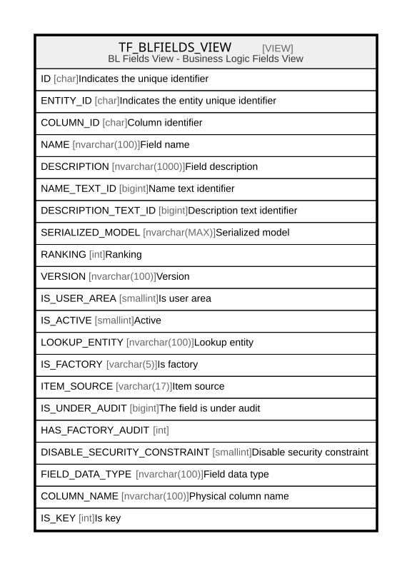

# TF_BLFIELDS_VIEW

## Description

BL Fields View - Business Logic Fields View  


<details>
<summary><strong>Table Definition</strong></summary>

```sql
-- Talentia Software - All right reserved
-- Type: VIEW                     Name: TF_BLFIELDS_VIEW
-- Date: 09-04-2026 07:27:59 (UTC)
-- 
-- ChangeLogId: 00000000-0000-0000-0000-000000000000
-- ChangeSetId: 2d4ebcde-19d8-4e00-a348-cf7e92273ac2
-- Original file name: C:\repos\Talentia-Software\hcm-core/DB/ProductDB/EDM\Schema\Views\TF_BLFIELDS_VIEW.xml


CREATE VIEW [TF_BLFIELDS_VIEW]
 AS 
( 
          SELECT BASE.ID, BASE.ENTITY_ID, BASE.COLUMN_ID, BASE.NAME, BASE.DESCRIPTION, BASE.NAME_TEXT_ID,
          BASE.DESCRIPTION_TEXT_ID, BASE.SERIALIZED_MODEL, BASE.RANKING, BASE.VERSION, BASE.IS_USER_AREA,
          BASE.IS_ACTIVE, BASE.LOOKUP_ENTITY, BASE.IS_FACTORY, BASE.ITEM_SOURCE, BASE.IS_UNDER_AUDIT, BASE.HAS_FACTORY_AUDIT, BASE.DISABLE_SECURITY_CONSTRAINT,
          TF_BLPHYSICAL_COLUMNS.DATA_TYPE FIELD_DATA_TYPE, TF_BLPHYSICAL_COLUMNS.NAME AS COLUMN_NAME,
          CASE WHEN dbo.TF_GET_NESTED_PROPERTY_VALUE(BASE.SERIALIZED_MODEL,'IsKey') = 'true' THEN 1 ELSE 0 END  IS_KEY
          FROM (
          SELECT TF_BLFIELDS.ID AS ID,
          TF_BLFIELDS.ENTITY_ID AS ENTITY_ID,
          TF_BLFIELDS.COLUMN_ID AS COLUMN_ID,
          TF_BLFIELDS.NAME AS NAME,
          TF_BLFIELDS.DESCRIPTION AS DESCRIPTION,
          TF_BLFIELDS.NAME_TEXT_ID AS NAME_TEXT_ID,
          TF_BLFIELDS.DESCRIPTION_TEXT_ID AS DESCRIPTION_TEXT_ID,
          TF_BLFIELDS.SERIALIZED_MODEL AS SERIALIZED_MODEL,
          TF_BLFIELDS.RANKING AS RANKING,
          TF_BLFIELDS.VERSION AS VERSION,
          TF_BLFIELDS.IS_USER_AREA AS IS_USER_AREA,
          TF_BLFIELDS.IS_ACTIVE AS IS_ACTIVE,
          TF_BLFIELDS.LOOKUP_ENTITY AS LOOKUP_ENTITY,
          COALESCE(PE.NUMERIC_PROPERTY_VALUE, 0) AS IS_UNDER_AUDIT,
          CASE WHEN PE.NUMERIC_PROPERTY_VALUE IS NOT NULL AND PE.IS_CUSTOM = 0 THEN 1 ELSE 0 END AS HAS_FACTORY_AUDIT,
          TF_BLFIELDS.DISABLE_SECURITY_CONSTRAINT AS DISABLE_SECURITY_CONSTRAINT,
          'True' AS IS_FACTORY,
          'Vanilla' AS ITEM_SOURCE
          FROM TF_BLFIELDS
          LEFT JOIN TF_BLPROPERTY_EXCEPTIONS PE ON PE.TARGET_ID = TF_BLFIELDS.ID AND PE.PROPERTY_ID = 'fafc987e-5e86-4515-a73c-b08978b5b27d'
            AND ((PE.IS_CUSTOM = 1) OR (PE.IS_CUSTOM = 0 AND PE.ID NOT IN (SELECT ORIGINAL_ID FROM TF_BLPROPERTY_EXCEPTIONS AS FACTORY0 WHERE(ORIGINAL_ID IS NOT NULL))))
          WHERE NOT EXISTS (SELECT 1 FROM TF_BLFIELDS_CUSTOM WHERE TF_BLFIELDS_CUSTOM.ID = TF_BLFIELDS.ID)
          UNION ALL
          SELECT TF_BLFIELDS_CUSTOM.ID AS ID,
          TF_BLFIELDS_CUSTOM.ENTITY_ID AS ENTITY_ID,
          TF_BLFIELDS_CUSTOM.COLUMN_ID AS COLUMN_ID,
          TF_BLFIELDS_CUSTOM.NAME AS NAME,
          TF_BLFIELDS_CUSTOM.DESCRIPTION AS DESCRIPTION,
          TF_BLFIELDS_CUSTOM.NAME_TEXT_ID AS NAME_TEXT_ID,
          TF_BLFIELDS_CUSTOM.DESCRIPTION_TEXT_ID AS DESCRIPTION_TEXT_ID,
          TF_BLFIELDS_CUSTOM.SERIALIZED_MODEL AS SERIALIZED_MODEL,
          TF_BLFIELDS_CUSTOM.RANKING AS RANKING,
          TF_BLFIELDS_CUSTOM.VERSION AS VERSION,
          TF_BLFIELDS_CUSTOM.IS_USER_AREA AS IS_USER_AREA,
          TF_BLFIELDS_CUSTOM.IS_ACTIVE AS IS_ACTIVE,
          TF_BLFIELDS_CUSTOM.LOOKUP_ENTITY AS LOOKUP_ENTITY,
          COALESCE(PE.NUMERIC_PROPERTY_VALUE, 0) AS IS_UNDER_AUDIT,
          CASE WHEN PE.NUMERIC_PROPERTY_VALUE IS NOT NULL AND PE.IS_CUSTOM = 0 THEN 1 ELSE 0 END AS HAS_FACTORY_AUDIT,
          TF_BLFIELDS_CUSTOM.DISABLE_SECURITY_CONSTRAINT AS DISABLE_SECURITY_CONSTRAINT,
          'False' AS IS_FACTORY,
          CASE WHEN (TF_BLFIELDS.ID IS NOT NULL) THEN 'CustomizedVanilla' ELSE 'CustomizedOnly' END AS ITEM_SOURCE
          FROM TF_BLFIELDS_CUSTOM
          LEFT JOIN TF_BLPROPERTY_EXCEPTIONS PE ON PE.TARGET_ID = TF_BLFIELDS_CUSTOM.ID AND PE.PROPERTY_ID = 'fafc987e-5e86-4515-a73c-b08978b5b27d'
            AND ((PE.IS_CUSTOM = 1) OR (PE.IS_CUSTOM = 0 AND PE.ID NOT IN (SELECT ORIGINAL_ID FROM TF_BLPROPERTY_EXCEPTIONS AS FACTORY0 WHERE(ORIGINAL_ID IS NOT NULL))))
          LEFT JOIN TF_BLFIELDS ON (TF_BLFIELDS_CUSTOM.ID = TF_BLFIELDS.ID)
          ) BASE
          LEFT OUTER JOIN TF_BLPHYSICAL_COLUMNS ON TF_BLPHYSICAL_COLUMNS.ID = BASE.COLUMN_ID
         )

```

</details>

## Columns

| Name | Type | Default | Nullable | Comment |
| ---- | ---- | ------- | -------- | ------- |
| ID | char |  | false | Indicates the unique identifier |
| ENTITY_ID | char |  | false | Indicates the entity unique identifier |
| COLUMN_ID | char |  | true | Column identifier |
| NAME | nvarchar(100) |  | false | Field name |
| DESCRIPTION | nvarchar(1000) |  | true | Field description |
| NAME_TEXT_ID | bigint |  | true | Name text identifier |
| DESCRIPTION_TEXT_ID | bigint |  | true | Description text identifier |
| SERIALIZED_MODEL | nvarchar(MAX) |  | true | Serialized model |
| RANKING | int |  | false | Ranking |
| VERSION | nvarchar(100) |  | false | Version |
| IS_USER_AREA | smallint |  | false | Is user area |
| IS_ACTIVE | smallint |  | false | Active |
| LOOKUP_ENTITY | nvarchar(100) |  | true | Lookup entity |
| IS_FACTORY | varchar(5) |  | false | Is factory |
| ITEM_SOURCE | varchar(17) |  | false | Item source |
| IS_UNDER_AUDIT | bigint |  | true | The field is under audit |
| HAS_FACTORY_AUDIT | int |  | false |  |
| DISABLE_SECURITY_CONSTRAINT | smallint |  | false | Disable security constraint |
| FIELD_DATA_TYPE | nvarchar(100) |  | true | Field data type |
| COLUMN_NAME | nvarchar(100) |  | true | Physical column name |
| IS_KEY | int |  | false | Is key |

## Referenced Tables

| Name | Columns | Comment | Type |
| ---- | ------- | ------- | ---- |
| [TF_BLFIELDS](TF_BLFIELDS.md) | 22 |  | BASIC TABLE |
| [TF_BLPROPERTY_EXCEPTIONS](TF_BLPROPERTY_EXCEPTIONS.md) | 13 | Audit Fields - Audit Fields<br /> | BASIC TABLE |
| [TF_BLFIELDS_CUSTOM](TF_BLFIELDS_CUSTOM.md) | 22 |  | BASIC TABLE |
| [TF_BLPHYSICAL_COLUMNS](TF_BLPHYSICAL_COLUMNS.md) | 23 |  | BASIC TABLE |

## Relations



---

> Generated by [tbls](https://github.com/k1LoW/tbls)
