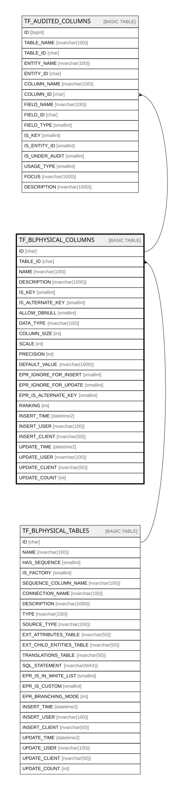

# TF_BLPHYSICAL_COLUMNS

## Columns

| Name | Type | Default | Nullable | Children | Parents | Comment |
| ---- | ---- | ------- | -------- | -------- | ------- | ------- |
| ID | char |  | false | [TF_AUDITED_COLUMNS](TF_AUDITED_COLUMNS.md) |  |  |
| TABLE_ID | char |  | false |  | [TF_BLPHYSICAL_TABLES](TF_BLPHYSICAL_TABLES.md) |  |
| NAME | nvarchar(100) |  | false |  |  |  |
| DESCRIPTION | nvarchar(1000) |  | true |  |  |  |
| IS_KEY | smallint |  | false |  |  |  |
| IS_ALTERNATE_KEY | smallint |  | false |  |  |  |
| ALLOW_DBNULL | smallint |  | false |  |  |  |
| DATA_TYPE | nvarchar(100) | (N'Unknown') | false |  |  |  |
| COLUMN_SIZE | int |  | true |  |  |  |
| SCALE | int |  | true |  |  |  |
| PRECISION | int |  | true |  |  |  |
| DEFAULT_VALUE | nvarchar(1000) |  | true |  |  |  |
| EPR_IGNORE_FOR_INSERT | smallint | ((0)) | true |  |  |  |
| EPR_IGNORE_FOR_UPDATE | smallint | ((0)) | true |  |  |  |
| EPR_IS_ALTERNATE_KEY | smallint | ((0)) | true |  |  |  |
| RANKING | int | ((0)) | false |  |  |  |
| INSERT_TIME | datetime2 | (sysutcdatetime()) | false |  |  |  |
| INSERT_USER | nvarchar(100) | (N'MAIN') | false |  |  |  |
| INSERT_CLIENT | nvarchar(50) | (N'localhost') | false |  |  |  |
| UPDATE_TIME | datetime2 | (sysutcdatetime()) | false |  |  |  |
| UPDATE_USER | nvarchar(100) | (N'MAIN') | false |  |  |  |
| UPDATE_CLIENT | nvarchar(50) | (N'localhost') | false |  |  |  |
| UPDATE_COUNT | int | ((0)) | false |  |  |  |

## Constraints

| Name | Type | Definition |
| ---- | ---- | ---------- |
| PK_BLPHYSICAL_COLUMNS | PRIMARY KEY | CLUSTERED, unique, part of a PRIMARY KEY constraint, [ ID ] |
| UQ_BLPHYSICAL_COLUMNS_NAME | UNIQUE | NONCLUSTERED, unique, part of a UNIQUE constraint, [ TABLE_ID, NAME ] |
| FK_BLPHYSICAL_COLUMNS_TABLES | FOREIGN KEY | FOREIGN KEY(TABLE_ID) REFERENCES TF_BLPHYSICAL_TABLES(ID) ON UPDATE NO_ACTION ON DELETE CASCADE |

## Indexes

| Name | Definition |
| ---- | ---------- |
| PK_BLPHYSICAL_COLUMNS | CLUSTERED, unique, part of a PRIMARY KEY constraint, [ ID ] |
| UQ_BLPHYSICAL_COLUMNS_NAME | NONCLUSTERED, unique, part of a UNIQUE constraint, [ TABLE_ID, NAME ] |

## Relations

---

> Generated by [tbls](https://github.com/k1LoW/tbls)
