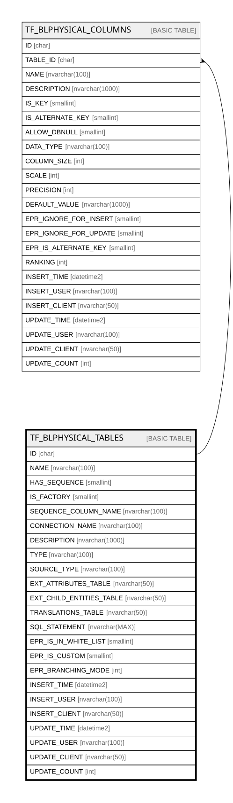

# TF_BLPHYSICAL_TABLES

## Columns

| Name | Type | Default | Nullable | Children | Comment |
| ---- | ---- | ------- | -------- | -------- | ------- |
| ID | char |  | false | [TF_BLPHYSICAL_COLUMNS](TF_BLPHYSICAL_COLUMNS.md) |  |
| NAME | nvarchar(100) |  | false |  |  |
| HAS_SEQUENCE | smallint | ((0)) | false |  |  |
| IS_FACTORY | smallint | ((1)) | false |  |  |
| SEQUENCE_COLUMN_NAME | nvarchar(100) |  | true |  |  |
| CONNECTION_NAME | nvarchar(100) | (N'app') | false |  |  |
| DESCRIPTION | nvarchar(1000) |  | true |  |  |
| TYPE | nvarchar(100) | (N'Standard') | false |  |  |
| SOURCE_TYPE | nvarchar(100) | (N'Table') | false |  |  |
| EXT_ATTRIBUTES_TABLE | nvarchar(50) |  | true |  |  |
| EXT_CHILD_ENTITIES_TABLE | nvarchar(50) |  | true |  |  |
| TRANSLATIONS_TABLE | nvarchar(50) |  | true |  |  |
| SQL_STATEMENT | nvarchar(MAX) |  | true |  |  |
| EPR_IS_IN_WHITE_LIST | smallint | ((0)) | true |  |  |
| EPR_IS_CUSTOM | smallint | ((0)) | true |  |  |
| EPR_BRANCHING_MODE | int | ((0)) | true |  |  |
| INSERT_TIME | datetime2 | (sysutcdatetime()) | false |  |  |
| INSERT_USER | nvarchar(100) | (N'MAIN') | false |  |  |
| INSERT_CLIENT | nvarchar(50) | (N'localhost') | false |  |  |
| UPDATE_TIME | datetime2 | (sysutcdatetime()) | false |  |  |
| UPDATE_USER | nvarchar(100) | (N'MAIN') | false |  |  |
| UPDATE_CLIENT | nvarchar(50) | (N'localhost') | false |  |  |
| UPDATE_COUNT | int | ((0)) | false |  |  |

## Constraints

| Name | Type | Definition |
| ---- | ---- | ---------- |
| PK_BLPHYSICAL_TABLES | PRIMARY KEY | CLUSTERED, unique, part of a PRIMARY KEY constraint, [ ID ] |
| UQ_BLPHYSICAL_TABLES_NAME | UNIQUE | NONCLUSTERED, unique, part of a UNIQUE constraint, [ NAME, CONNECTION_NAME ] |

## Indexes

| Name | Definition |
| ---- | ---------- |
| PK_BLPHYSICAL_TABLES | CLUSTERED, unique, part of a PRIMARY KEY constraint, [ ID ] |
| UQ_BLPHYSICAL_TABLES_NAME | NONCLUSTERED, unique, part of a UNIQUE constraint, [ NAME, CONNECTION_NAME ] |

## Relations

---

> Generated by [tbls](https://github.com/k1LoW/tbls)
