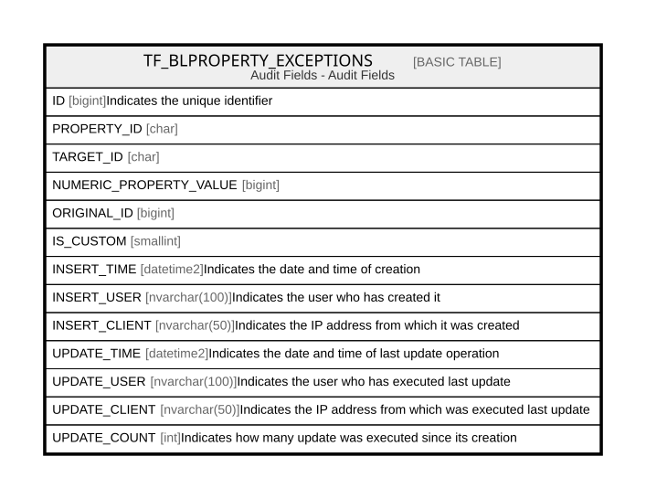

# TF_BLPROPERTY_EXCEPTIONS

## Description

Audit Fields - Audit Fields  

## Columns

| Name | Type | Default | Nullable | Comment |
| ---- | ---- | ------- | -------- | ------- |
| ID | bigint |  | false | Indicates the unique identifier |
| PROPERTY_ID | char |  | false |  |
| TARGET_ID | char |  | false |  |
| NUMERIC_PROPERTY_VALUE | bigint |  | false |  |
| ORIGINAL_ID | bigint |  | true |  |
| IS_CUSTOM | smallint |  | false |  |
| INSERT_TIME | datetime2 | (sysutcdatetime()) | false | Indicates the date and time of creation |
| INSERT_USER | nvarchar(100) | (N'MAIN') | false | Indicates the user who has created it |
| INSERT_CLIENT | nvarchar(50) | (N'localhost') | false | Indicates the IP address from which it was created |
| UPDATE_TIME | datetime2 | (sysutcdatetime()) | false | Indicates the date and time of last update operation |
| UPDATE_USER | nvarchar(100) | (N'MAIN') | false | Indicates the user who has executed last update |
| UPDATE_CLIENT | nvarchar(50) | (N'localhost') | false | Indicates the IP address from which was executed last update |
| UPDATE_COUNT | int | ((0)) | false | Indicates how many update was executed since its creation |

## Constraints

| Name | Type | Definition |
| ---- | ---- | ---------- |
| PK_TF_BLPROPERTY_EXCEPTIONS | PRIMARY KEY | CLUSTERED, unique, part of a PRIMARY KEY constraint, [ ID ] |
| UQ_PROP_EXCEPTION_CUSTOM | UNIQUE | NONCLUSTERED, unique, part of a UNIQUE constraint, [ PROPERTY_ID, TARGET_ID, IS_CUSTOM ] |

## Indexes

| Name | Definition |
| ---- | ---------- |
| PK_TF_BLPROPERTY_EXCEPTIONS | CLUSTERED, unique, part of a PRIMARY KEY constraint, [ ID ] |
| UQ_PROP_EXCEPTION_CUSTOM | NONCLUSTERED, unique, part of a UNIQUE constraint, [ PROPERTY_ID, TARGET_ID, IS_CUSTOM ] |
| IDX_PROP_EXCEPTION_ORIGINAL | NONCLUSTERED, [ IS_CUSTOM, ORIGINAL_ID ] |
| IDX_PROP_EXCEPTION_PROPERTY | NONCLUSTERED, [ PROPERTY_ID ] |
| IDX_PROP_EXCEPTION_TARGET | NONCLUSTERED, [ TARGET_ID ] |

## Relations

---

> Generated by [tbls](https://github.com/k1LoW/tbls)
