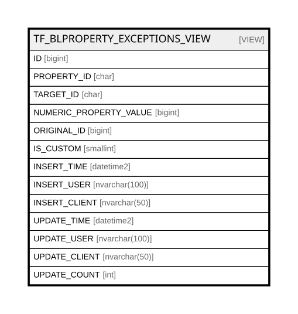

# TF_BLPROPERTY_EXCEPTIONS_VIEW

## Description

<details>
<summary><strong>Table Definition</strong></summary>

```sql
-- Talentia Software - All right reserved
-- Type: VIEW                     Name: TF_BLPROPERTY_EXCEPTIONS_VIEW
-- Date: 09-04-2026 07:27:59 (UTC)
-- 
-- ChangeLogId: 00000000-0000-0000-0000-000000000000
-- ChangeSetId: e741df55-679c-4a05-add4-9822504f6180
-- Original file name: C:\repos\Talentia-Software\hcm-core/DB/ProductDB/EDM\Schema\Views\TF_BLPROPERTY_EXCEPTIONS_VIEW.xml


CREATE VIEW [TF_BLPROPERTY_EXCEPTIONS_VIEW]
 AS 
( 
SELECT F.ID, F.PROPERTY_ID, F.TARGET_ID, F.NUMERIC_PROPERTY_VALUE, F.ORIGINAL_ID, F.IS_CUSTOM, F.INSERT_TIME, F.INSERT_USER, F.INSERT_CLIENT, F.UPDATE_TIME, F.UPDATE_USER, F.UPDATE_CLIENT, F.UPDATE_COUNT
FROM TF_BLPROPERTY_EXCEPTIONS F
WHERE (F.IS_CUSTOM = 1) OR (F.IS_CUSTOM = 0 AND F.ID NOT IN (SELECT ORIGINAL_ID FROM TF_BLPROPERTY_EXCEPTIONS AS FACTORY0 WHERE(ORIGINAL_ID IS NOT NULL)))
                 )

```

</details>

## Columns

| Name | Type | Default | Nullable | Comment |
| ---- | ---- | ------- | -------- | ------- |
| ID | bigint |  | false |  |
| PROPERTY_ID | char |  | false |  |
| TARGET_ID | char |  | false |  |
| NUMERIC_PROPERTY_VALUE | bigint |  | false |  |
| ORIGINAL_ID | bigint |  | true |  |
| IS_CUSTOM | smallint |  | false |  |
| INSERT_TIME | datetime2 |  | false |  |
| INSERT_USER | nvarchar(100) |  | false |  |
| INSERT_CLIENT | nvarchar(50) |  | false |  |
| UPDATE_TIME | datetime2 |  | false |  |
| UPDATE_USER | nvarchar(100) |  | false |  |
| UPDATE_CLIENT | nvarchar(50) |  | false |  |
| UPDATE_COUNT | int |  | false |  |

## Referenced Tables

| Name | Columns | Comment | Type |
| ---- | ------- | ------- | ---- |
| [TF_BLPROPERTY_EXCEPTIONS](TF_BLPROPERTY_EXCEPTIONS.md) | 13 | Audit Fields - Audit Fields<br /> | BASIC TABLE |

## Relations



---

> Generated by [tbls](https://github.com/k1LoW/tbls)
