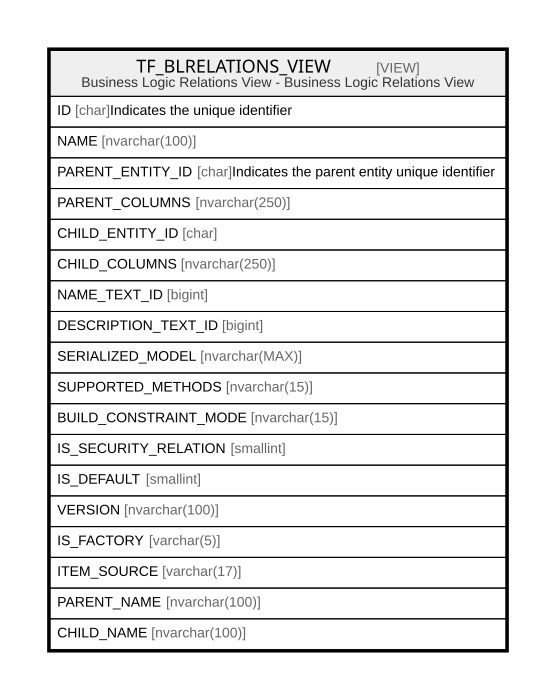

# TF_BLRELATIONS_VIEW

## Description

Business Logic Relations View - Business Logic Relations View  


<details>
<summary><strong>Table Definition</strong></summary>

```sql
-- Talentia Software - All right reserved
-- Type: VIEW                     Name: TF_BLRELATIONS_VIEW
-- Date: 09-04-2026 07:27:59 (UTC)
-- 
-- ChangeLogId: 00000000-0000-0000-0000-000000000000
-- ChangeSetId: 71c1758f-be6b-4485-8764-23d2705650fc
-- Original file name: C:\repos\Talentia-Software\hcm-core/DB/ProductDB/EDM\Schema\Views\TF_BLRELATIONS_VIEW.xml


CREATE VIEW [TF_BLRELATIONS_VIEW]
 AS 
( 
                  SELECT FINAL_RELATIONS.ID,
                  FINAL_RELATIONS.NAME,
                  FINAL_RELATIONS.PARENT_ENTITY_ID,
                  FINAL_RELATIONS.PARENT_COLUMNS,
                  FINAL_RELATIONS.CHILD_ENTITY_ID,
                  FINAL_RELATIONS.CHILD_COLUMNS,
                  FINAL_RELATIONS.NAME_TEXT_ID,
                  FINAL_RELATIONS.DESCRIPTION_TEXT_ID,
                  FINAL_RELATIONS.SERIALIZED_MODEL,
                  FINAL_RELATIONS.SUPPORTED_METHODS,
                  FINAL_RELATIONS.BUILD_CONSTRAINT_MODE,
                  FINAL_RELATIONS.IS_SECURITY_RELATION,
                  FINAL_RELATIONS.IS_DEFAULT,
                  FINAL_RELATIONS.VERSION,
                  FINAL_RELATIONS.IS_FACTORY,
                  FINAL_RELATIONS.ITEM_SOURCE,
                  COALESCE(PARENT_CUSTOM.NAME, PARENT.NAME) AS PARENT_NAME,
                  COALESCE(CHILD_CUSTOM.NAME, CHILD.NAME) AS CHILD_NAME
                  FROM
                  (
                  SELECT TF_BLRELATIONS.ID AS ID,
                  TF_BLRELATIONS.NAME AS NAME,
                  TF_BLRELATIONS.PARENT_ENTITY_ID AS PARENT_ENTITY_ID,
                  TF_BLRELATIONS.PARENT_COLUMNS AS PARENT_COLUMNS,
                  TF_BLRELATIONS.CHILD_ENTITY_ID AS CHILD_ENTITY_ID,
                  TF_BLRELATIONS.CHILD_COLUMNS AS CHILD_COLUMNS,
                  TF_BLRELATIONS.NAME_TEXT_ID AS NAME_TEXT_ID,
                  TF_BLRELATIONS.DESCRIPTION_TEXT_ID AS DESCRIPTION_TEXT_ID,
                  TF_BLRELATIONS.SERIALIZED_MODEL AS SERIALIZED_MODEL,
                  TF_BLRELATIONS.SUPPORTED_METHODS AS SUPPORTED_METHODS,
                  TF_BLRELATIONS.BUILD_CONSTRAINT_MODE AS BUILD_CONSTRAINT_MODE,
                  TF_BLRELATIONS.IS_SECURITY_RELATION AS IS_SECURITY_RELATION,
                  TF_BLRELATIONS.IS_DEFAULT AS IS_DEFAULT,
                  TF_BLRELATIONS.VERSION AS VERSION,
                  'True' AS IS_FACTORY,
                  'Vanilla' AS ITEM_SOURCE
                  FROM TF_BLRELATIONS
                  WHERE NOT EXISTS (SELECT 1 FROM TF_BLRELATIONS_CUSTOM WHERE TF_BLRELATIONS_CUSTOM.ID = TF_BLRELATIONS.ID)
                  ) FINAL_RELATIONS
                  LEFT OUTER JOIN TF_BLENTITIES PARENT ON PARENT.ID = FINAL_RELATIONS.PARENT_ENTITY_ID
                  LEFT OUTER JOIN TF_BLENTITIES CHILD ON CHILD.ID = FINAL_RELATIONS.CHILD_ENTITY_ID
                  LEFT OUTER JOIN TF_BLENTITIES_CUSTOM PARENT_CUSTOM ON PARENT_CUSTOM.ID = FINAL_RELATIONS.PARENT_ENTITY_ID
                  LEFT OUTER JOIN TF_BLENTITIES_CUSTOM CHILD_CUSTOM ON CHILD_CUSTOM.ID = FINAL_RELATIONS.CHILD_ENTITY_ID
                  UNION ALL
                  SELECT FINAL_RELATIONS.ID,
                  FINAL_RELATIONS.NAME,
                  FINAL_RELATIONS.PARENT_ENTITY_ID,
                  FINAL_RELATIONS.PARENT_COLUMNS,
                  FINAL_RELATIONS.CHILD_ENTITY_ID,
                  FINAL_RELATIONS.CHILD_COLUMNS,
                  FINAL_RELATIONS.NAME_TEXT_ID,
                  FINAL_RELATIONS.DESCRIPTION_TEXT_ID,
                  FINAL_RELATIONS.SERIALIZED_MODEL,
                  FINAL_RELATIONS.SUPPORTED_METHODS,
                  FINAL_RELATIONS.BUILD_CONSTRAINT_MODE,
                  FINAL_RELATIONS.IS_SECURITY_RELATION,
                  FINAL_RELATIONS.IS_DEFAULT,
                  FINAL_RELATIONS.VERSION,
                  FINAL_RELATIONS.IS_FACTORY,
                  FINAL_RELATIONS.ITEM_SOURCE,
                  COALESCE(PARENT_CUSTOM.NAME, PARENT.NAME) AS PARENT_NAME,
                  COALESCE(CHILD_CUSTOM.NAME, CHILD.NAME) AS CHILD_NAME
                  FROM
                  (
                  SELECT TF_BLRELATIONS_CUSTOM.ID AS ID,
                  TF_BLRELATIONS_CUSTOM.NAME AS NAME,
                  TF_BLRELATIONS_CUSTOM.PARENT_ENTITY_ID AS PARENT_ENTITY_ID,
                  TF_BLRELATIONS_CUSTOM.PARENT_COLUMNS AS PARENT_COLUMNS,
                  TF_BLRELATIONS_CUSTOM.CHILD_ENTITY_ID AS CHILD_ENTITY_ID,
                  TF_BLRELATIONS_CUSTOM.CHILD_COLUMNS AS CHILD_COLUMNS,
                  TF_BLRELATIONS_CUSTOM.NAME_TEXT_ID AS NAME_TEXT_ID,
                  TF_BLRELATIONS_CUSTOM.DESCRIPTION_TEXT_ID AS DESCRIPTION_TEXT_ID,
                  TF_BLRELATIONS_CUSTOM.SERIALIZED_MODEL AS SERIALIZED_MODEL,
                  TF_BLRELATIONS_CUSTOM.SUPPORTED_METHODS AS SUPPORTED_METHODS,
                  TF_BLRELATIONS_CUSTOM.BUILD_CONSTRAINT_MODE AS BUILD_CONSTRAINT_MODE,
                  TF_BLRELATIONS_CUSTOM.IS_SECURITY_RELATION AS IS_SECURITY_RELATION,
                  TF_BLRELATIONS_CUSTOM.IS_DEFAULT AS IS_DEFAULT,
                  TF_BLRELATIONS_CUSTOM.VERSION AS VERSION,
                  'False' AS IS_FACTORY,
                  CASE WHEN (TF_BLRELATIONS.ID IS NOT NULL) THEN 'CustomizedVanilla' ELSE 'CustomizedOnly' END AS ITEM_SOURCE
                  FROM TF_BLRELATIONS_CUSTOM
                  LEFT JOIN TF_BLRELATIONS ON (TF_BLRELATIONS_CUSTOM.ID = TF_BLRELATIONS.ID)
                  ) FINAL_RELATIONS
                  LEFT OUTER JOIN TF_BLENTITIES PARENT ON PARENT.ID = FINAL_RELATIONS.PARENT_ENTITY_ID
                  LEFT OUTER JOIN TF_BLENTITIES CHILD ON CHILD.ID = FINAL_RELATIONS.CHILD_ENTITY_ID
                  LEFT OUTER JOIN TF_BLENTITIES_CUSTOM PARENT_CUSTOM ON PARENT_CUSTOM.ID = FINAL_RELATIONS.PARENT_ENTITY_ID
                  LEFT OUTER JOIN TF_BLENTITIES_CUSTOM CHILD_CUSTOM ON CHILD_CUSTOM.ID = FINAL_RELATIONS.CHILD_ENTITY_ID
                 )

```

</details>

## Columns

| Name | Type | Default | Nullable | Comment |
| ---- | ---- | ------- | -------- | ------- |
| ID | char |  | false | Indicates the unique identifier |
| NAME | nvarchar(100) |  | false |  |
| PARENT_ENTITY_ID | char |  | false | Indicates the parent entity unique identifier |
| PARENT_COLUMNS | nvarchar(250) |  | false |  |
| CHILD_ENTITY_ID | char |  | false |  |
| CHILD_COLUMNS | nvarchar(250) |  | false |  |
| NAME_TEXT_ID | bigint |  | true |  |
| DESCRIPTION_TEXT_ID | bigint |  | true |  |
| SERIALIZED_MODEL | nvarchar(MAX) |  | true |  |
| SUPPORTED_METHODS | nvarchar(15) |  | false |  |
| BUILD_CONSTRAINT_MODE | nvarchar(15) |  | false |  |
| IS_SECURITY_RELATION | smallint |  | false |  |
| IS_DEFAULT | smallint |  | false |  |
| VERSION | nvarchar(100) |  | false |  |
| IS_FACTORY | varchar(5) |  | false |  |
| ITEM_SOURCE | varchar(17) |  | false |  |
| PARENT_NAME | nvarchar(100) |  | true |  |
| CHILD_NAME | nvarchar(100) |  | true |  |

## Referenced Tables

| Name | Columns | Comment | Type |
| ---- | ------- | ------- | ---- |
| [TF_BLRELATIONS](TF_BLRELATIONS.md) | 22 |  | BASIC TABLE |
| [TF_BLRELATIONS_CUSTOM](TF_BLRELATIONS_CUSTOM.md) | 22 |  | BASIC TABLE |
| [TF_BLENTITIES](TF_BLENTITIES.md) | 33 | TF_BLENTITIES_LOOKUP - TF_BLENTITIES_LOOKUP<br /> | BASIC TABLE |
| [TF_BLENTITIES_CUSTOM](TF_BLENTITIES_CUSTOM.md) | 33 |  | BASIC TABLE |

## Relations



---

> Generated by [tbls](https://github.com/k1LoW/tbls)
