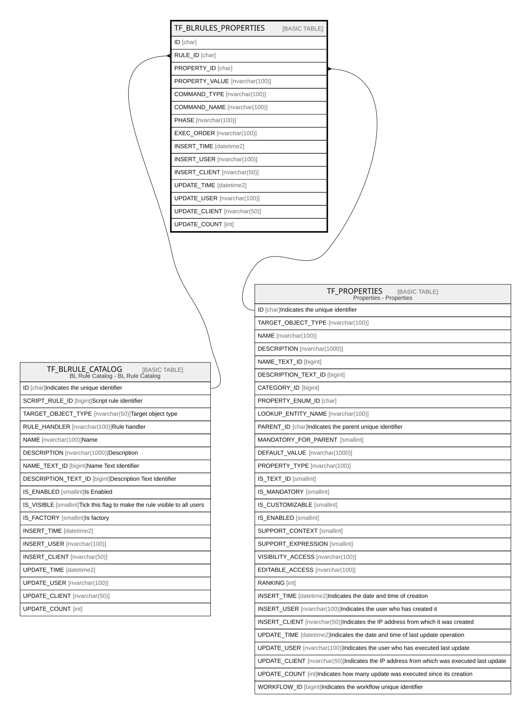

# TF_BLRULES_PROPERTIES

## Columns

| Name | Type | Default | Nullable | Parents | Comment |
| ---- | ---- | ------- | -------- | ------- | ------- |
| ID | char |  | false |  |  |
| RULE_ID | char |  | false | [TF_BLRULE_CATALOG](TF_BLRULE_CATALOG.md) |  |
| PROPERTY_ID | char |  | false | [TF_PROPERTIES](TF_PROPERTIES.md) |  |
| PROPERTY_VALUE | nvarchar(100) |  | true |  |  |
| COMMAND_TYPE | nvarchar(100) |  | false |  |  |
| COMMAND_NAME | nvarchar(100) |  | true |  |  |
| PHASE | nvarchar(100) |  | false |  |  |
| EXEC_ORDER | nvarchar(100) |  | false |  |  |
| INSERT_TIME | datetime2 | (sysutcdatetime()) | false |  |  |
| INSERT_USER | nvarchar(100) | (N'MAIN') | false |  |  |
| INSERT_CLIENT | nvarchar(50) | (N'localhost') | false |  |  |
| UPDATE_TIME | datetime2 | (sysutcdatetime()) | false |  |  |
| UPDATE_USER | nvarchar(100) | (N'MAIN') | false |  |  |
| UPDATE_CLIENT | nvarchar(50) | (N'localhost') | false |  |  |
| UPDATE_COUNT | int | ((0)) | false |  |  |

## Constraints

| Name | Type | Definition |
| ---- | ---- | ---------- |
| PK_BLRULES_PROPERTIES | PRIMARY KEY | CLUSTERED, unique, part of a PRIMARY KEY constraint, [ ID ] |
| UQ_BLRULES_PROPERTIES | UNIQUE | NONCLUSTERED, unique, part of a UNIQUE constraint, [ RULE_ID, PROPERTY_ID, PROPERTY_VALUE, COMMAND_TYPE, COMMAND_NAME, PHASE ] |
| FK_BLRULEPROP_PROPERTIES | FOREIGN KEY | FOREIGN KEY(PROPERTY_ID) REFERENCES TF_PROPERTIES(ID) ON UPDATE NO_ACTION ON DELETE NO_ACTION |
| FK_BLRULEPROP_RULES | FOREIGN KEY | FOREIGN KEY(RULE_ID) REFERENCES TF_BLRULE_CATALOG(ID) ON UPDATE NO_ACTION ON DELETE NO_ACTION |

## Indexes

| Name | Definition |
| ---- | ---------- |
| PK_BLRULES_PROPERTIES | CLUSTERED, unique, part of a PRIMARY KEY constraint, [ ID ] |
| UQ_BLRULES_PROPERTIES | NONCLUSTERED, unique, part of a UNIQUE constraint, [ RULE_ID, PROPERTY_ID, PROPERTY_VALUE, COMMAND_TYPE, COMMAND_NAME, PHASE ] |

## Relations

---

> Generated by [tbls](https://github.com/k1LoW/tbls)
