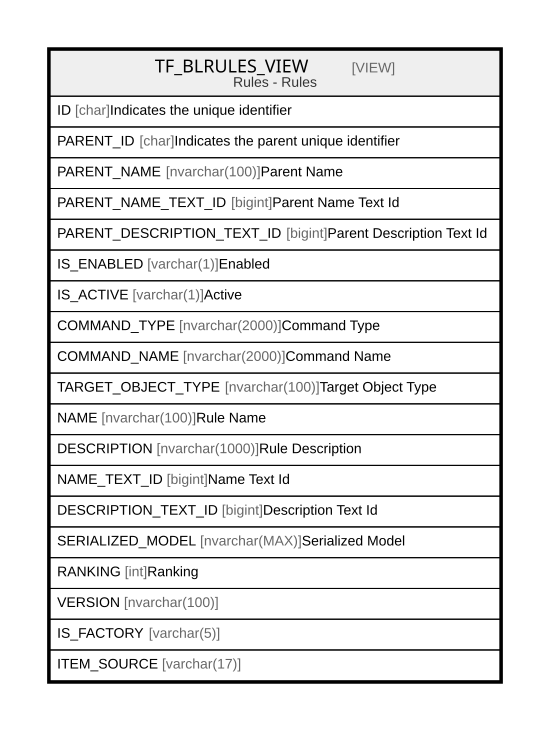

# TF_BLRULES_VIEW

## Description

Rules - Rules  


<details>
<summary><strong>Table Definition</strong></summary>

```sql
-- Talentia Software - All right reserved
-- Type: VIEW                     Name: TF_BLRULES_VIEW
-- Date: 09-04-2026 07:27:59 (UTC)
-- 
-- ChangeLogId: 00000000-0000-0000-0000-000000000000
-- ChangeSetId: 04851fde-51fb-40e1-9cc0-77c828bb9748
-- Original file name: C:\repos\Talentia-Software\hcm-core/DB/ProductDB/EDM\Schema\Views\TF_BLRULES_VIEW.xml


CREATE VIEW [TF_BLRULES_VIEW]
 AS 
( 
                SELECT TF_BLRULES.ID AS ID,
                TF_BLRULES.PARENT_ID AS PARENT_ID,
                CASE WHEN TF_BLRULES.TARGET_OBJECT_TYPE = 'Entity' THEN TF_BLENTITIES_VIEW.NAME
                WHEN TF_BLRULES.TARGET_OBJECT_TYPE = 'Blc' THEN TF_BLCS_VIEW.NAME
                WHEN TF_BLRULES.TARGET_OBJECT_TYPE = 'Relation' THEN TF_BLRELATIONS_VIEW.NAME END AS PARENT_NAME,
                CASE WHEN TF_BLRULES.TARGET_OBJECT_TYPE = 'Entity' THEN TF_BLENTITIES_VIEW.NAME_TEXT_ID
                WHEN TF_BLRULES.TARGET_OBJECT_TYPE = 'Blc' THEN TF_BLCS_VIEW.NAME_TEXT_ID
                WHEN TF_BLRULES.TARGET_OBJECT_TYPE = 'Relation' THEN TF_BLRELATIONS_VIEW.NAME_TEXT_ID END AS PARENT_NAME_TEXT_ID,
                CASE WHEN TF_BLRULES.TARGET_OBJECT_TYPE = 'Entity' THEN TF_BLENTITIES_VIEW.DESCRIPTION_TEXT_ID
                WHEN TF_BLRULES.TARGET_OBJECT_TYPE = 'Blc' THEN TF_BLCS_VIEW.DESCRIPTION_TEXT_ID
                WHEN TF_BLRULES.TARGET_OBJECT_TYPE = 'Relation' THEN TF_BLRELATIONS_VIEW.DESCRIPTION_TEXT_ID END AS PARENT_DESCRIPTION_TEXT_ID,
                CASE WHEN dbo.TF_GET_NESTED_PROPERTY_VALUE (TF_BLRULES.SERIALIZED_MODEL, 'IsEnabled') IN ('true', '1', 'True', 'TRUE') THEN 'Y'
                WHEN dbo.TF_GET_NESTED_PROPERTY_VALUE (TF_BLRULES.SERIALIZED_MODEL, 'IsEnabled') IN ('false', '0', 'False', 'FALSE') THEN 'N'
                WHEN dbo.TF_GET_NESTED_PROPERTY_VALUE (TF_BLRULES.SERIALIZED_MODEL, 'IsEnabled') IS NULL THEN 'Y' END AS IS_ENABLED,
                CASE WHEN dbo.TF_GET_PROPERTY_VALUE (TF_BLRULES.SERIALIZED_MODEL, 'IsActive') IN ('true', '1', 'True', 'TRUE') THEN 'Y'
                WHEN dbo.TF_GET_PROPERTY_VALUE (TF_BLRULES.SERIALIZED_MODEL, 'IsActive') IN ('false', '0', 'False', 'FALSE') THEN 'N'
                WHEN dbo.TF_GET_PROPERTY_VALUE (TF_BLRULES.SERIALIZED_MODEL, 'IsActive') IS NULL THEN 'Y' END AS IS_ACTIVE,
                COALESCE(dbo.TF_GET_NESTED_PROPERTY_VALUE (TF_BLRULES.SERIALIZED_MODEL, 'CommandType'), N'Retrieve') AS COMMAND_TYPE,
                dbo.TF_GET_NESTED_PROPERTY_VALUE(TF_BLRULES.SERIALIZED_MODEL, 'CommandName') AS COMMAND_NAME,
                TF_BLRULES.TARGET_OBJECT_TYPE AS TARGET_OBJECT_TYPE,
                TF_BLRULES.NAME AS NAME,
                TF_BLRULES.DESCRIPTION AS DESCRIPTION,
                TF_BLRULES.NAME_TEXT_ID AS NAME_TEXT_ID,
                TF_BLRULES.DESCRIPTION_TEXT_ID AS DESCRIPTION_TEXT_ID,
                TF_BLRULES.SERIALIZED_MODEL AS SERIALIZED_MODEL,
                TF_BLRULES.RANKING AS RANKING,
                TF_BLRULES.VERSION AS VERSION,
                'True' AS IS_FACTORY,
                'Vanilla' AS ITEM_SOURCE
                FROM TF_BLRULES
                LEFT JOIN TF_BLENTITIES_VIEW ON TF_BLRULES.PARENT_ID = TF_BLENTITIES_VIEW.ID AND TF_BLRULES.TARGET_OBJECT_TYPE = 'Entity'
                LEFT JOIN TF_BLCS_VIEW ON TF_BLRULES.PARENT_ID = TF_BLCS_VIEW.ID AND TF_BLRULES.TARGET_OBJECT_TYPE = 'Blc'
                LEFT JOIN TF_BLRELATIONS_VIEW ON TF_BLRULES.PARENT_ID = TF_BLRELATIONS_VIEW.ID AND TF_BLRULES.TARGET_OBJECT_TYPE = 'Relation'
                WHERE NOT EXISTS (SELECT 1 FROM TF_BLRULES_CUSTOM WHERE TF_BLRULES_CUSTOM.ID = TF_BLRULES.ID)
                UNION ALL
                SELECT TF_BLRULES_CUSTOM.ID AS ID,
                TF_BLRULES_CUSTOM.PARENT_ID AS PARENT_ID,
                CASE WHEN TF_BLRULES_CUSTOM.TARGET_OBJECT_TYPE = 'Entity' THEN TF_BLENTITIES_VIEW.NAME
                WHEN TF_BLRULES_CUSTOM.TARGET_OBJECT_TYPE = 'Blc' THEN TF_BLCS_VIEW.NAME
                WHEN TF_BLRULES_CUSTOM.TARGET_OBJECT_TYPE = 'Relation' THEN TF_BLRELATIONS_VIEW.NAME END AS PARENT_NAME,
                CASE WHEN TF_BLRULES_CUSTOM.TARGET_OBJECT_TYPE = 'Entity' THEN TF_BLENTITIES_VIEW.NAME_TEXT_ID
                WHEN TF_BLRULES_CUSTOM.TARGET_OBJECT_TYPE = 'Blc' THEN TF_BLCS_VIEW.NAME_TEXT_ID
                WHEN TF_BLRULES_CUSTOM.TARGET_OBJECT_TYPE = 'Relation' THEN TF_BLRELATIONS_VIEW.NAME_TEXT_ID END AS PARENT_NAME_TEXT_ID,
                CASE WHEN TF_BLRULES_CUSTOM.TARGET_OBJECT_TYPE = 'Entity' THEN TF_BLENTITIES_VIEW.DESCRIPTION_TEXT_ID
                WHEN TF_BLRULES_CUSTOM.TARGET_OBJECT_TYPE = 'Blc' THEN TF_BLCS_VIEW.DESCRIPTION_TEXT_ID
                WHEN TF_BLRULES_CUSTOM.TARGET_OBJECT_TYPE = 'Relation' THEN TF_BLRELATIONS_VIEW.DESCRIPTION_TEXT_ID END AS PARENT_DESCRIPTION_TEXT_ID,
                CASE WHEN dbo.TF_GET_NESTED_PROPERTY_VALUE (TF_BLRULES_CUSTOM.SERIALIZED_MODEL, 'IsEnabled') IN ('true', '1', 'True', 'TRUE') THEN 'Y'
                WHEN dbo.TF_GET_NESTED_PROPERTY_VALUE (TF_BLRULES_CUSTOM.SERIALIZED_MODEL, 'IsEnabled') IN ('false', '0', 'False', 'FALSE') THEN 'N'
                WHEN dbo.TF_GET_NESTED_PROPERTY_VALUE (TF_BLRULES_CUSTOM.SERIALIZED_MODEL, 'IsEnabled') IS NULL THEN 'Y' END AS IS_ENABLED,
                CASE WHEN dbo.TF_GET_PROPERTY_VALUE (TF_BLRULES_CUSTOM.SERIALIZED_MODEL, 'IsActive') IN ('true', '1', 'True', 'TRUE') THEN 'Y'
                WHEN dbo.TF_GET_PROPERTY_VALUE (TF_BLRULES_CUSTOM.SERIALIZED_MODEL, 'IsActive') IN ('false', '0', 'False', 'FALSE') THEN 'N'
                WHEN dbo.TF_GET_PROPERTY_VALUE (TF_BLRULES_CUSTOM.SERIALIZED_MODEL, 'IsActive') IS NULL THEN 'Y' END AS IS_ACTIVE,
                COALESCE(dbo.TF_GET_NESTED_PROPERTY_VALUE (TF_BLRULES_CUSTOM.SERIALIZED_MODEL, 'CommandType'), N'Retrieve') AS COMMAND_TYPE,
                dbo.TF_GET_NESTED_PROPERTY_VALUE(TF_BLRULES_CUSTOM.SERIALIZED_MODEL, 'CommandName') AS COMMAND_NAME,
                TF_BLRULES_CUSTOM.TARGET_OBJECT_TYPE AS TARGET_OBJECT_TYPE,
                TF_BLRULES_CUSTOM.NAME AS NAME,
                TF_BLRULES_CUSTOM.DESCRIPTION AS DESCRIPTION,
                TF_BLRULES_CUSTOM.NAME_TEXT_ID AS NAME_TEXT_ID,
                TF_BLRULES_CUSTOM.DESCRIPTION_TEXT_ID AS DESCRIPTION_TEXT_ID,
                TF_BLRULES_CUSTOM.SERIALIZED_MODEL AS SERIALIZED_MODEL,
                TF_BLRULES_CUSTOM.RANKING AS RANKING,
                TF_BLRULES_CUSTOM.VERSION AS VERSION,
                'False' AS IS_FACTORY,
                CASE WHEN (TF_BLRULES.ID IS NOT NULL) THEN 'CustomizedVanilla' ELSE 'CustomizedOnly' END AS ITEM_SOURCE
                FROM TF_BLRULES_CUSTOM
                LEFT JOIN TF_BLRULES ON (TF_BLRULES.ID = TF_BLRULES_CUSTOM.ID)
                LEFT JOIN TF_BLENTITIES_VIEW ON TF_BLRULES_CUSTOM.PARENT_ID = TF_BLENTITIES_VIEW.ID AND TF_BLRULES_CUSTOM.TARGET_OBJECT_TYPE = 'Entity'
                LEFT JOIN TF_BLCS_VIEW ON TF_BLRULES_CUSTOM.PARENT_ID = TF_BLCS_VIEW.ID AND TF_BLRULES_CUSTOM.TARGET_OBJECT_TYPE = 'Blc'
                LEFT JOIN TF_BLRELATIONS_VIEW ON TF_BLRULES_CUSTOM.PARENT_ID = TF_BLRELATIONS_VIEW.ID AND TF_BLRULES_CUSTOM.TARGET_OBJECT_TYPE = 'Relation'
               )

```

</details>

## Columns

| Name | Type | Default | Nullable | Comment |
| ---- | ---- | ------- | -------- | ------- |
| ID | char |  | false | Indicates the unique identifier |
| PARENT_ID | char |  | false | Indicates the parent unique identifier |
| PARENT_NAME | nvarchar(100) |  | true | Parent Name |
| PARENT_NAME_TEXT_ID | bigint |  | true | Parent Name Text Id |
| PARENT_DESCRIPTION_TEXT_ID | bigint |  | true | Parent Description Text Id |
| IS_ENABLED | varchar(1) |  | true | Enabled |
| IS_ACTIVE | varchar(1) |  | true | Active |
| COMMAND_TYPE | nvarchar(2000) |  | true | Command Type |
| COMMAND_NAME | nvarchar(2000) |  | true | Command Name |
| TARGET_OBJECT_TYPE | nvarchar(100) |  | false | Target Object Type |
| NAME | nvarchar(100) |  | false | Rule Name |
| DESCRIPTION | nvarchar(1000) |  | true | Rule Description |
| NAME_TEXT_ID | bigint |  | true | Name Text Id |
| DESCRIPTION_TEXT_ID | bigint |  | true | Description Text Id |
| SERIALIZED_MODEL | nvarchar(MAX) |  | true | Serialized Model |
| RANKING | int |  | false | Ranking |
| VERSION | nvarchar(100) |  | false |  |
| IS_FACTORY | varchar(5) |  | false |  |
| ITEM_SOURCE | varchar(17) |  | false |  |

## Referenced Tables

| Name | Columns | Comment | Type |
| ---- | ------- | ------- | ---- |
| [TF_BLRULES](TF_BLRULES.md) | 17 |  | BASIC TABLE |
| [TF_BLENTITIES_VIEW](TF_BLENTITIES_VIEW.md) | 29 | BL entities - Business Logic Entities<br /> | VIEW |
| [TF_BLCS_VIEW](TF_BLCS_VIEW.md) | 11 | Blcs - Blcs<br /> | VIEW |
| [TF_BLRELATIONS_VIEW](TF_BLRELATIONS_VIEW.md) | 18 | Business Logic Relations View - Business Logic Relations View<br /> | VIEW |
| [TF_BLRULES_CUSTOM](TF_BLRULES_CUSTOM.md) | 17 |  | BASIC TABLE |

## Relations



---

> Generated by [tbls](https://github.com/k1LoW/tbls)
