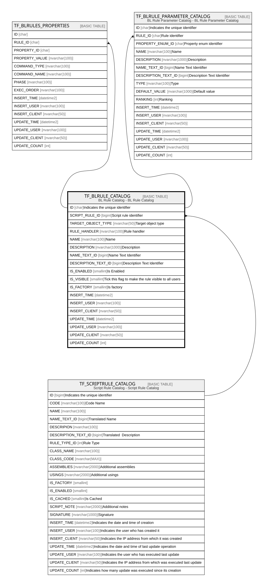

# TF_BLRULE_CATALOG

## Description

BL Rule Catalog - BL Rule Catalog  

## Columns

| Name | Type | Default | Nullable | Children | Parents | Comment |
| ---- | ---- | ------- | -------- | -------- | ------- | ------- |
| ID | char |  | false | [TF_BLRULES_PROPERTIES](TF_BLRULES_PROPERTIES.md) [TF_BLRULE_PARAMETER_CATALOG](TF_BLRULE_PARAMETER_CATALOG.md) |  | Indicates the unique identifier |
| SCRIPT_RULE_ID | bigint |  | true |  | [TF_SCRIPTRULE_CATALOG](TF_SCRIPTRULE_CATALOG.md) | Script rule identifier |
| TARGET_OBJECT_TYPE | nvarchar(50) |  | false |  |  | Target object type |
| RULE_HANDLER | nvarchar(100) |  | false |  |  | Rule handler |
| NAME | nvarchar(100) |  | false |  |  | Name |
| DESCRIPTION | nvarchar(1000) |  | true |  |  | Description |
| NAME_TEXT_ID | bigint |  | true |  |  | Name Text Identifier |
| DESCRIPTION_TEXT_ID | bigint |  | true |  |  | Description Text Identifier |
| IS_ENABLED | smallint | ((1)) | false |  |  | Is Enabled |
| IS_VISIBLE | smallint | ((0)) | false |  |  | Tick this flag to make the rule visible to all users  |
| IS_FACTORY | smallint | ((0)) | false |  |  | Is factory |
| INSERT_TIME | datetime2 | (sysutcdatetime()) | false |  |  |  |
| INSERT_USER | nvarchar(100) | (N'MAIN') | false |  |  |  |
| INSERT_CLIENT | nvarchar(50) | (N'localhost') | false |  |  |  |
| UPDATE_TIME | datetime2 | (sysutcdatetime()) | false |  |  |  |
| UPDATE_USER | nvarchar(100) | (N'MAIN') | false |  |  |  |
| UPDATE_CLIENT | nvarchar(50) | (N'localhost') | false |  |  |  |
| UPDATE_COUNT | int | ((0)) | false |  |  |  |

## Constraints

| Name | Type | Definition |
| ---- | ---- | ---------- |
| PK_BLRULE_CATALOG | PRIMARY KEY | CLUSTERED, unique, part of a PRIMARY KEY constraint, [ ID ] |
| UQ_BLRULE_CATALOG_NAME | UNIQUE | NONCLUSTERED, unique, part of a UNIQUE constraint, [ TARGET_OBJECT_TYPE, NAME ] |
| FK_SCRIPTRULE_CATALOG | FOREIGN KEY | FOREIGN KEY(SCRIPT_RULE_ID) REFERENCES TF_SCRIPTRULE_CATALOG(ID) ON UPDATE NO_ACTION ON DELETE NO_ACTION |

## Indexes

| Name | Definition |
| ---- | ---------- |
| PK_BLRULE_CATALOG | CLUSTERED, unique, part of a PRIMARY KEY constraint, [ ID ] |
| UQ_BLRULE_CATALOG_NAME | NONCLUSTERED, unique, part of a UNIQUE constraint, [ TARGET_OBJECT_TYPE, NAME ] |

## Relations

---

> Generated by [tbls](https://github.com/k1LoW/tbls)
