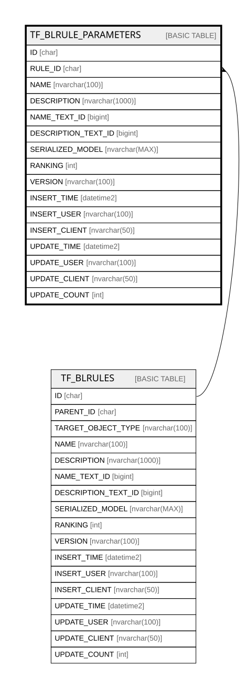

# TF_BLRULE_PARAMETERS

## Columns

| Name | Type | Default | Nullable | Parents | Comment |
| ---- | ---- | ------- | -------- | ------- | ------- |
| ID | char |  | false |  |  |
| RULE_ID | char |  | false | [TF_BLRULES](TF_BLRULES.md) |  |
| NAME | nvarchar(100) |  | false |  |  |
| DESCRIPTION | nvarchar(1000) |  | true |  |  |
| NAME_TEXT_ID | bigint |  | true |  |  |
| DESCRIPTION_TEXT_ID | bigint |  | true |  |  |
| SERIALIZED_MODEL | nvarchar(MAX) |  | true |  |  |
| RANKING | int | ((0)) | false |  |  |
| VERSION | nvarchar(100) | (N'1.0.0') | false |  |  |
| INSERT_TIME | datetime2 | (sysutcdatetime()) | false |  |  |
| INSERT_USER | nvarchar(100) | (N'MAIN') | false |  |  |
| INSERT_CLIENT | nvarchar(50) | (N'localhost') | false |  |  |
| UPDATE_TIME | datetime2 | (sysutcdatetime()) | false |  |  |
| UPDATE_USER | nvarchar(100) | (N'MAIN') | false |  |  |
| UPDATE_CLIENT | nvarchar(50) | (N'localhost') | false |  |  |
| UPDATE_COUNT | int | ((0)) | false |  |  |

## Constraints

| Name | Type | Definition |
| ---- | ---- | ---------- |
| PK_BLRULE_PARAMETERS | PRIMARY KEY | CLUSTERED, unique, part of a PRIMARY KEY constraint, [ ID ] |
| FK_BLRULE_PARAMETERS_RULES | FOREIGN KEY | FOREIGN KEY(RULE_ID) REFERENCES TF_BLRULES(ID) ON UPDATE NO_ACTION ON DELETE CASCADE |

## Indexes

| Name | Definition |
| ---- | ---------- |
| PK_BLRULE_PARAMETERS | CLUSTERED, unique, part of a PRIMARY KEY constraint, [ ID ] |

## Relations

---

> Generated by [tbls](https://github.com/k1LoW/tbls)
