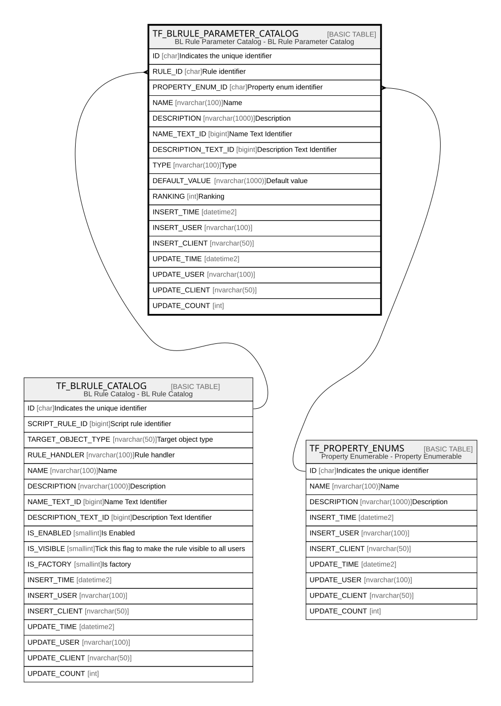

# TF_BLRULE_PARAMETER_CATALOG

## Description

BL Rule Parameter Catalog - BL Rule Parameter Catalog  

## Columns

| Name | Type | Default | Nullable | Parents | Comment |
| ---- | ---- | ------- | -------- | ------- | ------- |
| ID | char |  | false |  | Indicates the unique identifier |
| RULE_ID | char |  | false | [TF_BLRULE_CATALOG](TF_BLRULE_CATALOG.md) | Rule identifier |
| PROPERTY_ENUM_ID | char |  | true | [TF_PROPERTY_ENUMS](TF_PROPERTY_ENUMS.md) | Property enum identifier |
| NAME | nvarchar(100) |  | false |  | Name |
| DESCRIPTION | nvarchar(1000) |  | true |  | Description |
| NAME_TEXT_ID | bigint |  | true |  | Name Text Identifier |
| DESCRIPTION_TEXT_ID | bigint |  | true |  | Description Text Identifier |
| TYPE | nvarchar(100) |  | false |  | Type |
| DEFAULT_VALUE | nvarchar(1000) |  | true |  | Default value |
| RANKING | int |  | false |  | Ranking |
| INSERT_TIME | datetime2 | (sysutcdatetime()) | false |  |  |
| INSERT_USER | nvarchar(100) | (N'MAIN') | false |  |  |
| INSERT_CLIENT | nvarchar(50) | (N'localhost') | false |  |  |
| UPDATE_TIME | datetime2 | (sysutcdatetime()) | false |  |  |
| UPDATE_USER | nvarchar(100) | (N'MAIN') | false |  |  |
| UPDATE_CLIENT | nvarchar(50) | (N'localhost') | false |  |  |
| UPDATE_COUNT | int | ((0)) | false |  |  |

## Constraints

| Name | Type | Definition |
| ---- | ---- | ---------- |
| PK_BLRULE_PARAMETER_CATALOG | PRIMARY KEY | CLUSTERED, unique, part of a PRIMARY KEY constraint, [ ID ] |
| UQ_BLRULE_PARAMETER_CATALOG | UNIQUE | NONCLUSTERED, unique, part of a UNIQUE constraint, [ RULE_ID, NAME ] |
| FK_BLRULE_PARAMETERS_CATALOG | FOREIGN KEY | FOREIGN KEY(RULE_ID) REFERENCES TF_BLRULE_CATALOG(ID) ON UPDATE NO_ACTION ON DELETE CASCADE |
| FK_BLRULE_PARAMETERS_ENUMS | FOREIGN KEY | FOREIGN KEY(PROPERTY_ENUM_ID) REFERENCES TF_PROPERTY_ENUMS(ID) ON UPDATE NO_ACTION ON DELETE NO_ACTION |

## Indexes

| Name | Definition |
| ---- | ---------- |
| PK_BLRULE_PARAMETER_CATALOG | CLUSTERED, unique, part of a PRIMARY KEY constraint, [ ID ] |
| UQ_BLRULE_PARAMETER_CATALOG | NONCLUSTERED, unique, part of a UNIQUE constraint, [ RULE_ID, NAME ] |

## Relations

---

> Generated by [tbls](https://github.com/k1LoW/tbls)
