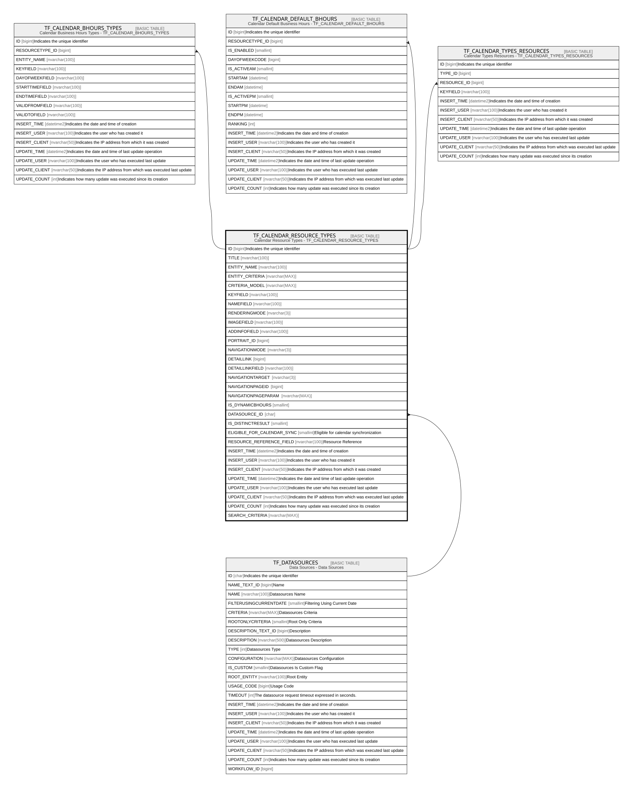

# TF_CALENDAR_RESOURCE_TYPES

## Description

Calendar Resource Types - TF_CALENDAR_RESOURCE_TYPES  

## Columns

| Name | Type | Default | Nullable | Children | Parents | Comment |
| ---- | ---- | ------- | -------- | -------- | ------- | ------- |
| ID | bigint |  | false | [TF_CALENDAR_BHOURS_TYPES](TF_CALENDAR_BHOURS_TYPES.md) [TF_CALENDAR_DEFAULT_BHOURS](TF_CALENDAR_DEFAULT_BHOURS.md) [TF_CALENDAR_TYPES_RESOURCES](TF_CALENDAR_TYPES_RESOURCES.md) |  | Indicates the unique identifier |
| TITLE | nvarchar(100) |  | false |  |  |  |
| ENTITY_NAME | nvarchar(100) |  | false |  |  |  |
| ENTITY_CRITERIA | nvarchar(MAX) |  | true |  |  |  |
| CRITERIA_MODEL | nvarchar(MAX) |  | true |  |  |  |
| KEYFIELD | nvarchar(100) |  | false |  |  |  |
| NAMEFIELD | nvarchar(100) |  | false |  |  |  |
| RENDERINGMODE | nvarchar(3) |  | true |  |  |  |
| IMAGEFIELD | nvarchar(100) |  | true |  |  |  |
| ADDINFOFIELD | nvarchar(100) |  | true |  |  |  |
| PORTRAIT_ID | bigint |  | true |  |  |  |
| NAVIGATIONMODE | nvarchar(3) | (N'LIN') | true |  |  |  |
| DETAILLINK | bigint |  | true |  |  |  |
| DETAILLINKFIELD | nvarchar(100) |  | true |  |  |  |
| NAVIGATIONTARGET | nvarchar(3) | (N'FUP') | true |  |  |  |
| NAVIGATIONPAGEID | bigint |  | true |  |  |  |
| NAVIGATIONPAGEPARAM | nvarchar(MAX) |  | true |  |  |  |
| IS_DYNAMICBHOURS | smallint | ((0)) | true |  |  |  |
| DATASOURCE_ID | char |  | false |  | [TF_DATASOURCES](TF_DATASOURCES.md) |  |
| IS_DISTINCTRESULT | smallint | ((1)) | true |  |  |  |
| ELIGIBLE_FOR_CALENDAR_SYNC | smallint | ((0)) | true |  |  | Eligible for calendar synchronization |
| RESOURCE_REFERENCE_FIELD | nvarchar(100) |  | true |  |  | Resource Reference |
| INSERT_TIME | datetime2 | (sysutcdatetime()) | false |  |  | Indicates the date and time of creation |
| INSERT_USER | nvarchar(100) | (N'MAIN') | false |  |  | Indicates the user who has created it |
| INSERT_CLIENT | nvarchar(50) | (N'localhost') | false |  |  | Indicates the IP address from which it was created |
| UPDATE_TIME | datetime2 | (sysutcdatetime()) | false |  |  | Indicates the date and time of last update operation |
| UPDATE_USER | nvarchar(100) | (N'MAIN') | false |  |  | Indicates the user who has executed last update |
| UPDATE_CLIENT | nvarchar(50) | (N'localhost') | false |  |  | Indicates the IP address from which was executed last update |
| UPDATE_COUNT | int | ((0)) | false |  |  | Indicates how many update was executed since its creation |
| SEARCH_CRITERIA | nvarchar(MAX) |  | true |  |  |  |

## Constraints

| Name | Type | Definition |
| ---- | ---- | ---------- |
| PK_TFCALENDAR_RESOURCE_TYPES | PRIMARY KEY | CLUSTERED, unique, part of a PRIMARY KEY constraint, [ ID ] |
| FK_TFCALENDARRES_DATASOURCES | FOREIGN KEY | FOREIGN KEY(DATASOURCE_ID) REFERENCES TF_DATASOURCES(ID) ON UPDATE NO_ACTION ON DELETE NO_ACTION |

## Indexes

| Name | Definition |
| ---- | ---------- |
| PK_TFCALENDAR_RESOURCE_TYPES | CLUSTERED, unique, part of a PRIMARY KEY constraint, [ ID ] |

## Relations

---

> Generated by [tbls](https://github.com/k1LoW/tbls)
