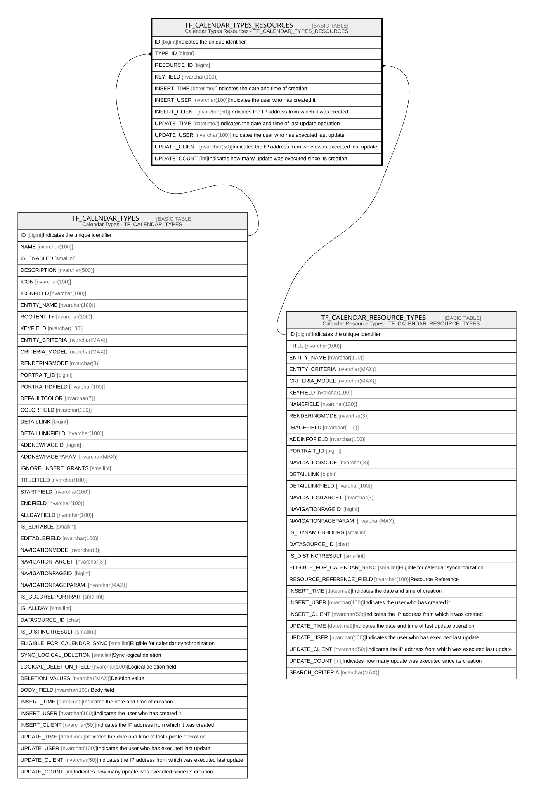

# TF_CALENDAR_TYPES_RESOURCES

## Description

Calendar Types Resources - TF_CALENDAR_TYPES_RESOURCES  

## Columns

| Name | Type | Default | Nullable | Parents | Comment |
| ---- | ---- | ------- | -------- | ------- | ------- |
| ID | bigint |  | false |  | Indicates the unique identifier |
| TYPE_ID | bigint |  | false | [TF_CALENDAR_TYPES](TF_CALENDAR_TYPES.md) |  |
| RESOURCE_ID | bigint |  | false | [TF_CALENDAR_RESOURCE_TYPES](TF_CALENDAR_RESOURCE_TYPES.md) |  |
| KEYFIELD | nvarchar(100) |  | false |  |  |
| INSERT_TIME | datetime2 | (sysutcdatetime()) | false |  | Indicates the date and time of creation |
| INSERT_USER | nvarchar(100) | (N'MAIN') | false |  | Indicates the user who has created it |
| INSERT_CLIENT | nvarchar(50) | (N'localhost') | false |  | Indicates the IP address from which it was created |
| UPDATE_TIME | datetime2 | (sysutcdatetime()) | false |  | Indicates the date and time of last update operation |
| UPDATE_USER | nvarchar(100) | (N'MAIN') | false |  | Indicates the user who has executed last update |
| UPDATE_CLIENT | nvarchar(50) | (N'localhost') | false |  | Indicates the IP address from which was executed last update |
| UPDATE_COUNT | int | ((0)) | false |  | Indicates how many update was executed since its creation |

## Constraints

| Name | Type | Definition |
| ---- | ---- | ---------- |
| PK_TFCALENDAR_TYPESRESOURCES | PRIMARY KEY | CLUSTERED, unique, part of a PRIMARY KEY constraint, [ ID ] |
| UQ_TYPES_RESOURCES | UNIQUE | NONCLUSTERED, unique, part of a UNIQUE constraint, [ TYPE_ID, RESOURCE_ID ] |
| FK_TFCALENDARRES_TYPESRES | FOREIGN KEY | FOREIGN KEY(RESOURCE_ID) REFERENCES TF_CALENDAR_RESOURCE_TYPES(ID) ON UPDATE NO_ACTION ON DELETE NO_ACTION |
| FK_TFCALENDARTYPES_TYPESRES | FOREIGN KEY | FOREIGN KEY(TYPE_ID) REFERENCES TF_CALENDAR_TYPES(ID) ON UPDATE NO_ACTION ON DELETE NO_ACTION |

## Indexes

| Name | Definition |
| ---- | ---------- |
| PK_TFCALENDAR_TYPESRESOURCES | CLUSTERED, unique, part of a PRIMARY KEY constraint, [ ID ] |
| UQ_TYPES_RESOURCES | NONCLUSTERED, unique, part of a UNIQUE constraint, [ TYPE_ID, RESOURCE_ID ] |

## Relations

---

> Generated by [tbls](https://github.com/k1LoW/tbls)
