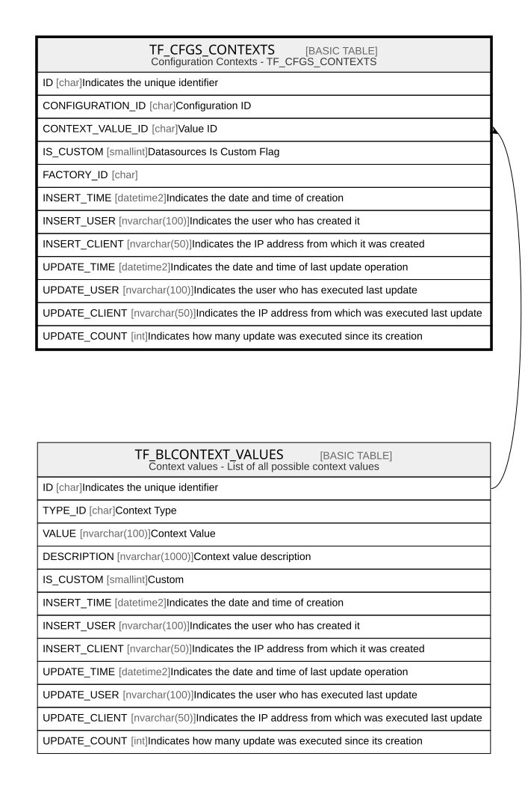

# TF_CFGS_CONTEXTS

## Description

Configuration Contexts - TF_CFGS_CONTEXTS  

## Columns

| Name | Type | Default | Nullable | Parents | Comment |
| ---- | ---- | ------- | -------- | ------- | ------- |
| ID | char |  | false |  | Indicates the unique identifier |
| CONFIGURATION_ID | char |  | false |  | Configuration ID |
| CONTEXT_VALUE_ID | char |  | false | [TF_BLCONTEXT_VALUES](TF_BLCONTEXT_VALUES.md) | Value ID |
| IS_CUSTOM | smallint |  | false |  | Datasources Is Custom Flag |
| FACTORY_ID | char |  | true |  |  |
| INSERT_TIME | datetime2 | (sysutcdatetime()) | false |  | Indicates the date and time of creation |
| INSERT_USER | nvarchar(100) | (N'MAIN') | false |  | Indicates the user who has created it |
| INSERT_CLIENT | nvarchar(50) | (N'localhost') | false |  | Indicates the IP address from which it was created |
| UPDATE_TIME | datetime2 | (sysutcdatetime()) | false |  | Indicates the date and time of last update operation |
| UPDATE_USER | nvarchar(100) | (N'MAIN') | false |  | Indicates the user who has executed last update |
| UPDATE_CLIENT | nvarchar(50) | (N'localhost') | false |  | Indicates the IP address from which was executed last update |
| UPDATE_COUNT | int | ((0)) | false |  | Indicates how many update was executed since its creation |

## Constraints

| Name | Type | Definition |
| ---- | ---- | ---------- |
| PK_CFGS_CONTEXTS | PRIMARY KEY | CLUSTERED, unique, part of a PRIMARY KEY constraint, [ ID ] |
| UQ_CFGS_CONTEXTS | UNIQUE | NONCLUSTERED, unique, part of a UNIQUE constraint, [ CONFIGURATION_ID, CONTEXT_VALUE_ID, IS_CUSTOM ] |
| FK_CFGSCXTS_CXTVALUES | FOREIGN KEY | FOREIGN KEY(CONTEXT_VALUE_ID) REFERENCES TF_BLCONTEXT_VALUES(ID) ON UPDATE NO_ACTION ON DELETE NO_ACTION |

## Indexes

| Name | Definition |
| ---- | ---------- |
| PK_CFGS_CONTEXTS | CLUSTERED, unique, part of a PRIMARY KEY constraint, [ ID ] |
| UQ_CFGS_CONTEXTS | NONCLUSTERED, unique, part of a UNIQUE constraint, [ CONFIGURATION_ID, CONTEXT_VALUE_ID, IS_CUSTOM ] |
| IDX_CFGS_CNTXTS_CUSTOM_FACTORY | NONCLUSTERED, [ FACTORY_ID, IS_CUSTOM ] |

## Relations

---

> Generated by [tbls](https://github.com/k1LoW/tbls)
