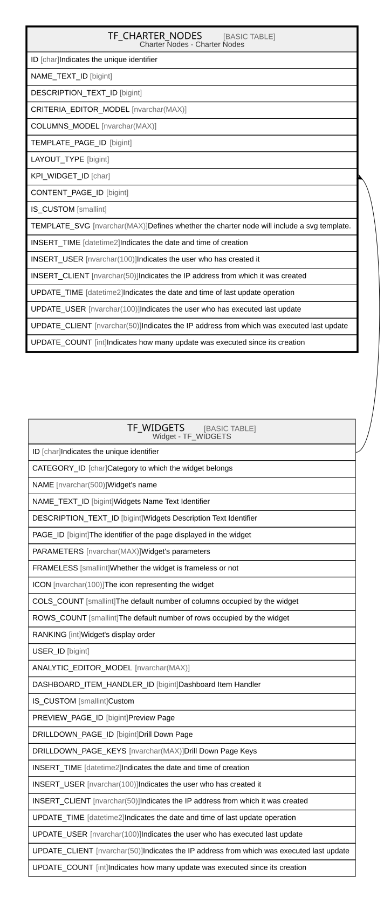

# TF_CHARTER_NODES

## Description

Charter Nodes - Charter Nodes  

## Columns

| Name | Type | Default | Nullable | Parents | Comment |
| ---- | ---- | ------- | -------- | ------- | ------- |
| ID | char |  | false |  | Indicates the unique identifier |
| NAME_TEXT_ID | bigint |  | false |  |  |
| DESCRIPTION_TEXT_ID | bigint |  | true |  |  |
| CRITERIA_EDITOR_MODEL | nvarchar(MAX) |  | true |  |  |
| COLUMNS_MODEL | nvarchar(MAX) |  | true |  |  |
| TEMPLATE_PAGE_ID | bigint |  | true |  |  |
| LAYOUT_TYPE | bigint |  | false |  |  |
| KPI_WIDGET_ID | char |  | true | [TF_WIDGETS](TF_WIDGETS.md) |  |
| CONTENT_PAGE_ID | bigint |  | false |  |  |
| IS_CUSTOM | smallint | ((0)) | false |  |  |
| TEMPLATE_SVG | nvarchar(MAX) |  | true |  | Defines whether the charter node will include a svg template. |
| INSERT_TIME | datetime2 | (sysutcdatetime()) | false |  | Indicates the date and time of creation |
| INSERT_USER | nvarchar(100) | (N'MAIN') | false |  | Indicates the user who has created it |
| INSERT_CLIENT | nvarchar(50) | (N'localhost') | false |  | Indicates the IP address from which it was created |
| UPDATE_TIME | datetime2 | (sysutcdatetime()) | false |  | Indicates the date and time of last update operation |
| UPDATE_USER | nvarchar(100) | (N'MAIN') | false |  | Indicates the user who has executed last update |
| UPDATE_CLIENT | nvarchar(50) | (N'localhost') | false |  | Indicates the IP address from which was executed last update |
| UPDATE_COUNT | int | ((0)) | false |  | Indicates how many update was executed since its creation |

## Constraints

| Name | Type | Definition |
| ---- | ---- | ---------- |
| PK_CHARTER_NODES | PRIMARY KEY | CLUSTERED, unique, part of a PRIMARY KEY constraint, [ ID ] |
| UQ_CHARTER_NODES | UNIQUE | NONCLUSTERED, unique, part of a UNIQUE constraint, [ CONTENT_PAGE_ID ] |
| FK_CHARTERNODES_WIDGETS | FOREIGN KEY | FOREIGN KEY(KPI_WIDGET_ID) REFERENCES TF_WIDGETS(ID) ON UPDATE NO_ACTION ON DELETE NO_ACTION |

## Indexes

| Name | Definition |
| ---- | ---------- |
| PK_CHARTER_NODES | CLUSTERED, unique, part of a PRIMARY KEY constraint, [ ID ] |
| UQ_CHARTER_NODES | NONCLUSTERED, unique, part of a UNIQUE constraint, [ CONTENT_PAGE_ID ] |

## Relations

---

> Generated by [tbls](https://github.com/k1LoW/tbls)
