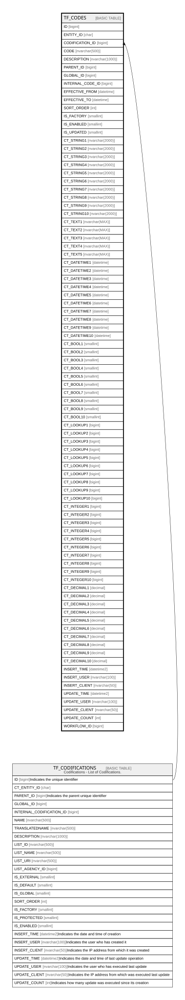

# TF_CODES

## Columns

| Name | Type | Default | Nullable | Parents | Comment |
| ---- | ---- | ------- | -------- | ------- | ------- |
| ID | bigint |  | false |  |  |
| ENTITY_ID | char |  | false |  |  |
| CODIFICATION_ID | bigint |  | true | [TF_CODIFICATIONS](TF_CODIFICATIONS.md) |  |
| CODE | nvarchar(500) |  | false |  |  |
| DESCRIPTION | nvarchar(1000) |  | true |  |  |
| PARENT_ID | bigint |  | true |  |  |
| GLOBAL_ID | bigint |  | true |  |  |
| INTERNAL_CODE_ID | bigint |  | true |  |  |
| EFFECTIVE_FROM | datetime |  | true |  |  |
| EFFECTIVE_TO | datetime |  | true |  |  |
| SORT_ORDER | int | ((0)) | false |  |  |
| IS_FACTORY | smallint | ((0)) | false |  |  |
| IS_ENABLED | smallint | ((1)) | false |  |  |
| IS_UPDATED | smallint | ((0)) | false |  |  |
| CT_STRING1 | nvarchar(2000) |  | true |  |  |
| CT_STRING2 | nvarchar(2000) |  | true |  |  |
| CT_STRING3 | nvarchar(2000) |  | true |  |  |
| CT_STRING4 | nvarchar(2000) |  | true |  |  |
| CT_STRING5 | nvarchar(2000) |  | true |  |  |
| CT_STRING6 | nvarchar(2000) |  | true |  |  |
| CT_STRING7 | nvarchar(2000) |  | true |  |  |
| CT_STRING8 | nvarchar(2000) |  | true |  |  |
| CT_STRING9 | nvarchar(2000) |  | true |  |  |
| CT_STRING10 | nvarchar(2000) |  | true |  |  |
| CT_TEXT1 | nvarchar(MAX) |  | true |  |  |
| CT_TEXT2 | nvarchar(MAX) |  | true |  |  |
| CT_TEXT3 | nvarchar(MAX) |  | true |  |  |
| CT_TEXT4 | nvarchar(MAX) |  | true |  |  |
| CT_TEXT5 | nvarchar(MAX) |  | true |  |  |
| CT_DATETIME1 | datetime |  | true |  |  |
| CT_DATETIME2 | datetime |  | true |  |  |
| CT_DATETIME3 | datetime |  | true |  |  |
| CT_DATETIME4 | datetime |  | true |  |  |
| CT_DATETIME5 | datetime |  | true |  |  |
| CT_DATETIME6 | datetime |  | true |  |  |
| CT_DATETIME7 | datetime |  | true |  |  |
| CT_DATETIME8 | datetime |  | true |  |  |
| CT_DATETIME9 | datetime |  | true |  |  |
| CT_DATETIME10 | datetime |  | true |  |  |
| CT_BOOL1 | smallint |  | true |  |  |
| CT_BOOL2 | smallint |  | true |  |  |
| CT_BOOL3 | smallint |  | true |  |  |
| CT_BOOL4 | smallint |  | true |  |  |
| CT_BOOL5 | smallint |  | true |  |  |
| CT_BOOL6 | smallint |  | true |  |  |
| CT_BOOL7 | smallint |  | true |  |  |
| CT_BOOL8 | smallint |  | true |  |  |
| CT_BOOL9 | smallint |  | true |  |  |
| CT_BOOL10 | smallint |  | true |  |  |
| CT_LOOKUP1 | bigint |  | true |  |  |
| CT_LOOKUP2 | bigint |  | true |  |  |
| CT_LOOKUP3 | bigint |  | true |  |  |
| CT_LOOKUP4 | bigint |  | true |  |  |
| CT_LOOKUP5 | bigint |  | true |  |  |
| CT_LOOKUP6 | bigint |  | true |  |  |
| CT_LOOKUP7 | bigint |  | true |  |  |
| CT_LOOKUP8 | bigint |  | true |  |  |
| CT_LOOKUP9 | bigint |  | true |  |  |
| CT_LOOKUP10 | bigint |  | true |  |  |
| CT_INTEGER1 | bigint |  | true |  |  |
| CT_INTEGER2 | bigint |  | true |  |  |
| CT_INTEGER3 | bigint |  | true |  |  |
| CT_INTEGER4 | bigint |  | true |  |  |
| CT_INTEGER5 | bigint |  | true |  |  |
| CT_INTEGER6 | bigint |  | true |  |  |
| CT_INTEGER7 | bigint |  | true |  |  |
| CT_INTEGER8 | bigint |  | true |  |  |
| CT_INTEGER9 | bigint |  | true |  |  |
| CT_INTEGER10 | bigint |  | true |  |  |
| CT_DECIMAL1 | decimal |  | true |  |  |
| CT_DECIMAL2 | decimal |  | true |  |  |
| CT_DECIMAL3 | decimal |  | true |  |  |
| CT_DECIMAL4 | decimal |  | true |  |  |
| CT_DECIMAL5 | decimal |  | true |  |  |
| CT_DECIMAL6 | decimal |  | true |  |  |
| CT_DECIMAL7 | decimal |  | true |  |  |
| CT_DECIMAL8 | decimal |  | true |  |  |
| CT_DECIMAL9 | decimal |  | true |  |  |
| CT_DECIMAL10 | decimal |  | true |  |  |
| INSERT_TIME | datetime2 | (sysutcdatetime()) | false |  |  |
| INSERT_USER | nvarchar(100) | (N'MAIN') | false |  |  |
| INSERT_CLIENT | nvarchar(50) | (N'localhost') | false |  |  |
| UPDATE_TIME | datetime2 | (sysutcdatetime()) | false |  |  |
| UPDATE_USER | nvarchar(100) | (N'MAIN') | false |  |  |
| UPDATE_CLIENT | nvarchar(50) | (N'localhost') | false |  |  |
| UPDATE_COUNT | int | ((0)) | false |  |  |
| WORKFLOW_ID | bigint |  | true |  |  |

## Constraints

| Name | Type | Definition |
| ---- | ---- | ---------- |
| PK_CODES | PRIMARY KEY | CLUSTERED, unique, part of a PRIMARY KEY constraint, [ ID ] |
| UQ_CODES | UNIQUE | NONCLUSTERED, unique, part of a UNIQUE constraint, [ ENTITY_ID, CODIFICATION_ID, CODE ] |
| FK_CODES_CODIFICATIONS | FOREIGN KEY | FOREIGN KEY(CODIFICATION_ID) REFERENCES TF_CODIFICATIONS(ID) ON UPDATE NO_ACTION ON DELETE NO_ACTION |

## Indexes

| Name | Definition |
| ---- | ---------- |
| PK_CODES | CLUSTERED, unique, part of a PRIMARY KEY constraint, [ ID ] |
| UQ_CODES | NONCLUSTERED, unique, part of a UNIQUE constraint, [ ENTITY_ID, CODIFICATION_ID, CODE ] |
| IDX_CODES_CODIFICATION | NONCLUSTERED, [ CODIFICATION_ID ] |
| TF_CODES_LOOKUP1 | NONCLUSTERED, [ CT_LOOKUP1 ] |
| TF_CODES_LOOKUP2 | NONCLUSTERED, [ CT_LOOKUP2 ] |
| TF_CODES_LOOKUP3 | NONCLUSTERED, [ CT_LOOKUP3 ] |
| TF_CODES_LOOKUP4 | NONCLUSTERED, [ CT_LOOKUP4 ] |
| TF_CODES_LOOKUP5 | NONCLUSTERED, [ CT_LOOKUP5 ] |
| TF_CODES_LOOKUP6 | NONCLUSTERED, [ CT_LOOKUP6 ] |
| TF_CODES_LOOKUP7 | NONCLUSTERED, [ CT_LOOKUP7 ] |
| TF_CODES_LOOKUP8 | NONCLUSTERED, [ CT_LOOKUP8 ] |
| TF_CODES_LOOKUP9 | NONCLUSTERED, [ CT_LOOKUP9 ] |
| TF_CODES_LOOKUP10 | NONCLUSTERED, [ CT_LOOKUP10 ] |
| IDX_CODES_DECIMALS | NONCLUSTERED, [ ENTITY_ID, CT_DECIMAL1, CT_DECIMAL2 ] |

## Triggers

| Name | Definition |
| ---- | ---------- |
| AUDIT_TF_CODES | -- Talentia Software - All right reserved -- Type: TRIGGER                  Name: AUDIT_TF_CODES -- Date: 09-04-2026 07:27:59 (UTC) --  -- ChangeLogId: 00000000-0000-0000-0000-000000000000 -- ChangeSetId: 1b02963b-55cf-490f-9461-86919fac3d78 -- Original file name: C:\repos\Talentia-Software\hcm-core/DB/ProductDB/EDM\Schema\Triggers\AUDIT_TF_CODES.xml   CREATE TRIGGER AUDIT_TF_CODES     ON  TF_CODES    AFTER INSERT,DELETE,UPDATE AS  BEGIN 	-- SET NOCOUNT ON added to prevent extra result sets from 	-- interfering with SELECT statements. 	SET NOCOUNT ON;      -- Insert statements for trigger here  	DECLARE @TableName varchar(100) 	DECLARE @LinkedEntityID varchar(36)  	DECLARE	@DefAuditPolicyStatus bit 	DECLARE @OperationType smallint -- Insert 1, Update 2, Delete 3 	DECLARE @ColumnKey varchar(100) 	DECLARE @PrimaryKey int 	DECLARE @Fields nvarchar(max) 	DECLARE @PrimaryKeyFieldName nvarchar(100) 	DECLARE @UpdateDate varchar(21)  	DECLARE @EntityIdColumn varchar(100)  	DECLARE @ColumnName nvarchar(max) 	DECLARE @EntityName nvarchar(max) 	DECLARE @EntityID char(36) 	DECLARE @ColumnID char(36) 	DECLARE @FieldID char(36) 	DECLARE @FieldName nvarchar(max) 	DECLARE @FieldType smallint  	DECLARE @ContextInfo varchar(128) 	DECLARE @ClientInfo nvarchar(max) 	DECLARE @DirectSQL bit = 0  	DECLARE @SQL nvarchar(max) 	DECLARE @SQL1 nvarchar(max) 	DECLARE @SQL2 nvarchar(max) 	DECLARE @SQL3 nvarchar(max) 	DECLARE @SQL4 nvarchar(max) 	DECLARE @SQL5 nvarchar(max) 	DECLARE @SQL6 nvarchar(max) 	DECLARE @SQLWorkTable nvarchar(max) 	DECLARE @SQLWorkTableRef nvarchar(max) 	DECLARE @SQLStart nvarchar(max) 	DECLARE @SQLStartInsertTo nvarchar(max) 	DECLARE @SQLStartSelect nvarchar(max) 	DECLARE @SQLPrimaryKeyField nvarchar(max) 	DECLARE @SQLNewValueFields nvarchar(max) 	DECLARE @SQLOldValueFields nvarchar(max) 	DECLARE @SQLInsertUser nvarchar(max) 	DECLARE @SQLInsertClient  nvarchar(max) 	DECLARE @SQLAuditFields nvarchar(max) 	DECLARE @SQLAuditFieldsInserted nvarchar(max) 	DECLARE @SQLAuditFieldsDeleted nvarchar(max) 	DECLARE @req nVARCHAR(MAX)   	SET @Tablename = 'TF_CODES'  	--IF AUDITED IS ENABLE 	SELECT @DefAuditPolicyStatus = ACTIVE FROM TF_AUDIT_SWITCH WHERE [ID]=1 	if (@DefAuditPolicyStatus=1)  	BEGIN  		DECLARE @EntityAuditedFields as int = (SELECT COUNT(*) FROM TF_AUDITED_COLUMNS WHERE ENTITY_ID IN 		( 			SELECT DISTINCT ENTITY_ID FROM inserted  			UNION 			SELECT DISTINCT ENTITY_ID FROM deleted 		) 		AND IS_UNDER_AUDIT = 1) 		 		IF (@EntityAuditedFields = 0) 		RETURN;      		--Get Operation Type 		if exists (SELECT * FROM inserted) 			if exists (SELECT * FROM deleted) 				SELECT @OperationType = 2 --Update 			else 				SELECT @OperationType = 1 --Insert 		else 			SELECT @OperationType = 3 --Delete  		--GET HasEntityId 		SET @EntityIdColumn = 'ENTITY_ID'  		--GET THE SAME DATE FOR ALL 		SELECT @UpdateDate = convert(varchar(8), getutcdate(), 112) + ' ' + convert(varchar(12), getutcdate(), 114)  		--Get Primary field name 		SELECT @PrimaryKeyFieldName = 'ID'  		--get Context Info 		IF CONTEXT_INFO() is null 			BEGIN 				SELECT @ContextInfo= '' 				SET @DirectSQL = 1 			END 		ELSE 			BEGIN 				-- Context Info should contain the Applicative UserName 				SELECT @ContextInfo = REPLACE(CAST(CONTEXT_INFO() as varchar(128)), NCHAR(0) COLLATE Latin1_General_100_BIN2, N''); 				SET @DirectSQL = 0 			END 	 		--Get Client Info 		SET @ClientInfo = SYSTEM_USER  		-- TEMPORARY TABLES 		SELECT * INTO #ins FROM inserted 		SELECT * INTO #del FROM deleted  		-- Start of the SQL request 		SET @SQLStart = 'INSERT INTO TF_AUDIT 				(  [TABLE_NAME], [ENTITY_NAME], [ENTITY_ID], [COLUMN_NAME], [FIELD_NAME], [FIELD_ID], [FIELD_TYPE] 				    ,[PRIMARY_KEY], [OPERATION_TYPE] 					,[LONG_VALUE],[DECIMAL_VALUE],[DATETIME_VALUE],[STRING_VALUE],[VARBINARY_VALUE] 					,[OLD_LONG_VALUE],[OLD_DECIMAL_VALUE],[OLD_DATETIME_VALUE],[OLD_STRING_VALUE],[OLD_VARBINARY_VALUE] 					,[INSERT_USER],[INSERT_CLIENT],[INSERT_TIME],[TRANSACTION_ID] 				)  				SELECT AUDITED_COLUMNS.[TABLE_NAME], AUDITED_COLUMNS.[ENTITY_NAME], AUDITED_COLUMNS.[ENTITY_ID], AUDITED_COLUMNS.[COLUMN_NAME], AUDITED_COLUMNS.[FIELD_NAME], AUDITED_COLUMNS.[FIELD_ID], AUDITED_COLUMNS.[FIELD_TYPE]' 		 		SET @SQLStartInsertTo = 'INSERT INTO TF_AUDIT 				(  [TABLE_NAME], [ENTITY_NAME], [ENTITY_ID], [COLUMN_NAME], [FIELD_NAME], [FIELD_ID], [FIELD_TYPE] 				    ,[PRIMARY_KEY], [OPERATION_TYPE] 					,[LONG_VALUE],[DECIMAL_VALUE],[DATETIME_VALUE],[STRING_VALUE],[VARBINARY_VALUE] 					,[OLD_LONG_VALUE],[OLD_DECIMAL_VALUE],[OLD_DATETIME_VALUE],[OLD_STRING_VALUE],[OLD_VARBINARY_VALUE] 					,[INSERT_USER],[INSERT_CLIENT],[INSERT_TIME],[TRANSACTION_ID] 				)  				' 		SET @SQLStartSelect = ' 				SELECT AUDITED_COLUMNS.[TABLE_NAME], AUDITED_COLUMNS.[ENTITY_NAME], AUDITED_COLUMNS.[ENTITY_ID], AUDITED_COLUMNS.[COLUMN_NAME], AUDITED_COLUMNS.[FIELD_NAME], AUDITED_COLUMNS.[FIELD_ID], AUDITED_COLUMNS.[FIELD_TYPE] 				' 	 		-- INSERTED OPERATION TYPE 		IF(@OperationType = 1) 		BEGIN 			SET @SQLWorkTable = '#ins' 			SET @SQLWorkTableRef = @SQLWOrkTable + '.' 			SET @SQLPrimaryKeyField = @SQLWorkTableRef + @PrimaryKeyFieldName 			SET @SQLInsertUser = '''' + Replace(@ContextInfo,'''','''''') + ''''  			SET @SQLInsertClient =  '''' + @ClientInfo + '''' 			SET @SQL1 = @SQLStartSelect + ' ,' + @SQLPrimaryKeyField + ', ' + convert(nvarchar(max), @OperationType)  			SET @SQL2 = ',NULL, NULL, NULL, NULL, NULL' +  			',' + @SQLInsertUser + ', ' + @SQLInsertClient + ', '''+ @UpdateDate + ''', CURRENT_TRANSACTION_ID() 			FROM TF_AUDITED_COLUMNS AUDITED_COLUMNS INNER JOIN ' + @SQLWorkTable + ' ON AUDITED_COLUMNS.TABLE_NAME = ''' + @Tablename + ''' AND IS_KEY = 0 AND AUDITED_COLUMNS.COLUMN_NAME = ''' 			SET @SQL3 = ''' AND AUDITED_COLUMNS.ENTITY_ID = ''' 			SET @SQL4 = ''' WHERE ' + @SQLWorkTableRef + @EntityIdColumn + ' = AUDITED_COLUMNS.ENTITY_ID 			' 			SELECT @req = Coalesce( @req +  ' UNION ', '') + @SQL1 +' 			' +  				CASE WHEN Field_type =  2  THEN ', ' + @SQLWorkTableRef + COLUMN_NAME ELSE ', NULL' END + 				CASE WHEN Field_type =  3  THEN ', ' + @SQLWorkTableRef + COLUMN_NAME ELSE ', NULL' END + 				CASE WHEN Field_type =  4  THEN ', ' + @SQLWorkTableRef + COLUMN_NAME ELSE ', NULL' END + 				CASE WHEN Field_type =  1  THEN ', ' + @SQLWorkTableRef + COLUMN_NAME ELSE ', NULL' END + 				CASE WHEN Field_type =  5  THEN ', ' + @SQLWorkTableRef + COLUMN_NAME ELSE ', NULL' END + 			@SQL2 + COLUMN_NAME + @SQL3 + ENTITY_ID + @SQL4  			FROM   TF_AUDITED_COLUMNS 			WHERE  TABLE_NAME = @Tablename 							AND IS_UNDER_AUDIT = 1 			ORDER BY COLUMN_NAME  			SET @SQL = @SQLStartInsertTo + @req  			EXEC ( @Sql )	 			    		END 		-- UPDATED OPERATION TYPE 		IF(@OperationType = 2) 		BEGIN 			SET @SQLWorkTable = '#ins' 			SET @SQLWorkTableRef = @SQLWOrkTable + '.' 			SET @SQLPrimaryKeyField = @SQLWorkTableRef + @PrimaryKeyFieldName 			SET @SQLInsertUser = '''' + Replace(@ContextInfo,'''','''''') + ''''  			SET @SQLInsertClient =  '''' + @ClientInfo + '''' 			SET @SQL1 = @SQLStartSelect + ' ,' + @SQLPrimaryKeyField + ', ' + convert(nvarchar(max), @OperationType)  			SET @SQL2 = ', ' + @SQLInsertUser + ', ' +@SQLInsertClient + ', '''+ @UpdateDate + ''', CURRENT_TRANSACTION_ID() 			FROM TF_AUDITED_COLUMNS AUDITED_COLUMNS INNER JOIN #INS ON AUDITED_COLUMNS.TABLE_NAME = ''' + @Tablename + ''' AND IS_KEY = 0 AND AUDITED_COLUMNS.COLUMN_NAME = ''' 			SET @SQL3 = ''' AND AUDITED_COLUMNS.ENTITY_ID = ''' 			SET @SQL4 = '''  			INNER JOIN #DEL on ' + @SQLWorkTableRef + @PrimaryKeyFieldName + ' = #DEL.' + @PrimaryKeyFieldName + ' AND ' + @SQLWorkTableRef 			SET @SQL5 = ' <> #DEL.' 			SET @SQL6 = ' 			WHERE ' + @SQLWorkTableRef + @EntityIdColumn + ' = AUDITED_COLUMNS.ENTITY_ID'  			SELECT @req = Coalesce( @req +  ' UNION ', '') + @SQL1 +' 			' +  				CASE WHEN Field_type =  2  THEN ', ' + @SQLWorkTableRef + COLUMN_NAME ELSE ', NULL' END + 				CASE WHEN Field_type =  3  THEN ', ' + @SQLWorkTableRef + COLUMN_NAME ELSE ', NULL' END + 				CASE WHEN Field_type =  4  THEN ', ' + @SQLWorkTableRef + COLUMN_NAME ELSE ', NULL' END + 				CASE WHEN Field_type =  1  THEN ', ' + @SQLWorkTableRef + COLUMN_NAME ELSE ', NULL' END + 				CASE WHEN Field_type =  5  THEN ', ' + @SQLWorkTableRef + COLUMN_NAME ELSE ', NULL' END + 				CASE WHEN Field_type =  2  THEN ', #del.' + COLUMN_NAME ELSE ', NULL' END + 				CASE WHEN Field_type =  3  THEN ', #del.' + COLUMN_NAME ELSE ', NULL' END + 				CASE WHEN Field_type =  4  THEN ', #del.' + COLUMN_NAME ELSE ', NULL' END + 				CASE WHEN Field_type =  1  THEN ', #del.' + COLUMN_NAME ELSE ', NULL' END + 				CASE WHEN Field_type =  5  THEN ', #del.' + COLUMN_NAME ELSE ', NULL' END +  			@SQL2 + COLUMN_NAME + @SQL3 + ENTITY_ID +@SQL4 + COLUMN_NAME + @SQL5 + COLUMN_NAME + @SQL6  			FROM   TF_AUDITED_COLUMNS 			WHERE  TABLE_NAME = @Tablename 							AND IS_UNDER_AUDIT = 1 			ORDER BY COLUMN_NAME  			SET @SQL = @SQLStartInsertTo + @req  			EXEC ( @Sql ) 			    		END 		-- DELETED OPERATION TYPE 		IF(@OperationType = 3) 		BEGIN 			SET @SQLWorkTable = '#del' 			SET @SQLWorkTableRef = @SQLWOrkTable + '.' 			SET @SQLPrimaryKeyField = @SQLWorkTableRef + @PrimaryKeyFieldName 			SET @SQLInsertUser = '''' + Replace(@ContextInfo,'''','''''') + ''''  			SET @SQLInsertClient =  '''' + @ClientInfo + '''' 			SET @SQL1 = @SQLStartSelect + ' ,' + @SQLPrimaryKeyField + ', ' + convert(nvarchar(max), @OperationType)  			SET @SQL2 = ',NULL, NULL, NULL, NULL, NULL' +   			', ' + @SQLInsertUser + ', ' + @SQLInsertClient + ', '''+ @UpdateDate + ''', CURRENT_TRANSACTION_ID() 			FROM TF_AUDITED_COLUMNS AUDITED_COLUMNS INNER JOIN ' + @SQLWorkTable + ' ON AUDITED_COLUMNS.TABLE_NAME = ''' + @Tablename + ''' AND IS_KEY = 0 AND AUDITED_COLUMNS.COLUMN_NAME = ''' 			SET @SQL3 = ''' AND AUDITED_COLUMNS.ENTITY_ID = ''' 			SET @SQL4 = '''  			WHERE ' + @SQLWorkTableRef + @EntityIdColumn + ' = AUDITED_COLUMNS.ENTITY_ID' 			SELECT @req = Coalesce( @req +  ' UNION ', '') + @SQL1 +' 			' +  				CASE WHEN Field_type =  2  THEN ', ' + @SQLWorkTableRef + COLUMN_NAME ELSE ', NULL' END + 				CASE WHEN Field_type =  3  THEN ', ' + @SQLWorkTableRef + COLUMN_NAME ELSE ', NULL' END + 				CASE WHEN Field_type =  4  THEN ', ' + @SQLWorkTableRef + COLUMN_NAME ELSE ', NULL' END + 				CASE WHEN Field_type =  1  THEN ', ' + @SQLWorkTableRef + COLUMN_NAME ELSE ', NULL' END + 				CASE WHEN Field_type =  5  THEN ', ' + @SQLWorkTableRef + COLUMN_NAME ELSE ', NULL' END + 				@SQL2 + COLUMN_NAME + @SQL3 + ENTITY_ID + @SQL4  			FROM   TF_AUDITED_COLUMNS 			WHERE  TABLE_NAME = @Tablename 							AND IS_UNDER_AUDIT = 1 			ORDER BY COLUMN_NAME  			SET @SQL = @SQLStartInsertTo + @req  			EXEC ( @Sql )			 			    		END 	END END   |

## Relations

---

> Generated by [tbls](https://github.com/k1LoW/tbls)
