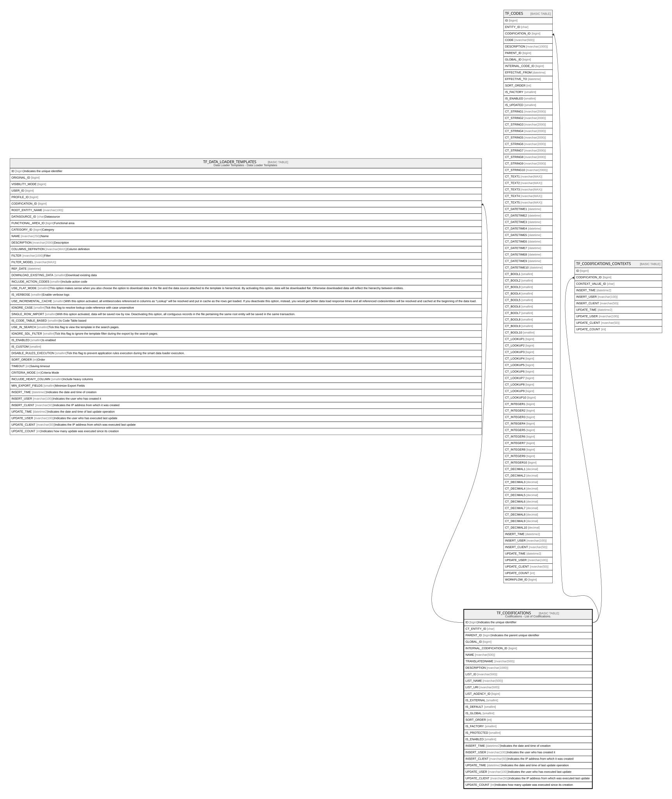

# TF_CODIFICATIONS

## Description

Codifications - List of Codifications.  

## Columns

| Name | Type | Default | Nullable | Children | Comment |
| ---- | ---- | ------- | -------- | -------- | ------- |
| ID | bigint |  | false | [TF_DATA_LOADER_TEMPLATES](TF_DATA_LOADER_TEMPLATES.md) [TF_CODES](TF_CODES.md) [TF_CODIFICATIONS_CONTEXTS](TF_CODIFICATIONS_CONTEXTS.md) | Indicates the unique identifier |
| CT_ENTITY_ID | char |  | false |  |  |
| PARENT_ID | bigint |  | true |  | Indicates the parent unique identifier |
| GLOBAL_ID | bigint |  | true |  |  |
| INTERNAL_CODIFICATION_ID | bigint |  | true |  |  |
| NAME | nvarchar(500) |  | false |  |  |
| TRANSLATEDNAME | nvarchar(500) |  | true |  |  |
| DESCRIPTION | nvarchar(1000) |  | true |  |  |
| LIST_ID | nvarchar(500) |  | false |  |  |
| LIST_NAME | nvarchar(500) |  | false |  |  |
| LIST_URI | nvarchar(500) |  | true |  |  |
| LIST_AGENCY_ID | bigint | ((0)) | false |  |  |
| IS_EXTERNAL | smallint | ((0)) | false |  |  |
| IS_DEFAULT | smallint | ((1)) | false |  |  |
| IS_GLOBAL | smallint | ((0)) | false |  |  |
| SORT_ORDER | int | ((0)) | false |  |  |
| IS_FACTORY | smallint | ((0)) | false |  |  |
| IS_PROTECTED | smallint | ((0)) | false |  |  |
| IS_ENABLED | smallint | ((1)) | false |  |  |
| INSERT_TIME | datetime2 | (sysutcdatetime()) | false |  | Indicates the date and time of creation |
| INSERT_USER | nvarchar(100) | (N'MAIN') | false |  | Indicates the user who has created it |
| INSERT_CLIENT | nvarchar(50) | (N'localhost') | false |  | Indicates the IP address from which it was created |
| UPDATE_TIME | datetime2 | (sysutcdatetime()) | false |  | Indicates the date and time of last update operation |
| UPDATE_USER | nvarchar(100) | (N'MAIN') | false |  | Indicates the user who has executed last update |
| UPDATE_CLIENT | nvarchar(50) | (N'localhost') | false |  | Indicates the IP address from which was executed last update |
| UPDATE_COUNT | int | ((0)) | false |  | Indicates how many update was executed since its creation |

## Constraints

| Name | Type | Definition |
| ---- | ---- | ---------- |
| PK_CODIFICATIONS | PRIMARY KEY | CLUSTERED, unique, part of a PRIMARY KEY constraint, [ ID ] |
| UQ_CODIFICATIONS_NAME | UNIQUE | NONCLUSTERED, unique, part of a UNIQUE constraint, [ CT_ENTITY_ID, NAME ] |

## Indexes

| Name | Definition |
| ---- | ---------- |
| PK_CODIFICATIONS | CLUSTERED, unique, part of a PRIMARY KEY constraint, [ ID ] |
| UQ_CODIFICATIONS_NAME | NONCLUSTERED, unique, part of a UNIQUE constraint, [ CT_ENTITY_ID, NAME ] |
| IDX_CODIFICATIONS_AGENCY_ID | NONCLUSTERED, [ LIST_AGENCY_ID ] |

## Relations

---

> Generated by [tbls](https://github.com/k1LoW/tbls)
