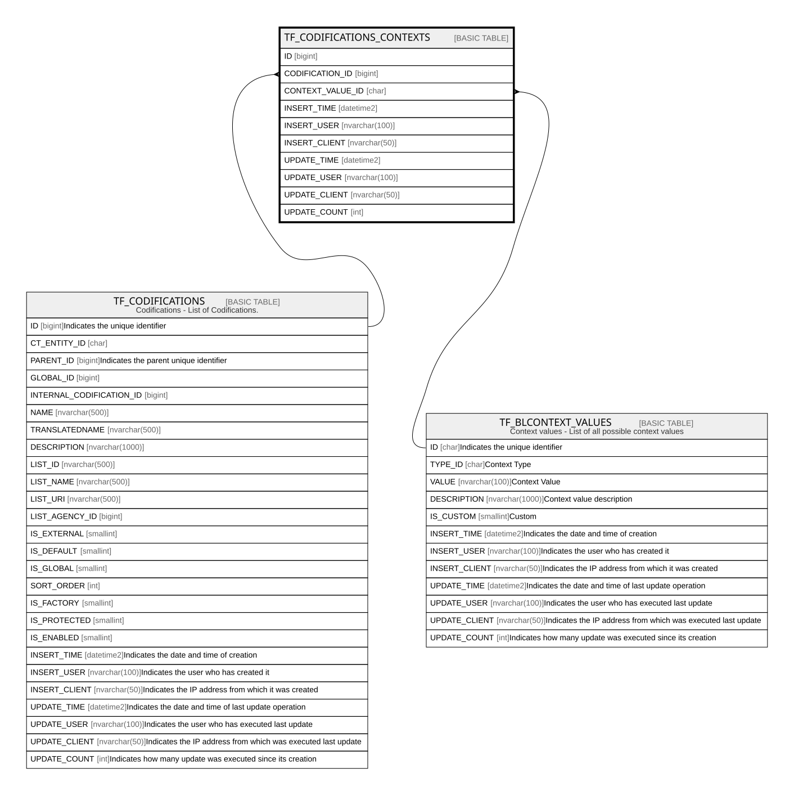

# TF_CODIFICATIONS_CONTEXTS

## Columns

| Name | Type | Default | Nullable | Parents | Comment |
| ---- | ---- | ------- | -------- | ------- | ------- |
| ID | bigint |  | false |  |  |
| CODIFICATION_ID | bigint |  | false | [TF_CODIFICATIONS](TF_CODIFICATIONS.md) |  |
| CONTEXT_VALUE_ID | char |  | false | [TF_BLCONTEXT_VALUES](TF_BLCONTEXT_VALUES.md) |  |
| INSERT_TIME | datetime2 | (sysutcdatetime()) | false |  |  |
| INSERT_USER | nvarchar(100) | (N'MAIN') | false |  |  |
| INSERT_CLIENT | nvarchar(50) | (N'localhost') | false |  |  |
| UPDATE_TIME | datetime2 | (sysutcdatetime()) | false |  |  |
| UPDATE_USER | nvarchar(100) | (N'MAIN') | false |  |  |
| UPDATE_CLIENT | nvarchar(50) | (N'localhost') | false |  |  |
| UPDATE_COUNT | int | ((0)) | false |  |  |

## Constraints

| Name | Type | Definition |
| ---- | ---- | ---------- |
| PK_CODIFICATIONS_CONTEXTS | PRIMARY KEY | CLUSTERED, unique, part of a PRIMARY KEY constraint, [ ID ] |
| UQ_CODIFICATIONS_CONTEXTS | UNIQUE | NONCLUSTERED, unique, part of a UNIQUE constraint, [ CODIFICATION_ID, CONTEXT_VALUE_ID ] |
| FK_CODES_CONTEXTS_CODES | FOREIGN KEY | FOREIGN KEY(CODIFICATION_ID) REFERENCES TF_CODIFICATIONS(ID) ON UPDATE NO_ACTION ON DELETE CASCADE |
| FK_CODES_CONTEXTS_CONTEXTS | FOREIGN KEY | FOREIGN KEY(CONTEXT_VALUE_ID) REFERENCES TF_BLCONTEXT_VALUES(ID) ON UPDATE NO_ACTION ON DELETE CASCADE |

## Indexes

| Name | Definition |
| ---- | ---------- |
| PK_CODIFICATIONS_CONTEXTS | CLUSTERED, unique, part of a PRIMARY KEY constraint, [ ID ] |
| UQ_CODIFICATIONS_CONTEXTS | NONCLUSTERED, unique, part of a UNIQUE constraint, [ CODIFICATION_ID, CONTEXT_VALUE_ID ] |

## Relations

---

> Generated by [tbls](https://github.com/k1LoW/tbls)
