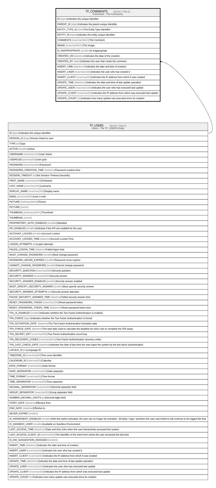

# TF_COMMENTS

## Description

Comments - The Comments.  

## Columns

| Name | Type | Default | Nullable | Parents | Comment |
| ---- | ---- | ------- | -------- | ------- | ------- |
| ID | bigint |  | false |  | Indicates the unique identifier |
| PARENT_ID | bigint |  | true |  | Indicates the parent unique identifier |
| ENTITY_TYPE_ID | char |  | false |  | The Entity Type Identifier. |
| ENTITY_ID | bigint |  | false |  | Indicates the entity unique identifier |
| COMMENTS | nvarchar(MAX) |  | true |  | The Comment. |
| IMAGE | nvarchar(MAX) |  | true |  | The Image. |
| IS_INAPPROPRIATE | smallint | ((0)) | false |  | Is Inappropriate |
| CREATED_ON | datetime | (sysutcdatetime()) | false |  | Indicates the date of the creation. |
| CREATED_BY | bigint |  | true | [TF_USERS](TF_USERS.md) | Indicates the user that create the comment. |
| INSERT_TIME | datetime2 | (sysutcdatetime()) | false |  | Indicates the date and time of creation |
| INSERT_USER | nvarchar(100) | (N'MAIN') | false |  | Indicates the user who has created it |
| INSERT_CLIENT | nvarchar(50) | (N'localhost') | false |  | Indicates the IP address from which it was created |
| UPDATE_TIME | datetime2 | (sysutcdatetime()) | false |  | Indicates the date and time of last update operation |
| UPDATE_USER | nvarchar(100) | (N'MAIN') | false |  | Indicates the user who has executed last update |
| UPDATE_CLIENT | nvarchar(50) | (N'localhost') | false |  | Indicates the IP address from which was executed last update |
| UPDATE_COUNT | int | ((0)) | false |  | Indicates how many update was executed since its creation |

## Constraints

| Name | Type | Definition |
| ---- | ---- | ---------- |
| PK_COMMENTS | PRIMARY KEY | CLUSTERED, unique, part of a PRIMARY KEY constraint, [ ID ] |
| FK_COMMENTS_USERS | FOREIGN KEY | FOREIGN KEY(CREATED_BY) REFERENCES TF_USERS(ID) ON UPDATE NO_ACTION ON DELETE SET_NULL |

## Indexes

| Name | Definition |
| ---- | ---------- |
| PK_COMMENTS | CLUSTERED, unique, part of a PRIMARY KEY constraint, [ ID ] |
| IDX_COMMENTS_EE | NONCLUSTERED, [ ENTITY_TYPE_ID, ENTITY_ID ] |

## Relations

---

> Generated by [tbls](https://github.com/k1LoW/tbls)
