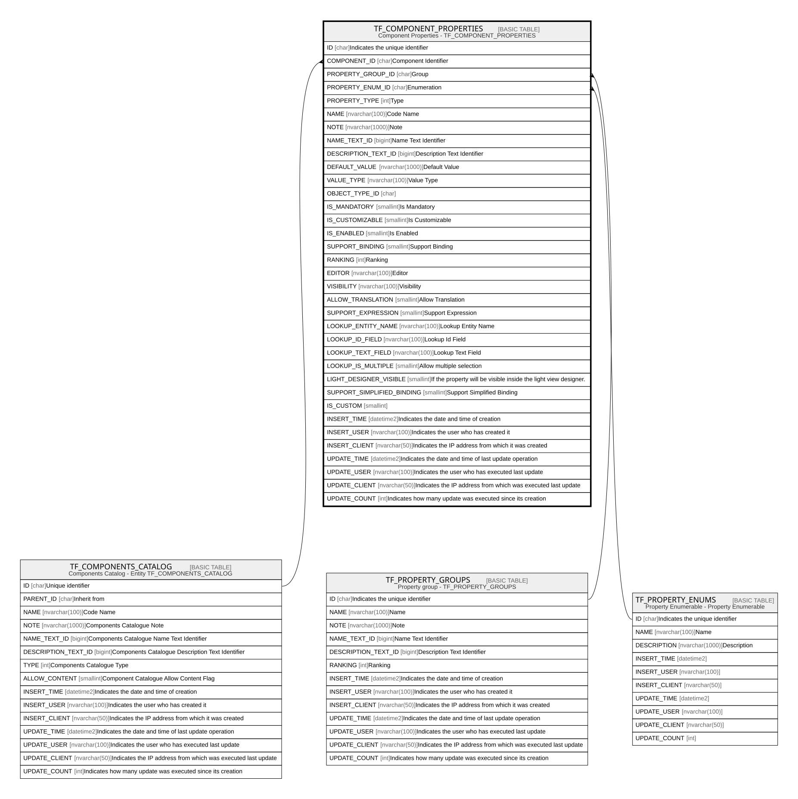

# TF_COMPONENT_PROPERTIES

## Description

Component Properties - TF_COMPONENT_PROPERTIES  

## Columns

| Name | Type | Default | Nullable | Parents | Comment |
| ---- | ---- | ------- | -------- | ------- | ------- |
| ID | char |  | false |  | Indicates the unique identifier |
| COMPONENT_ID | char |  | false | [TF_COMPONENTS_CATALOG](TF_COMPONENTS_CATALOG.md) | Component Identifier |
| PROPERTY_GROUP_ID | char |  | false | [TF_PROPERTY_GROUPS](TF_PROPERTY_GROUPS.md) | Group |
| PROPERTY_ENUM_ID | char |  | true | [TF_PROPERTY_ENUMS](TF_PROPERTY_ENUMS.md) | Enumeration |
| PROPERTY_TYPE | int |  | false |  | Type |
| NAME | nvarchar(100) |  | false |  | Code Name |
| NOTE | nvarchar(1000) |  | true |  | Note |
| NAME_TEXT_ID | bigint |  | false |  | Name Text Identifier |
| DESCRIPTION_TEXT_ID | bigint |  | false |  | Description Text Identifier |
| DEFAULT_VALUE | nvarchar(1000) |  | true |  | Default Value |
| VALUE_TYPE | nvarchar(100) |  | false |  | Value Type |
| OBJECT_TYPE_ID | char |  | true |  |  |
| IS_MANDATORY | smallint | ((0)) | false |  | Is Mandatory |
| IS_CUSTOMIZABLE | smallint | ((1)) | false |  | Is Customizable |
| IS_ENABLED | smallint | ((1)) | false |  | Is Enabled |
| SUPPORT_BINDING | smallint | ((1)) | false |  | Support Binding |
| RANKING | int | ((0)) | false |  | Ranking |
| EDITOR | nvarchar(100) |  | true |  | Editor |
| VISIBILITY | nvarchar(100) | (N'Developer') | false |  | Visibility |
| ALLOW_TRANSLATION | smallint | ((0)) | false |  | Allow Translation |
| SUPPORT_EXPRESSION | smallint | ((1)) | false |  | Support Expression |
| LOOKUP_ENTITY_NAME | nvarchar(100) |  | true |  | Lookup Entity Name |
| LOOKUP_ID_FIELD | nvarchar(100) |  | true |  | Lookup Id Field |
| LOOKUP_TEXT_FIELD | nvarchar(100) |  | true |  | Lookup Text Field |
| LOOKUP_IS_MULTIPLE | smallint | ((0)) | true |  | Allow multiple selection |
| LIGHT_DESIGNER_VISIBLE | smallint | ((0)) | true |  | If the property will be visible inside the light view designer. |
| SUPPORT_SIMPLIFIED_BINDING | smallint | ((0)) | true |  | Support Simplified Binding |
| IS_CUSTOM | smallint | ((0)) | true |  |  |
| INSERT_TIME | datetime2 | (sysutcdatetime()) | false |  | Indicates the date and time of creation |
| INSERT_USER | nvarchar(100) | (N'MAIN') | false |  | Indicates the user who has created it |
| INSERT_CLIENT | nvarchar(50) | (N'localhost') | false |  | Indicates the IP address from which it was created |
| UPDATE_TIME | datetime2 | (sysutcdatetime()) | false |  | Indicates the date and time of last update operation |
| UPDATE_USER | nvarchar(100) | (N'MAIN') | false |  | Indicates the user who has executed last update |
| UPDATE_CLIENT | nvarchar(50) | (N'localhost') | false |  | Indicates the IP address from which was executed last update |
| UPDATE_COUNT | int | ((0)) | false |  | Indicates how many update was executed since its creation |

## Constraints

| Name | Type | Definition |
| ---- | ---- | ---------- |
| PK_COMPONENT_PROPERTIES | PRIMARY KEY | CLUSTERED, unique, part of a PRIMARY KEY constraint, [ ID ] |
| UQ_COMPONENT_PROPERTIES | UNIQUE | NONCLUSTERED, unique, part of a UNIQUE constraint, [ COMPONENT_ID, PROPERTY_TYPE, NAME ] |
| FK_COMPONENT_PROPS_ENUMS | FOREIGN KEY | FOREIGN KEY(PROPERTY_ENUM_ID) REFERENCES TF_PROPERTY_ENUMS(ID) ON UPDATE NO_ACTION ON DELETE NO_ACTION |
| FK_PROPERTIES_COMPONENTS | FOREIGN KEY | FOREIGN KEY(COMPONENT_ID) REFERENCES TF_COMPONENTS_CATALOG(ID) ON UPDATE NO_ACTION ON DELETE NO_ACTION |
| FK_PROPERTIES_GROUPS | FOREIGN KEY | FOREIGN KEY(PROPERTY_GROUP_ID) REFERENCES TF_PROPERTY_GROUPS(ID) ON UPDATE NO_ACTION ON DELETE NO_ACTION |

## Indexes

| Name | Definition |
| ---- | ---------- |
| PK_COMPONENT_PROPERTIES | CLUSTERED, unique, part of a PRIMARY KEY constraint, [ ID ] |
| UQ_COMPONENT_PROPERTIES | NONCLUSTERED, unique, part of a UNIQUE constraint, [ COMPONENT_ID, PROPERTY_TYPE, NAME ] |

## Relations

---

> Generated by [tbls](https://github.com/k1LoW/tbls)
