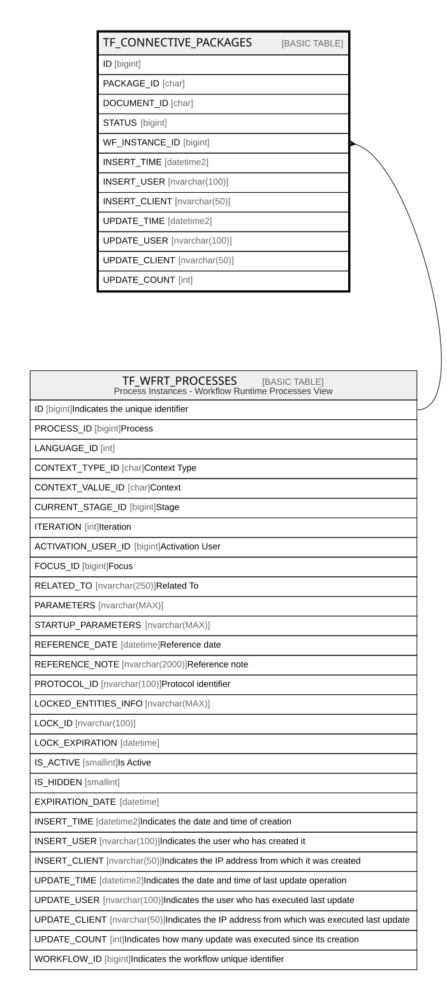

# TF_CONNECTIVE_PACKAGES

## Columns

| Name | Type | Default | Nullable | Parents | Comment |
| ---- | ---- | ------- | -------- | ------- | ------- |
| ID | bigint |  | false |  |  |
| PACKAGE_ID | char |  | false |  |  |
| DOCUMENT_ID | char |  | false |  |  |
| STATUS | bigint | ((0)) | true |  |  |
| WF_INSTANCE_ID | bigint |  | true | [TF_WFRT_PROCESSES](TF_WFRT_PROCESSES.md) |  |
| INSERT_TIME | datetime2 | (sysutcdatetime()) | false |  |  |
| INSERT_USER | nvarchar(100) | (N'MAIN') | false |  |  |
| INSERT_CLIENT | nvarchar(50) | (N'localhost') | false |  |  |
| UPDATE_TIME | datetime2 | (sysutcdatetime()) | false |  |  |
| UPDATE_USER | nvarchar(100) | (N'MAIN') | false |  |  |
| UPDATE_CLIENT | nvarchar(50) | (N'localhost') | false |  |  |
| UPDATE_COUNT | int | ((0)) | false |  |  |

## Constraints

| Name | Type | Definition |
| ---- | ---- | ---------- |
| PK_CONNECTIVESIGNERS | PRIMARY KEY | CLUSTERED, unique, part of a PRIMARY KEY constraint, [ ID ] |
| UQ_PACKAGESTAKEHOLDERID | UNIQUE | NONCLUSTERED, unique, part of a UNIQUE constraint, [ PACKAGE_ID, DOCUMENT_ID ] |
| FK_CNP_WFRTPROCESSES | FOREIGN KEY | FOREIGN KEY(WF_INSTANCE_ID) REFERENCES TF_WFRT_PROCESSES(ID) ON UPDATE NO_ACTION ON DELETE CASCADE |

## Indexes

| Name | Definition |
| ---- | ---------- |
| PK_CONNECTIVESIGNERS | CLUSTERED, unique, part of a PRIMARY KEY constraint, [ ID ] |
| UQ_PACKAGESTAKEHOLDERID | NONCLUSTERED, unique, part of a UNIQUE constraint, [ PACKAGE_ID, DOCUMENT_ID ] |
| IDX_CONEPACK_INSTANCE_ID | NONCLUSTERED, [ WF_INSTANCE_ID ] |

## Relations

---

> Generated by [tbls](https://github.com/k1LoW/tbls)
