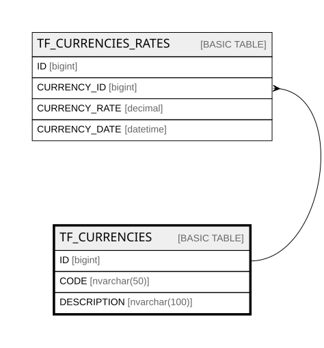

# TF_CURRENCIES

## Columns

| Name | Type | Default | Nullable | Children | Comment |
| ---- | ---- | ------- | -------- | -------- | ------- |
| ID | bigint |  | false | [TF_CURRENCIES_RATES](TF_CURRENCIES_RATES.md) |  |
| CODE | nvarchar(50) |  | false |  |  |
| DESCRIPTION | nvarchar(100) |  | true |  |  |

## Constraints

| Name | Type | Definition |
| ---- | ---- | ---------- |
| PK_CURRENCIES | PRIMARY KEY | CLUSTERED, unique, part of a PRIMARY KEY constraint, [ ID ] |

## Indexes

| Name | Definition |
| ---- | ---------- |
| PK_CURRENCIES | CLUSTERED, unique, part of a PRIMARY KEY constraint, [ ID ] |

## Relations

---

> Generated by [tbls](https://github.com/k1LoW/tbls)
