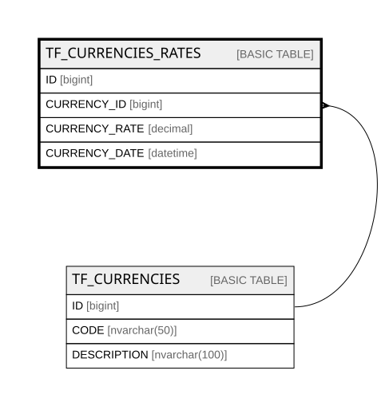

# TF_CURRENCIES_RATES

## Columns

| Name | Type | Default | Nullable | Parents | Comment |
| ---- | ---- | ------- | -------- | ------- | ------- |
| ID | bigint |  | false |  |  |
| CURRENCY_ID | bigint |  | false | [TF_CURRENCIES](TF_CURRENCIES.md) |  |
| CURRENCY_RATE | decimal |  | false |  |  |
| CURRENCY_DATE | datetime |  | true |  |  |

## Constraints

| Name | Type | Definition |
| ---- | ---- | ---------- |
| PK_CURRENCIES_RATES | PRIMARY KEY | CLUSTERED, unique, part of a PRIMARY KEY constraint, [ ID ] |
| FK_CURRENCIES_RATES | FOREIGN KEY | FOREIGN KEY(CURRENCY_ID) REFERENCES TF_CURRENCIES(ID) ON UPDATE NO_ACTION ON DELETE NO_ACTION |

## Indexes

| Name | Definition |
| ---- | ---------- |
| PK_CURRENCIES_RATES | CLUSTERED, unique, part of a PRIMARY KEY constraint, [ ID ] |

## Relations

---

> Generated by [tbls](https://github.com/k1LoW/tbls)
