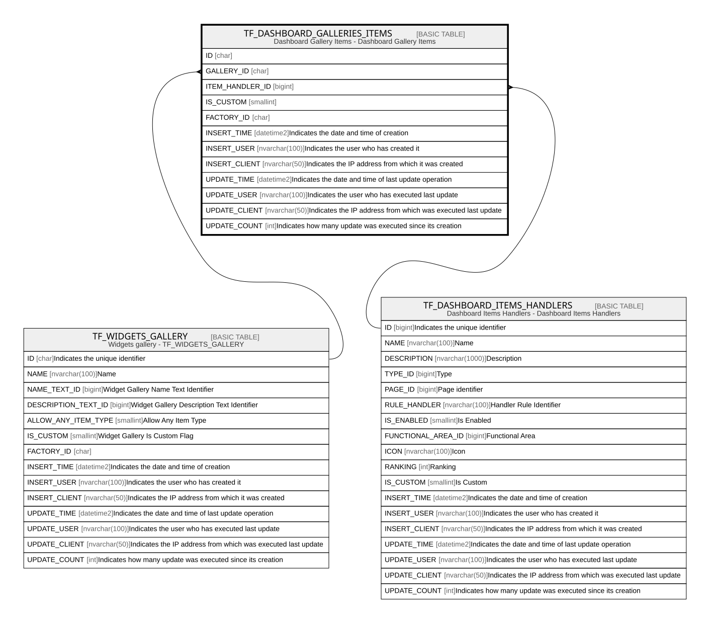

# TF_DASHBOARD_GALLERIES_ITEMS

## Description

Dashboard Gallery Items - Dashboard Gallery Items  

## Columns

| Name | Type | Default | Nullable | Parents | Comment |
| ---- | ---- | ------- | -------- | ------- | ------- |
| ID | char |  | false |  |  |
| GALLERY_ID | char |  | false | [TF_WIDGETS_GALLERY](TF_WIDGETS_GALLERY.md) |  |
| ITEM_HANDLER_ID | bigint |  | false | [TF_DASHBOARD_ITEMS_HANDLERS](TF_DASHBOARD_ITEMS_HANDLERS.md) |  |
| IS_CUSTOM | smallint | ((0)) | false |  |  |
| FACTORY_ID | char |  | true |  |  |
| INSERT_TIME | datetime2 | (sysutcdatetime()) | false |  | Indicates the date and time of creation |
| INSERT_USER | nvarchar(100) | (N'MAIN') | false |  | Indicates the user who has created it |
| INSERT_CLIENT | nvarchar(50) | (N'localhost') | false |  | Indicates the IP address from which it was created |
| UPDATE_TIME | datetime2 | (sysutcdatetime()) | false |  | Indicates the date and time of last update operation |
| UPDATE_USER | nvarchar(100) | (N'MAIN') | false |  | Indicates the user who has executed last update |
| UPDATE_CLIENT | nvarchar(50) | (N'localhost') | false |  | Indicates the IP address from which was executed last update |
| UPDATE_COUNT | int | ((0)) | false |  | Indicates how many update was executed since its creation |

## Constraints

| Name | Type | Definition |
| ---- | ---- | ---------- |
| PK_DASHBOARD_GALLERIES_ITEMS | PRIMARY KEY | CLUSTERED, unique, part of a PRIMARY KEY constraint, [ ID ] |
| UQ_DASHBOARD_GALLERIES_ITEMS | UNIQUE | NONCLUSTERED, unique, part of a UNIQUE constraint, [ GALLERY_ID, ITEM_HANDLER_ID, IS_CUSTOM ] |
| FK_DASHBOARD_GALLERIES | FOREIGN KEY | FOREIGN KEY(GALLERY_ID) REFERENCES TF_WIDGETS_GALLERY(ID) ON UPDATE NO_ACTION ON DELETE NO_ACTION |
| FK_DASHBOARD_ITEMS_HANDLERS | FOREIGN KEY | FOREIGN KEY(ITEM_HANDLER_ID) REFERENCES TF_DASHBOARD_ITEMS_HANDLERS(ID) ON UPDATE NO_ACTION ON DELETE NO_ACTION |

## Indexes

| Name | Definition |
| ---- | ---------- |
| PK_DASHBOARD_GALLERIES_ITEMS | CLUSTERED, unique, part of a PRIMARY KEY constraint, [ ID ] |
| UQ_DASHBOARD_GALLERIES_ITEMS | NONCLUSTERED, unique, part of a UNIQUE constraint, [ GALLERY_ID, ITEM_HANDLER_ID, IS_CUSTOM ] |
| IDX_GAL_ITEMS_CUSTOM_FACTORY | NONCLUSTERED, [ FACTORY_ID, IS_CUSTOM ] |

## Relations

---

> Generated by [tbls](https://github.com/k1LoW/tbls)
