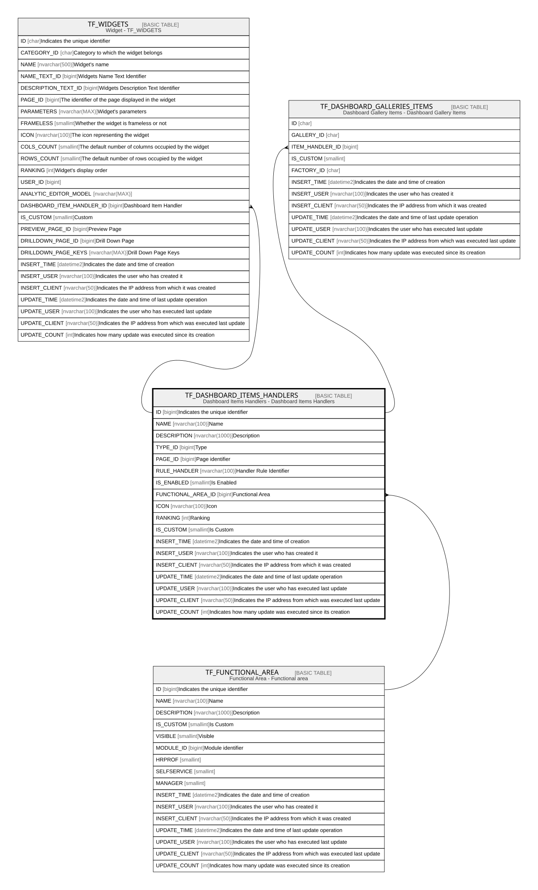

# TF_DASHBOARD_ITEMS_HANDLERS

## Description

Dashboard Items Handlers - Dashboard Items Handlers  

## Columns

| Name | Type | Default | Nullable | Children | Parents | Comment |
| ---- | ---- | ------- | -------- | -------- | ------- | ------- |
| ID | bigint |  | false | [TF_WIDGETS](TF_WIDGETS.md) [TF_DASHBOARD_GALLERIES_ITEMS](TF_DASHBOARD_GALLERIES_ITEMS.md) |  | Indicates the unique identifier |
| NAME | nvarchar(100) |  | false |  |  | Name |
| DESCRIPTION | nvarchar(1000) |  | false |  |  | Description |
| TYPE_ID | bigint |  | false |  |  | Type |
| PAGE_ID | bigint |  | false |  |  | Page identifier  |
| RULE_HANDLER | nvarchar(100) |  | false |  |  | Handler Rule Identifier |
| IS_ENABLED | smallint | ((1)) | false |  |  | Is Enabled |
| FUNCTIONAL_AREA_ID | bigint |  | true |  | [TF_FUNCTIONAL_AREA](TF_FUNCTIONAL_AREA.md) | Functional Area |
| ICON | nvarchar(100) |  | false |  |  | Icon |
| RANKING | int | ((0)) | false |  |  | Ranking |
| IS_CUSTOM | smallint | ((0)) | false |  |  | Is Custom |
| INSERT_TIME | datetime2 | (sysutcdatetime()) | false |  |  | Indicates the date and time of creation |
| INSERT_USER | nvarchar(100) | (N'MAIN') | false |  |  | Indicates the user who has created it |
| INSERT_CLIENT | nvarchar(50) | (N'localhost') | false |  |  | Indicates the IP address from which it was created |
| UPDATE_TIME | datetime2 | (sysutcdatetime()) | false |  |  | Indicates the date and time of last update operation |
| UPDATE_USER | nvarchar(100) | (N'MAIN') | false |  |  | Indicates the user who has executed last update |
| UPDATE_CLIENT | nvarchar(50) | (N'localhost') | false |  |  | Indicates the IP address from which was executed last update |
| UPDATE_COUNT | int | ((0)) | false |  |  | Indicates how many update was executed since its creation |

## Constraints

| Name | Type | Definition |
| ---- | ---- | ---------- |
| PK_TF_DASHBOARD_ITEMS_HANDLERS | PRIMARY KEY | CLUSTERED, unique, part of a PRIMARY KEY constraint, [ ID ] |
| FK_TF_FUNCTIONAL_AREA | FOREIGN KEY | FOREIGN KEY(FUNCTIONAL_AREA_ID) REFERENCES TF_FUNCTIONAL_AREA(ID) ON UPDATE NO_ACTION ON DELETE NO_ACTION |

## Indexes

| Name | Definition |
| ---- | ---------- |
| PK_TF_DASHBOARD_ITEMS_HANDLERS | CLUSTERED, unique, part of a PRIMARY KEY constraint, [ ID ] |

## Relations

---

> Generated by [tbls](https://github.com/k1LoW/tbls)
