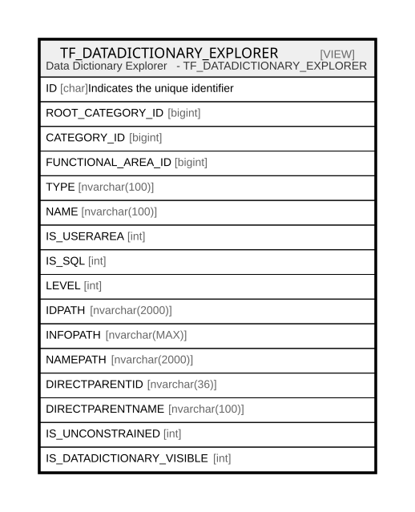

# TF_DATADICTIONARY_EXPLORER

## Description

Data Dictionary Explorer   - TF_DATADICTIONARY_EXPLORER  


<details>
<summary><strong>Table Definition</strong></summary>

```sql
-- Talentia Software - All right reserved
-- Type: VIEW                     Name: TF_DATADICTIONARY_EXPLORER
-- Date: 09-04-2026 07:27:59 (UTC)
-- 
-- ChangeLogId: 00000000-0000-0000-0000-000000000000
-- ChangeSetId: e7906615-e1e2-4b40-92ac-8b360c974090
-- Original file name: C:\repos\Talentia-Software\hcm-core/DB/ProductDB/EDM\Schema\Views\TF_DATADICTIONARY_EXPLORER.xml


CREATE VIEW [TF_DATADICTIONARY_EXPLORER]
 AS 
 
WITH EL (ID, ROOT_CATEGORY_ID, CATEGORY_ID, FUNCTIONAL_AREA_ID, TYPE, NAME, IS_USERAREA, IS_SQL, LEVEL, IDPATH, INFOPATH, NAMEPATH, DIRECTPARENTID, DIRECTPARENTNAME, IS_UNCONSTRAINED, IS_DATADICTIONARY_VISIBLE) 
AS
(
   SELECT BE.ID, BE.CATEGORY_ID ROOT_CATEGORY_ID, BE.CATEGORY_ID, BE.FUNCTIONAL_AREA_ID, BE.TYPE, BE.NAME, 
   CASE WHEN BE.ITEM_SOURCE = 'CustomizedOnly' THEN 1 ELSE 0 END AS IS_USERAREA, 
   CASE WHEN T.TYPE = 'Sql' THEN 1 ELSE 0 END AS IS_SQL,    
   1 AS LEVEL, 
   CAST(BE.ID AS NVARCHAR(2000)) AS IDPATH,
   CAST(CONCAT(BE.ID,'|',BE.TYPE,'|',CASE WHEN BE.ITEM_SOURCE = 'CustomizedOnly' THEN 1 ELSE 0 END) AS NVARCHAR(MAX)) AS INFOPATH,
   CAST(BE.NAME AS NVARCHAR(2000)) AS NAMEPATH,
   CAST(NULL AS NVARCHAR(36)) AS DIRECTPARENTID,
   CAST(NULL AS NVARCHAR(100)) AS DIRECTPARENTNAME,
   0 AS IS_UNCONSTRAINED,
   1 AS IS_DATADICTIONARY_VISIBLE
   FROM TF_BLENTITIES_VIEW BE 
   LEFT JOIN TF_BLPHYSICAL_TABLES T ON (T.ID = BE.TABLE_ID)
   WHERE BE.IS_MAIN = 1 OR BE.TYPE = 'CodeTable'
   UNION ALL
   SELECT CE.ID, EL.ROOT_CATEGORY_ID ROOT_CATEGORY_ID, CE.CATEGORY_ID, CE.FUNCTIONAL_AREA_ID, CE.TYPE, CE.NAME, 
   CASE WHEN CE.ITEM_SOURCE = 'CustomizedOnly' THEN 1 ELSE 0 END AS IS_USERAREA, 
   COALESCE ((SELECT CASE WHEN T.TYPE = 'Sql' THEN 1 ELSE 0 END FROM TF_BLPHYSICAL_TABLES T WHERE T.ID = CE.TABLE_ID), 0) AS IS_SQL,
   EL.LEVEL + 1 AS LEVEL, 
   CAST(CONCAT(EL.IDPATH, ';', CE.ID) AS NVARCHAR(2000)) AS IDPATH,
   CAST(CONCAT(EL.INFOPATH,';',CE.ID,'|',CE.TYPE,'|',CASE WHEN CE.ITEM_SOURCE = 'CustomizedOnly' THEN 1 ELSE 0 END) AS NVARCHAR(MAX)) AS INFOPATH,
   CAST(CONCAT(EL.NAMEPATH, ';', CE.NAME) AS NVARCHAR(2000)) AS NAMEPATH,
   CAST(EL.ID AS NVARCHAR(36)) AS DIRECTPARENTID,
   CAST(EL.NAME AS NVARCHAR(100)) AS DIRECTPARENTNAME,
   CASE WHEN EL.IS_UNCONSTRAINED = 1 THEN 1 WHEN PEREL.BUILD_CONSTRAINT_MODE <> 'Full' THEN 1 ELSE 0 END AS IS_UNCONSTRAINED,
   CASE WHEN (EL.IS_UNCONSTRAINED = 0 AND PEREL.BUILD_CONSTRAINT_MODE = 'Full') THEN 1 
   ELSE (CASE WHEN COALESCE ((SELECT CASE WHEN T.TYPE = 'Sql' THEN 1 ELSE 0 END FROM TF_BLPHYSICAL_TABLES T WHERE T.ID = CE.TABLE_ID), 0) = 1 THEN 1 
   ELSE 0 END) END AS IS_DATADICTIONARY_VISIBLE
   FROM EL
   INNER JOIN TF_BLRELATIONS_VIEW PEREL ON (PEREL.PARENT_ENTITY_ID = EL.ID)
   INNER JOIN TF_BLENTITIES_VIEW CE ON (CE.ID = PEREL.CHILD_ENTITY_ID AND CE.IS_MAIN = 0 AND CE.TYPE <> 'CodeTable')        
   WHERE EL.LEVEL <= 19 AND EL.IDPATH NOT LIKE '%' + CE.ID + '%'
)
SELECT ID, ROOT_CATEGORY_ID, CATEGORY_ID, FUNCTIONAL_AREA_ID, TYPE, NAME, IS_USERAREA, IS_SQL, LEVEL, IDPATH, INFOPATH, NAMEPATH, DIRECTPARENTID, DIRECTPARENTNAME, IS_UNCONSTRAINED, IS_DATADICTIONARY_VISIBLE FROM EL
                 

```

</details>

## Columns

| Name | Type | Default | Nullable | Comment |
| ---- | ---- | ------- | -------- | ------- |
| ID | char |  | true | Indicates the unique identifier |
| ROOT_CATEGORY_ID | bigint |  | true |  |
| CATEGORY_ID | bigint |  | true |  |
| FUNCTIONAL_AREA_ID | bigint |  | true |  |
| TYPE | nvarchar(100) |  | true |  |
| NAME | nvarchar(100) |  | true |  |
| IS_USERAREA | int |  | true |  |
| IS_SQL | int |  | true |  |
| LEVEL | int |  | true |  |
| IDPATH | nvarchar(2000) |  | true |  |
| INFOPATH | nvarchar(MAX) |  | true |  |
| NAMEPATH | nvarchar(2000) |  | true |  |
| DIRECTPARENTID | nvarchar(36) |  | true |  |
| DIRECTPARENTNAME | nvarchar(100) |  | true |  |
| IS_UNCONSTRAINED | int |  | true |  |
| IS_DATADICTIONARY_VISIBLE | int |  | true |  |

## Referenced Tables

| Name | Columns | Comment | Type |
| ---- | ------- | ------- | ---- |
| [TF_BLENTITIES_VIEW](TF_BLENTITIES_VIEW.md) | 29 | BL entities - Business Logic Entities<br /> | VIEW |
| [TF_BLPHYSICAL_TABLES](TF_BLPHYSICAL_TABLES.md) | 23 |  | BASIC TABLE |
| [TF_BLRELATIONS_VIEW](TF_BLRELATIONS_VIEW.md) | 18 | Business Logic Relations View - Business Logic Relations View<br /> | VIEW |

## Relations



---

> Generated by [tbls](https://github.com/k1LoW/tbls)
