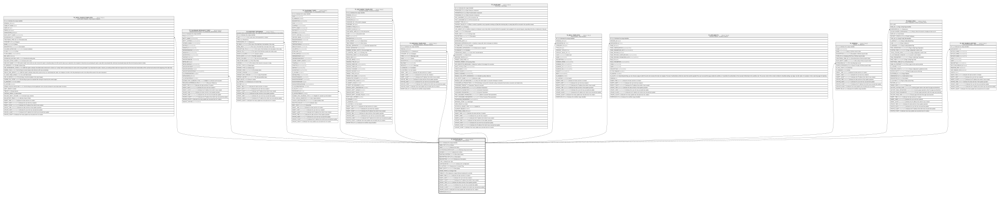

# TF_DATASOURCES

## Description

Data Sources - Data Sources  

## Columns

| Name | Type | Default | Nullable | Children | Comment |
| ---- | ---- | ------- | -------- | -------- | ------- |
| ID | char |  | false | [TF_DATA_LOADER_TEMPLATES](TF_DATA_LOADER_TEMPLATES.md) [TF_CALENDAR_RESOURCE_TYPES](TF_CALENDAR_RESOURCE_TYPES.md) [TF_ASSISTANT_RTPARAMS](TF_ASSISTANT_RTPARAMS.md) [TF_CALENDAR_TYPES](TF_CALENDAR_TYPES.md) [TF_DOCUMENT_TEMPLATES](TF_DOCUMENT_TEMPLATES.md) [TF_MESSAGE_TEMPLATES](TF_MESSAGE_TEMPLATES.md) [TF_SOAFLOWS](TF_SOAFLOWS.md) [TF_MAIL_TEMPLATES](TF_MAIL_TEMPLATES.md) [TF_WFSUBJECTS](TF_WFSUBJECTS.md) [TF_INDEXES](TF_INDEXES.md) [TF_PAGE_CFGS](TF_PAGE_CFGS.md) [TF_DW_NAMED_ENTITIES](TF_DW_NAMED_ENTITIES.md) | Indicates the unique identifier |
| NAME_TEXT_ID | bigint |  | true |  | Name |
| NAME | nvarchar(100) |  | false |  | Datasources Name |
| FILTERUSINGCURRENTDATE | smallint | ((0)) | false |  | Filtering Using Current Date  |
| CRITERIA | nvarchar(MAX) |  | true |  | Datasources Criteria |
| ROOTONLYCRITERIA | smallint | ((0)) | false |  | Root Only Criteria |
| DESCRIPTION_TEXT_ID | bigint |  | true |  | Description |
| DESCRIPTION | nvarchar(500) |  | true |  | Datasources Description |
| TYPE | int |  | false |  | Datasources Type |
| CONFIGURATION | nvarchar(MAX) |  | true |  | Datasources Configuration |
| IS_CUSTOM | smallint |  | false |  | Datasources Is Custom Flag |
| ROOT_ENTITY | nvarchar(100) |  | true |  | Root Entity |
| USAGE_CODE | bigint |  | true |  | Usage Code |
| TIMEOUT | int |  | true |  | The datasource request timeout expressed in seconds. |
| INSERT_TIME | datetime2 | (sysutcdatetime()) | false |  | Indicates the date and time of creation |
| INSERT_USER | nvarchar(100) | (N'MAIN') | false |  | Indicates the user who has created it |
| INSERT_CLIENT | nvarchar(50) | (N'localhost') | false |  | Indicates the IP address from which it was created |
| UPDATE_TIME | datetime2 | (sysutcdatetime()) | false |  | Indicates the date and time of last update operation |
| UPDATE_USER | nvarchar(100) | (N'MAIN') | false |  | Indicates the user who has executed last update |
| UPDATE_CLIENT | nvarchar(50) | (N'localhost') | false |  | Indicates the IP address from which was executed last update |
| UPDATE_COUNT | int | ((0)) | false |  | Indicates how many update was executed since its creation |
| WORKFLOW_ID | bigint |  | true |  |  |

## Constraints

| Name | Type | Definition |
| ---- | ---- | ---------- |
| PK_DATASOURCES | PRIMARY KEY | CLUSTERED, unique, part of a PRIMARY KEY constraint, [ ID ] |
| UQ_DATASOURCES | UNIQUE | NONCLUSTERED, unique, part of a UNIQUE constraint, [ NAME, IS_CUSTOM ] |

## Indexes

| Name | Definition |
| ---- | ---------- |
| PK_DATASOURCES | CLUSTERED, unique, part of a PRIMARY KEY constraint, [ ID ] |
| UQ_DATASOURCES | NONCLUSTERED, unique, part of a UNIQUE constraint, [ NAME, IS_CUSTOM ] |

## Relations

---

> Generated by [tbls](https://github.com/k1LoW/tbls)
