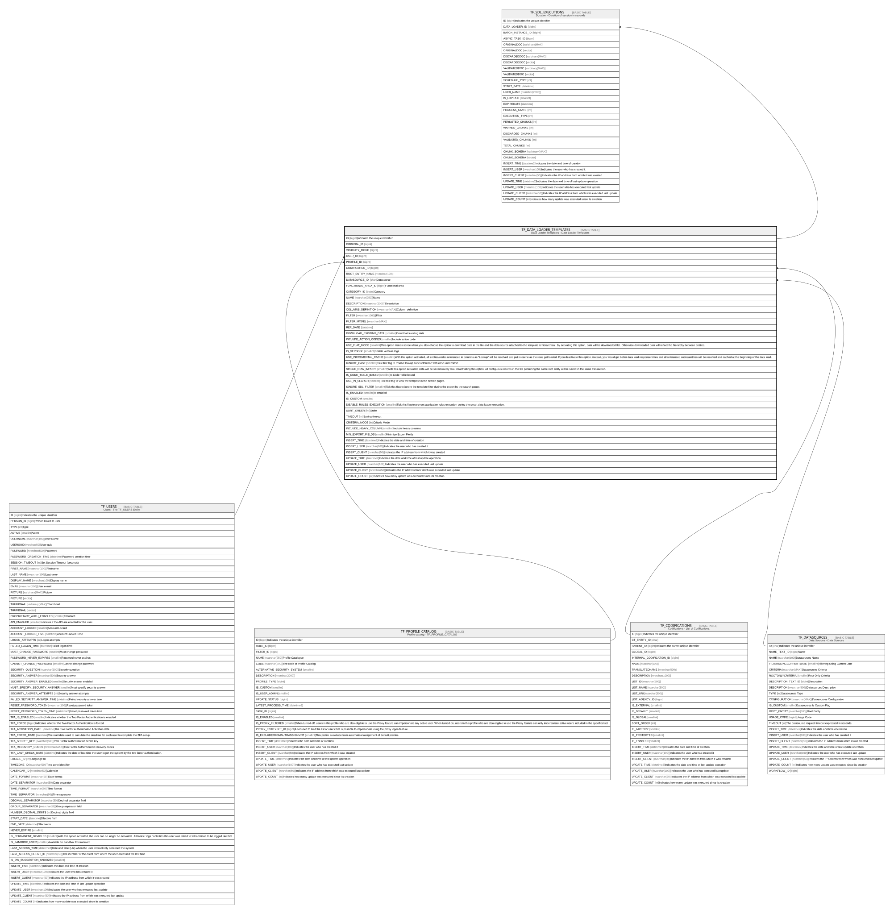

# TF_DATA_LOADER_TEMPLATES

## Description

Data Loader Templates - Data Loader Templates  

## Columns

| Name | Type | Default | Nullable | Children | Parents | Comment |
| ---- | ---- | ------- | -------- | -------- | ------- | ------- |
| ID | bigint |  | false | [TF_SDL_EXECUTIONS](TF_SDL_EXECUTIONS.md) |  | Indicates the unique identifier |
| ORIGINAL_ID | bigint |  | true |  |  |  |
| VISIBILITY_MODE | bigint | ((0)) | false |  |  |  |
| USER_ID | bigint |  | true |  | [TF_USERS](TF_USERS.md) |  |
| PROFILE_ID | bigint |  | true |  | [TF_PROFILE_CATALOG](TF_PROFILE_CATALOG.md) |  |
| CODIFICATION_ID | bigint |  | true |  | [TF_CODIFICATIONS](TF_CODIFICATIONS.md) |  |
| ROOT_ENTITY_NAME | nvarchar(100) |  | false |  |  |  |
| DATASOURCE_ID | char |  | false |  | [TF_DATASOURCES](TF_DATASOURCES.md) | Datasource |
| FUNCTIONAL_AREA_ID | bigint |  | true |  |  | Functional area |
| CATEGORY_ID | bigint |  | true |  |  | Category |
| NAME | nvarchar(250) |  | false |  |  | Name |
| DESCRIPTION | nvarchar(2000) |  | true |  |  | Description |
| COLUMNS_DEFINITION | nvarchar(MAX) |  | true |  |  | Column definition |
| FILTER | nvarchar(1000) |  | true |  |  | Filter |
| FILTER_MODEL | nvarchar(MAX) |  | true |  |  |  |
| REF_DATE | datetime |  | true |  |  |  |
| DOWNLOAD_EXISTING_DATA | smallint | ((0)) | false |  |  | Download existing data |
| INCLUDE_ACTION_CODES | smallint | ((0)) | false |  |  | Include action code |
| USE_FLAT_MODE | smallint | ((0)) | false |  |  | This option makes sense when you also choose the option to download data in the file and the data source attached to the template is hierarchical. By activating this option, data will be downloaded flat. Otherwise downloaded data will reflect the hierarchy between entities. |
| IS_VERBOSE | smallint | ((0)) | false |  |  | Enable verbose logs |
| USE_INCREMENTAL_CACHE | smallint | ((0)) | false |  |  | With this option activated, all entities/codes referenced in columns as “Lookup” will be resolved and put in cache as the rows get loaded. If you deactivate this option, instead, you would get better data load response times and all referenced codes/entities will be resolved and cached at the beginning of the data load. |
| IGNORE_CASE | smallint | ((1)) | false |  |  | Tick this flag to resolve lookup code reference with case unsensitive |
| SINGLE_ROW_IMPORT | smallint | ((0)) | false |  |  | With this option activated, data will be saved row by row. Deactivating this option, all contiguous records in the file pertaining the same root entity will be saved in the same transaction. |
| IS_CODE_TABLE_BASED | smallint | ((0)) | false |  |  | Is Code Table based |
| USE_IN_SEARCH | smallint | ((0)) | false |  |  | Tick this flag to view the template in the search pages. |
| IGNORE_SDL_FILTER | smallint | ((0)) | false |  |  | Tick this flag to ignore the template filter during the export by the search pages. |
| IS_ENABLED | smallint | ((0)) | false |  |  | Is enabled |
| IS_CUSTOM | smallint | ((0)) | false |  |  |  |
| DISABLE_RULES_EXECUTION | smallint | ((0)) | false |  |  | Tick this flag to prevent application rules execution during the smart data loader execution. |
| SORT_ORDER | int | ((0)) | false |  |  | Order |
| TIMEOUT | int |  | true |  |  | Saving timeout |
| CRITERIA_MODE | int | ((0)) | false |  |  | Criteria Mode |
| INCLUDE_HEAVY_COLUMN | smallint | ((1)) | false |  |  | Include heavy columns |
| MIN_EXPORT_FIELDS | smallint | ((1)) | false |  |  | Minimize Export Fields |
| INSERT_TIME | datetime2 | (sysutcdatetime()) | false |  |  | Indicates the date and time of creation |
| INSERT_USER | nvarchar(100) | (N'MAIN') | false |  |  | Indicates the user who has created it |
| INSERT_CLIENT | nvarchar(50) | (N'localhost') | false |  |  | Indicates the IP address from which it was created |
| UPDATE_TIME | datetime2 | (sysutcdatetime()) | false |  |  | Indicates the date and time of last update operation |
| UPDATE_USER | nvarchar(100) | (N'MAIN') | false |  |  | Indicates the user who has executed last update |
| UPDATE_CLIENT | nvarchar(50) | (N'localhost') | false |  |  | Indicates the IP address from which was executed last update |
| UPDATE_COUNT | int | ((0)) | false |  |  | Indicates how many update was executed since its creation |

## Constraints

| Name | Type | Definition |
| ---- | ---- | ---------- |
| PK_DATA_LOADER_TEMPLATES | PRIMARY KEY | CLUSTERED, unique, part of a PRIMARY KEY constraint, [ ID ] |
| FK_DLOADER_CODIFICATIONS | FOREIGN KEY | FOREIGN KEY(CODIFICATION_ID) REFERENCES TF_CODIFICATIONS(ID) ON UPDATE NO_ACTION ON DELETE NO_ACTION |
| FK_DLOADER_DATASOURCES | FOREIGN KEY | FOREIGN KEY(DATASOURCE_ID) REFERENCES TF_DATASOURCES(ID) ON UPDATE NO_ACTION ON DELETE NO_ACTION |
| FK_DLOADER_PROFILES | FOREIGN KEY | FOREIGN KEY(PROFILE_ID) REFERENCES TF_PROFILE_CATALOG(ID) ON UPDATE NO_ACTION ON DELETE NO_ACTION |
| FK_DLOADER_USERS | FOREIGN KEY | FOREIGN KEY(USER_ID) REFERENCES TF_USERS(ID) ON UPDATE NO_ACTION ON DELETE NO_ACTION |

## Indexes

| Name | Definition |
| ---- | ---------- |
| PK_DATA_LOADER_TEMPLATES | CLUSTERED, unique, part of a PRIMARY KEY constraint, [ ID ] |
| IDX_DLTEMPLATES_CUSTOM_FACTORY | NONCLUSTERED, [ ORIGINAL_ID, IS_CUSTOM ] |

## Relations

---

> Generated by [tbls](https://github.com/k1LoW/tbls)
