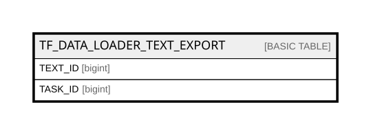

# TF_DATA_LOADER_TEXT_EXPORT

## Columns

| Name | Type | Default | Nullable | Comment |
| ---- | ---- | ------- | -------- | ------- |
| TEXT_ID | bigint |  | false |  |
| TASK_ID | bigint |  | false |  |

## Constraints

| Name | Type | Definition |
| ---- | ---- | ---------- |
| PK_DATA_LOADER_TEXT_EXPORT | PRIMARY KEY | CLUSTERED, unique, part of a PRIMARY KEY constraint, [ TEXT_ID, TASK_ID ] |

## Indexes

| Name | Definition |
| ---- | ---------- |
| PK_DATA_LOADER_TEXT_EXPORT | CLUSTERED, unique, part of a PRIMARY KEY constraint, [ TEXT_ID, TASK_ID ] |

## Relations

---

> Generated by [tbls](https://github.com/k1LoW/tbls)
