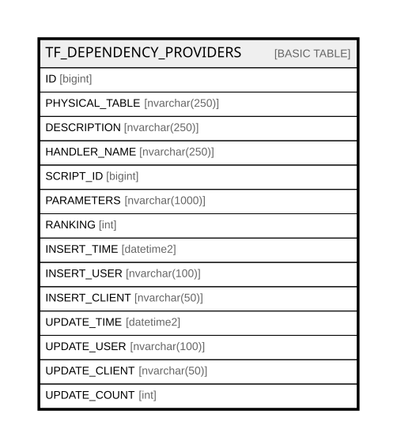

# TF_DEPENDENCY_PROVIDERS

## Columns

| Name | Type | Default | Nullable | Comment |
| ---- | ---- | ------- | -------- | ------- |
| ID | bigint |  | false |  |
| PHYSICAL_TABLE | nvarchar(250) |  | false |  |
| DESCRIPTION | nvarchar(250) |  | true |  |
| HANDLER_NAME | nvarchar(250) |  | false |  |
| SCRIPT_ID | bigint |  | true |  |
| PARAMETERS | nvarchar(1000) |  | true |  |
| RANKING | int | ((0)) | false |  |
| INSERT_TIME | datetime2 | (sysutcdatetime()) | false |  |
| INSERT_USER | nvarchar(100) | (N'MAIN') | false |  |
| INSERT_CLIENT | nvarchar(50) | (N'localhost') | false |  |
| UPDATE_TIME | datetime2 | (sysutcdatetime()) | false |  |
| UPDATE_USER | nvarchar(100) | (N'MAIN') | false |  |
| UPDATE_CLIENT | nvarchar(50) | (N'localhost') | false |  |
| UPDATE_COUNT | int | ((0)) | false |  |

## Constraints

| Name | Type | Definition |
| ---- | ---- | ---------- |
| PK_DEPENDENCY_PROVIDERS | PRIMARY KEY | CLUSTERED, unique, part of a PRIMARY KEY constraint, [ ID ] |
| UQ_DEPENDENCY_PROVIDERS | UNIQUE | NONCLUSTERED, unique, part of a UNIQUE constraint, [ PHYSICAL_TABLE ] |

## Indexes

| Name | Definition |
| ---- | ---------- |
| PK_DEPENDENCY_PROVIDERS | CLUSTERED, unique, part of a PRIMARY KEY constraint, [ ID ] |
| UQ_DEPENDENCY_PROVIDERS | NONCLUSTERED, unique, part of a UNIQUE constraint, [ PHYSICAL_TABLE ] |

## Relations

---

> Generated by [tbls](https://github.com/k1LoW/tbls)
