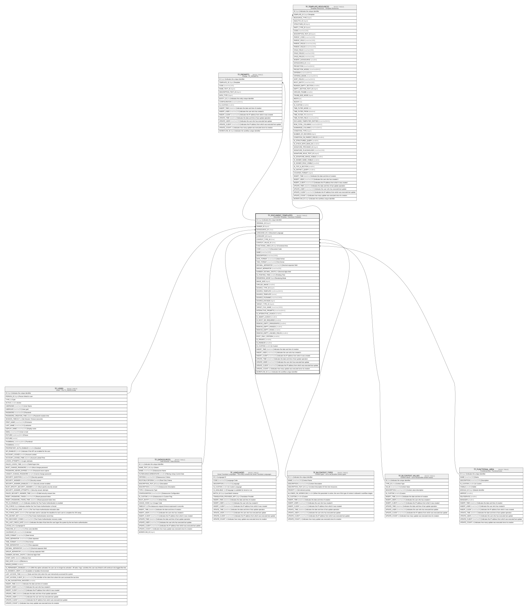

# TF_DOCUMENT_TEMPLATES

## Description

Document Template - Document Template  

## Columns

| Name | Type | Default | Nullable | Children | Parents | Comment |
| ---- | ---- | ------- | -------- | -------- | ------- | ------- |
| ID | bigint |  | false | [TF_PROMPTS](TF_PROMPTS.md) [TF_TEMPLATE_RESOURCES](TF_TEMPLATE_RESOURCES.md) |  | Indicates the unique identifier |
| ORIGINAL_ID | bigint |  | true |  |  |  |
| OWNER_ID | bigint |  | true |  | [TF_USERS](TF_USERS.md) |  |
| DATASOURCE_ID | char |  | true |  | [TF_DATASOURCES](TF_DATASOURCES.md) |  |
| LANGUAGE_ID | int |  | false |  | [TF_LANGUAGES](TF_LANGUAGES.md) | Document Language |
| CATEGORY_ID | bigint |  | true |  |  |  |
| CONTEXT_TYPE_ID | char | ('00000000-0000-0000-0000-000000000001') | false |  | [TF_BLCONTEXT_TYPES](TF_BLCONTEXT_TYPES.md) |  |
| CONTEXT_VALUE_ID | char |  | true |  | [TF_BLCONTEXT_VALUES](TF_BLCONTEXT_VALUES.md) |  |
| FUNCTIONAL_AREA_ID | bigint |  | true |  | [TF_FUNCTIONAL_AREA](TF_FUNCTIONAL_AREA.md) | Functional Area |
| CODE | nvarchar(100) |  | false |  |  | Document Code |
| NAME | nvarchar(100) |  | false |  |  |  |
| DESCRIPTION | nvarchar(1000) |  | true |  |  |  |
| DATE_FORMAT | nvarchar(50) |  | true |  |  | Date format |
| TIME_FORMAT | nvarchar(50) |  | true |  |  | Time format |
| DECIMAL_SEPARATOR | nvarchar(50) |  | true |  |  | Decimal separator field |
| GROUP_SEPARATOR | nvarchar(50) |  | true |  |  |  |
| NUMBER_DECIMAL_DIGITS | int |  | true |  |  | Decimal digits field |
| IS_POINTING_TIME | smallint | ((0)) | false |  |  | Pointing Time |
| RENDERING_MODE | bigint | ((0)) | false |  |  | Rendering Mode |
| IMAGE_SIZE | bigint | ((2000001)) | false |  |  |  |
| CIRCLED_IMAGE | smallint |  | true |  |  |  |
| SOURCE_TYPE_ID | bigint |  | false |  |  |  |
| SOURCE_TEMPLATE | varbinary(MAX) |  | true |  |  |  |
| SOURCE_TEMPLATE | vector |  | true |  |  |  |
| SOURCE_FILENAME | nvarchar(1000) |  | false |  |  |  |
| SOURCE_DOCSIZE | bigint |  | false |  |  |  |
| TARGET_TYPE_ID | bigint |  | false |  |  |  |
| TARGET_FILE_NAME | nvarchar(1000) |  | true |  |  |  |
| INTERACTIVE_PROMPTS | nvarchar(MAX) |  | true |  |  |  |
| IS_INTERACTIVE_LAUNCH | smallint | ((0)) | false |  |  |  |
| IS_SMART_LAUNCH | smallint | ((0)) | false |  |  |  |
| IS_ROOT_IDS_REQUIRED | smallint | ((0)) | false |  |  |  |
| REMOVE_EMPTY_PARAGRAPHS | smallint |  | false |  |  |  |
| REMOVE_EMPTY_RANGES | smallint |  | false |  |  |  |
| REMOVE_EMPTY_ROWS | smallint |  | false |  |  |  |
| REMOVE_EMPTY_UNUSED_FIELDS | smallint |  | false |  |  |  |
| ROOT_ONLY_CRITERIA | smallint | ((0)) | false |  |  |  |
| IS_PRIVATE | smallint | ((0)) | false |  |  |  |
| IS_ENABLED | smallint | ((0)) | false |  |  |  |
| IS_CUSTOM | smallint |  | false |  |  | Is Custom |
| INSERT_TIME | datetime2 | (sysutcdatetime()) | false |  |  | Indicates the date and time of creation |
| INSERT_USER | nvarchar(100) | (N'MAIN') | false |  |  | Indicates the user who has created it |
| INSERT_CLIENT | nvarchar(50) | (N'localhost') | false |  |  | Indicates the IP address from which it was created |
| UPDATE_TIME | datetime2 | (sysutcdatetime()) | false |  |  | Indicates the date and time of last update operation |
| UPDATE_USER | nvarchar(100) | (N'MAIN') | false |  |  | Indicates the user who has executed last update |
| UPDATE_CLIENT | nvarchar(50) | (N'localhost') | false |  |  | Indicates the IP address from which was executed last update |
| UPDATE_COUNT | int | ((0)) | false |  |  | Indicates how many update was executed since its creation |
| WORKFLOW_ID | bigint |  | true |  |  | Indicates the workflow unique identifier |

## Constraints

| Name | Type | Definition |
| ---- | ---- | ---------- |
| PK_DOCUMENT_TEMPLATES | PRIMARY KEY | CLUSTERED, unique, part of a PRIMARY KEY constraint, [ ID ] |
| UQ_DOCUMENT_TEMPLATES | UNIQUE | NONCLUSTERED, unique, part of a UNIQUE constraint, [ CODE, LANGUAGE_ID, IS_CUSTOM ] |
| FK_DOCUMENT_CTXS_TYPES | FOREIGN KEY | FOREIGN KEY(CONTEXT_TYPE_ID) REFERENCES TF_BLCONTEXT_TYPES(ID) ON UPDATE NO_ACTION ON DELETE NO_ACTION |
| FK_DOCUMENT_CTXS_VALUES | FOREIGN KEY | FOREIGN KEY(CONTEXT_VALUE_ID) REFERENCES TF_BLCONTEXT_VALUES(ID) ON UPDATE NO_ACTION ON DELETE NO_ACTION |
| FK_DOCUMENT_DATASOURCE | FOREIGN KEY | FOREIGN KEY(DATASOURCE_ID) REFERENCES TF_DATASOURCES(ID) ON UPDATE NO_ACTION ON DELETE NO_ACTION |
| FK_DOCUMENT_FUNC_AREA | FOREIGN KEY | FOREIGN KEY(FUNCTIONAL_AREA_ID) REFERENCES TF_FUNCTIONAL_AREA(ID) ON UPDATE NO_ACTION ON DELETE NO_ACTION |
| FK_DOCUMENT_LANGUAGE | FOREIGN KEY | FOREIGN KEY(LANGUAGE_ID) REFERENCES TF_LANGUAGES(ID) ON UPDATE NO_ACTION ON DELETE NO_ACTION |
| FK_DOCUMENT_USER | FOREIGN KEY | FOREIGN KEY(OWNER_ID) REFERENCES TF_USERS(ID) ON UPDATE NO_ACTION ON DELETE NO_ACTION |

## Indexes

| Name | Definition |
| ---- | ---------- |
| PK_DOCUMENT_TEMPLATES | CLUSTERED, unique, part of a PRIMARY KEY constraint, [ ID ] |
| UQ_DOCUMENT_TEMPLATES | NONCLUSTERED, unique, part of a UNIQUE constraint, [ CODE, LANGUAGE_ID, IS_CUSTOM ] |
| IDX_DOCTPT_CUSTOM_FACTORY | NONCLUSTERED, [ ORIGINAL_ID, IS_CUSTOM ] |

## Relations

---

> Generated by [tbls](https://github.com/k1LoW/tbls)
