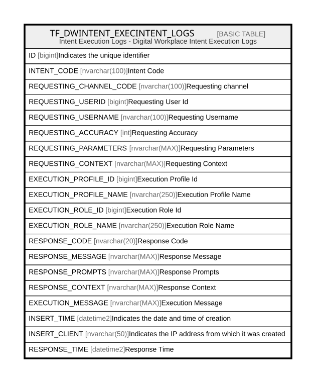

# TF_DWINTENT_EXECINTENT_LOGS

## Description

Intent Execution Logs - Digital Workplace Intent Execution Logs  

## Columns

| Name | Type | Default | Nullable | Comment |
| ---- | ---- | ------- | -------- | ------- |
| ID | bigint |  | false | Indicates the unique identifier |
| INTENT_CODE | nvarchar(100) |  | false | Intent Code |
| REQUESTING_CHANNEL_CODE | nvarchar(100) |  | false | Requesting channel |
| REQUESTING_USERID | bigint |  | false | Requesting User Id |
| REQUESTING_USERNAME | nvarchar(100) |  | false | Requesting Username |
| REQUESTING_ACCURACY | int |  | false | Requesting Accuracy |
| REQUESTING_PARAMETERS | nvarchar(MAX) |  | true | Requesting Parameters |
| REQUESTING_CONTEXT | nvarchar(MAX) |  | true | Requesting Context |
| EXECUTION_PROFILE_ID | bigint |  | false | Execution Profile Id |
| EXECUTION_PROFILE_NAME | nvarchar(250) |  | false | Execution Profile Name |
| EXECUTION_ROLE_ID | bigint |  | false | Execution Role Id |
| EXECUTION_ROLE_NAME | nvarchar(250) |  | false | Execution Role Name |
| RESPONSE_CODE | nvarchar(20) |  | true | Response Code |
| RESPONSE_MESSAGE | nvarchar(MAX) |  | true | Response Message |
| RESPONSE_PROMPTS | nvarchar(MAX) |  | true | Response Prompts |
| RESPONSE_CONTEXT | nvarchar(MAX) |  | true | Response Context |
| EXECUTION_MESSAGE | nvarchar(MAX) |  | true | Execution Message |
| INSERT_TIME | datetime2 | (sysutcdatetime()) | false | Indicates the date and time of creation |
| INSERT_CLIENT | nvarchar(50) | (N'localhost') | false | Indicates the IP address from which it was created |
| RESPONSE_TIME | datetime2 |  | true | Response Time |

## Constraints

| Name | Type | Definition |
| ---- | ---- | ---------- |
| PK_DW_INTENTEXECINTENTLOGS | PRIMARY KEY | CLUSTERED, unique, part of a PRIMARY KEY constraint, [ ID ] |

## Indexes

| Name | Definition |
| ---- | ---------- |
| PK_DW_INTENTEXECINTENTLOGS | CLUSTERED, unique, part of a PRIMARY KEY constraint, [ ID ] |
| IDX_DWINTEXECLOGS_INSERTTIME | NONCLUSTERED, [ INSERT_TIME ] |

## Relations

---

> Generated by [tbls](https://github.com/k1LoW/tbls)
