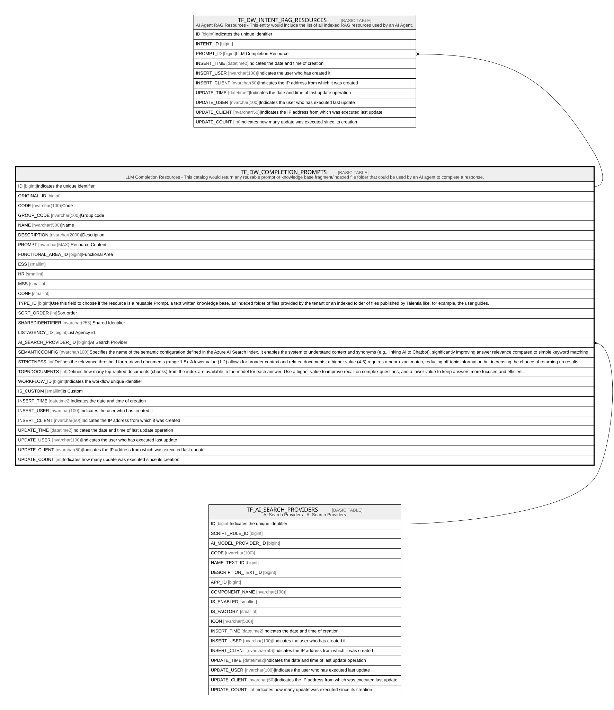

# TF_DW_COMPLETION_PROMPTS

## Description

LLM Completion Resources - This catalog would return any reusable prompt or knowledge base fragment/indexed file folder that could be used by an AI agent to complete a response.  

## Columns

| Name | Type | Default | Nullable | Children | Parents | Comment |
| ---- | ---- | ------- | -------- | -------- | ------- | ------- |
| ID | bigint |  | false | [TF_DW_INTENT_RAG_RESOURCES](TF_DW_INTENT_RAG_RESOURCES.md) |  | Indicates the unique identifier |
| ORIGINAL_ID | bigint |  | true |  |  |  |
| CODE | nvarchar(100) |  | false |  |  | Code |
| GROUP_CODE | nvarchar(100) |  | true |  |  | Group code |
| NAME | nvarchar(500) |  | false |  |  | Name |
| DESCRIPTION | nvarchar(2000) |  | true |  |  | Description |
| PROMPT | nvarchar(MAX) |  | false |  |  | Resource Content |
| FUNCTIONAL_AREA_ID | bigint |  | true |  |  | Functional Area |
| ESS | smallint | ((1)) | false |  |  |  |
| HR | smallint | ((1)) | false |  |  |  |
| MSS | smallint | ((1)) | false |  |  |  |
| CONF | smallint | ((1)) | false |  |  |  |
| TYPE_ID | bigint | ((1185879)) | true |  |  | Use this field to choose if the resource is a reusable Prompt, a text written knowledge base, an indexed folder of files provided by the tenant or an indexed folder of files published by Talentia like, for example, the user guides. |
| SORT_ORDER | int | ((0)) | false |  |  | Sort order |
| SHAREDIDENTIFIER | nvarchar(255) |  | true |  |  | Shared Identifier |
| LISTAGENCY_ID | bigint |  | true |  |  | List Agency id |
| AI_SEARCH_PROVIDER_ID | bigint |  | true |  | [TF_AI_SEARCH_PROVIDERS](TF_AI_SEARCH_PROVIDERS.md) | AI Search Provider |
| SEMANTICCONFIG | nvarchar(100) |  | true |  |  | Specifies the name of the semantic configuration defined in the Azure AI Search index. It enables the system to understand context and synonyms (e.g., linking AI to Chatbot), significantly improving answer relevance compared to simple keyword matching. |
| STRICTNESS | int |  | true |  |  | Defines the relevance threshold for retrieved documents (range 1-5). A lower value (1-2) allows for broader context and related documents; a higher value (4-5) requires a near-exact match, reducing off-topic information but increasing the chance of returning no results. |
| TOPNDOCUMENTS | int |  | true |  |  | Defines how many top-ranked documents (chunks) from the index are available to the model for each answer. Use a higher value to improve recall on complex questions, and a lower value to keep answers more focused and efficient. |
| WORKFLOW_ID | bigint |  | true |  |  | Indicates the workflow unique identifier |
| IS_CUSTOM | smallint | ((1)) | false |  |  | Is Custom |
| INSERT_TIME | datetime2 | (sysutcdatetime()) | false |  |  | Indicates the date and time of creation |
| INSERT_USER | nvarchar(100) | (N'MAIN') | false |  |  | Indicates the user who has created it |
| INSERT_CLIENT | nvarchar(50) | (N'localhost') | false |  |  | Indicates the IP address from which it was created |
| UPDATE_TIME | datetime2 | (sysutcdatetime()) | false |  |  | Indicates the date and time of last update operation |
| UPDATE_USER | nvarchar(100) | (N'MAIN') | false |  |  | Indicates the user who has executed last update |
| UPDATE_CLIENT | nvarchar(50) | (N'localhost') | false |  |  | Indicates the IP address from which was executed last update |
| UPDATE_COUNT | int | ((0)) | false |  |  | Indicates how many update was executed since its creation |

## Constraints

| Name | Type | Definition |
| ---- | ---- | ---------- |
| PK_DW_COMPLETION_PROMPT | PRIMARY KEY | CLUSTERED, unique, part of a PRIMARY KEY constraint, [ ID ] |
| UQ_DW_COMPLETION_PROMPT | UNIQUE | NONCLUSTERED, unique, part of a UNIQUE constraint, [ CODE, IS_CUSTOM ] |
| FK_AI_SEARCH_PROVIDERS | FOREIGN KEY | FOREIGN KEY(AI_SEARCH_PROVIDER_ID) REFERENCES TF_AI_SEARCH_PROVIDERS(ID) ON UPDATE NO_ACTION ON DELETE NO_ACTION |

## Indexes

| Name | Definition |
| ---- | ---------- |
| PK_DW_COMPLETION_PROMPT | CLUSTERED, unique, part of a PRIMARY KEY constraint, [ ID ] |
| UQ_DW_COMPLETION_PROMPT | NONCLUSTERED, unique, part of a UNIQUE constraint, [ CODE, IS_CUSTOM ] |

## Relations

---

> Generated by [tbls](https://github.com/k1LoW/tbls)
