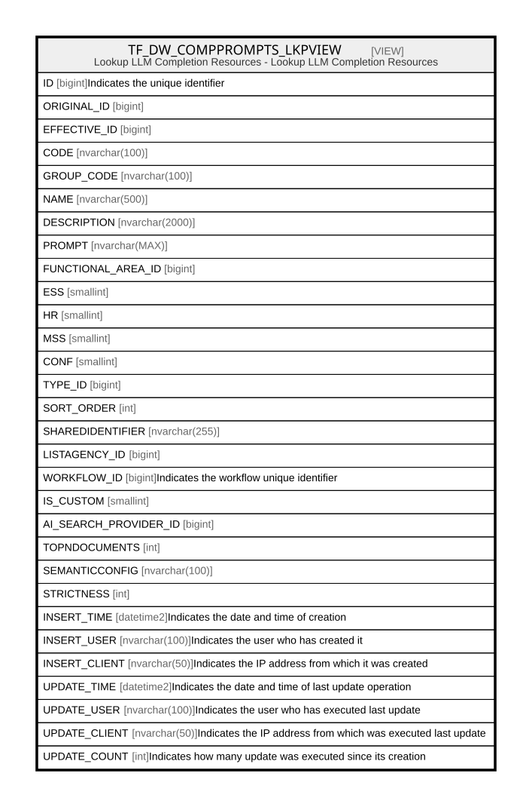

# TF_DW_COMPPROMPTS_LKPVIEW

## Description

Lookup LLM Completion Resources - Lookup LLM Completion Resources  


<details>
<summary><strong>Table Definition</strong></summary>

```sql
-- Talentia Software - All right reserved
-- Type: VIEW                     Name: TF_DW_COMPPROMPTS_LKPVIEW
-- Date: 09-04-2026 07:27:59 (UTC)
-- 
-- ChangeLogId: 00000000-0000-0000-0000-000000000000
-- ChangeSetId: 8d0dc1df-f2f6-4da6-94b5-20525b24c2f7
-- Original file name: C:\repos\Talentia-Software\hcm-core/DB/ProductDB/EDM\Schema\Views\TF_DW_COMPPROMPTS_LKPVIEW.xml


CREATE VIEW [TF_DW_COMPPROMPTS_LKPVIEW]
 AS 
( 
          SELECT COALESCE(ORIGINAL_ID,ID) ID,ORIGINAL_ID, ID EFFECTIVE_ID,CODE,GROUP_CODE,NAME,
          DESCRIPTION,PROMPT,FUNCTIONAL_AREA_ID,ESS,HR,MSS,CONF,
          TYPE_ID,SORT_ORDER,SHAREDIDENTIFIER,LISTAGENCY_ID,WORKFLOW_ID,IS_CUSTOM,AI_SEARCH_PROVIDER_ID,TOPNDOCUMENTS,SEMANTICCONFIG,STRICTNESS,
          INSERT_TIME,INSERT_USER,INSERT_CLIENT,UPDATE_TIME,UPDATE_USER,UPDATE_CLIENT,UPDATE_COUNT
          FROM TF_DW_COMPLETION_PROMPTS
          WHERE IS_CUSTOM = 1

          UNION ALL

          SELECT ID,ORIGINAL_ID, ID EFFECTIVE_ID,CODE,GROUP_CODE,NAME,
          DESCRIPTION,PROMPT,FUNCTIONAL_AREA_ID,ESS,HR,MSS,CONF,
          TYPE_ID,SORT_ORDER,SHAREDIDENTIFIER,LISTAGENCY_ID,WORKFLOW_ID,IS_CUSTOM,AI_SEARCH_PROVIDER_ID,TOPNDOCUMENTS,SEMANTICCONFIG,STRICTNESS,
          INSERT_TIME,INSERT_USER,INSERT_CLIENT,UPDATE_TIME,UPDATE_USER,UPDATE_CLIENT,UPDATE_COUNT
          FROM TF_DW_COMPLETION_PROMPTS
          WHERE IS_CUSTOM = 0 AND ID NOT IN (SELECT FACTORY.ORIGINAL_ID FROM TF_DW_COMPLETION_PROMPTS FACTORY WHERE FACTORY.ORIGINAL_ID IS NOT NULL)
         )

```

</details>

## Columns

| Name | Type | Default | Nullable | Comment |
| ---- | ---- | ------- | -------- | ------- |
| ID | bigint |  | true | Indicates the unique identifier |
| ORIGINAL_ID | bigint |  | true |  |
| EFFECTIVE_ID | bigint |  | false |  |
| CODE | nvarchar(100) |  | false |  |
| GROUP_CODE | nvarchar(100) |  | true |  |
| NAME | nvarchar(500) |  | false |  |
| DESCRIPTION | nvarchar(2000) |  | true |  |
| PROMPT | nvarchar(MAX) |  | false |  |
| FUNCTIONAL_AREA_ID | bigint |  | true |  |
| ESS | smallint |  | false |  |
| HR | smallint |  | false |  |
| MSS | smallint |  | false |  |
| CONF | smallint |  | false |  |
| TYPE_ID | bigint |  | true |  |
| SORT_ORDER | int |  | false |  |
| SHAREDIDENTIFIER | nvarchar(255) |  | true |  |
| LISTAGENCY_ID | bigint |  | true |  |
| WORKFLOW_ID | bigint |  | true | Indicates the workflow unique identifier |
| IS_CUSTOM | smallint |  | false |  |
| AI_SEARCH_PROVIDER_ID | bigint |  | true |  |
| TOPNDOCUMENTS | int |  | true |  |
| SEMANTICCONFIG | nvarchar(100) |  | true |  |
| STRICTNESS | int |  | true |  |
| INSERT_TIME | datetime2 |  | false | Indicates the date and time of creation |
| INSERT_USER | nvarchar(100) |  | false | Indicates the user who has created it |
| INSERT_CLIENT | nvarchar(50) |  | false | Indicates the IP address from which it was created |
| UPDATE_TIME | datetime2 |  | false | Indicates the date and time of last update operation |
| UPDATE_USER | nvarchar(100) |  | false | Indicates the user who has executed last update |
| UPDATE_CLIENT | nvarchar(50) |  | false | Indicates the IP address from which was executed last update |
| UPDATE_COUNT | int |  | false | Indicates how many update was executed since its creation |

## Referenced Tables

| Name | Columns | Comment | Type |
| ---- | ------- | ------- | ---- |
| [TF_DW_COMPLETION_PROMPTS](TF_DW_COMPLETION_PROMPTS.md) | 29 | LLM Completion Resources - This catalog would return any reusable prompt or knowledge base fragment/indexed file folder that could be used by an AI agent to complete a response.<br /> | BASIC TABLE |

## Relations



---

> Generated by [tbls](https://github.com/k1LoW/tbls)
