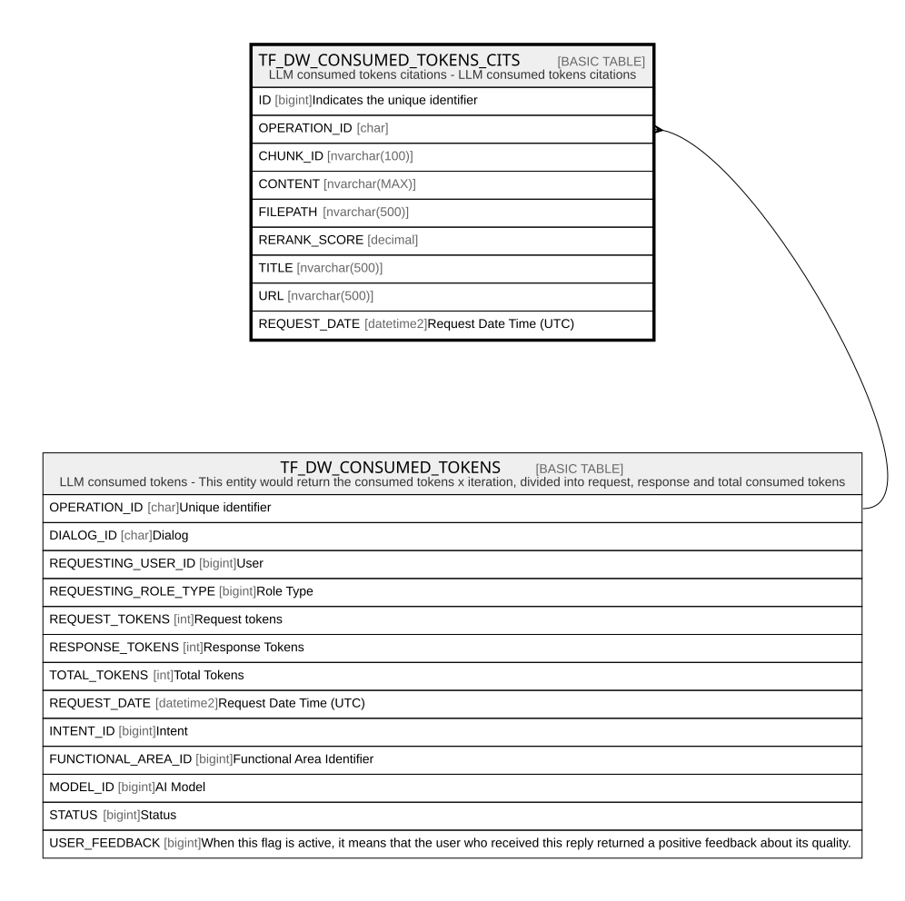

# TF_DW_CONSUMED_TOKENS_CITS

## Description

LLM consumed tokens citations - LLM consumed tokens citations  

## Columns

| Name | Type | Default | Nullable | Parents | Comment |
| ---- | ---- | ------- | -------- | ------- | ------- |
| ID | bigint |  | false |  | Indicates the unique identifier |
| OPERATION_ID | char |  | false | [TF_DW_CONSUMED_TOKENS](TF_DW_CONSUMED_TOKENS.md) |  |
| CHUNK_ID | nvarchar(100) |  | true |  |  |
| CONTENT | nvarchar(MAX) |  | false |  |  |
| FILEPATH | nvarchar(500) |  | true |  |  |
| RERANK_SCORE | decimal |  | true |  |  |
| TITLE | nvarchar(500) |  | true |  |  |
| URL | nvarchar(500) |  | true |  |  |
| REQUEST_DATE | datetime2 | (sysutcdatetime()) | false |  | Request Date Time (UTC) |

## Constraints

| Name | Type | Definition |
| ---- | ---- | ---------- |
| PK_DWCONSUMEDTOKENS_CITS | PRIMARY KEY | CLUSTERED, unique, part of a PRIMARY KEY constraint, [ ID ] |
| FK_DWCONSUMEDTOKENS_CITS | FOREIGN KEY | FOREIGN KEY(OPERATION_ID) REFERENCES TF_DW_CONSUMED_TOKENS(OPERATION_ID) ON UPDATE NO_ACTION ON DELETE CASCADE |

## Indexes

| Name | Definition |
| ---- | ---------- |
| PK_DWCONSUMEDTOKENS_CITS | CLUSTERED, unique, part of a PRIMARY KEY constraint, [ ID ] |

## Relations

---

> Generated by [tbls](https://github.com/k1LoW/tbls)
