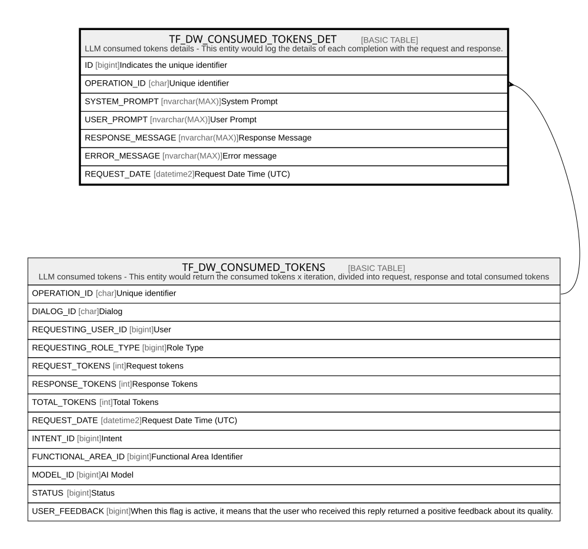

# TF_DW_CONSUMED_TOKENS_DET

## Description

LLM consumed tokens details - This entity would log the details of each completion with the request and response.  

## Columns

| Name | Type | Default | Nullable | Parents | Comment |
| ---- | ---- | ------- | -------- | ------- | ------- |
| ID | bigint |  | false |  | Indicates the unique identifier |
| OPERATION_ID | char |  | false | [TF_DW_CONSUMED_TOKENS](TF_DW_CONSUMED_TOKENS.md) | Unique identifier |
| SYSTEM_PROMPT | nvarchar(MAX) |  | true |  | System Prompt |
| USER_PROMPT | nvarchar(MAX) |  | true |  | User Prompt |
| RESPONSE_MESSAGE | nvarchar(MAX) |  | true |  | Response Message |
| ERROR_MESSAGE | nvarchar(MAX) |  | true |  | Error message |
| REQUEST_DATE | datetime2 | (sysutcdatetime()) | false |  | Request Date Time (UTC) |

## Constraints

| Name | Type | Definition |
| ---- | ---- | ---------- |
| PK_DWCONSUMEDTOKENSDETAILS | PRIMARY KEY | CLUSTERED, unique, part of a PRIMARY KEY constraint, [ ID ] |
| FK_DWCONSUMEDTOKENSDETAILS | FOREIGN KEY | FOREIGN KEY(OPERATION_ID) REFERENCES TF_DW_CONSUMED_TOKENS(OPERATION_ID) ON UPDATE NO_ACTION ON DELETE CASCADE |

## Indexes

| Name | Definition |
| ---- | ---------- |
| PK_DWCONSUMEDTOKENSDETAILS | CLUSTERED, unique, part of a PRIMARY KEY constraint, [ ID ] |

## Relations

---

> Generated by [tbls](https://github.com/k1LoW/tbls)
