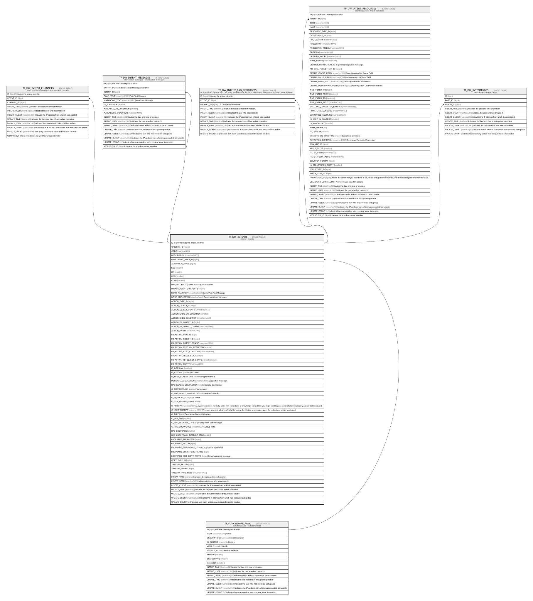

# TF_DW_INTENTS

## Description

Intents - Intents  

## Columns

| Name | Type | Default | Nullable | Children | Parents | Comment |
| ---- | ---- | ------- | -------- | -------- | ------- | ------- |
| ID | bigint |  | false | [TF_DW_INTENT_CHANNELS](TF_DW_INTENT_CHANNELS.md) [TF_DW_INTENT_MESSAGES](TF_DW_INTENT_MESSAGES.md) [TF_DW_INTENT_RAG_RESOURCES](TF_DW_INTENT_RAG_RESOURCES.md) [TF_DW_INTENT_RESOURCES](TF_DW_INTENT_RESOURCES.md) [TF_DW_INTENTPAGES](TF_DW_INTENTPAGES.md) |  | Indicates the unique identifier |
| ORIGINAL_ID | bigint |  | true |  |  |  |
| CODE | nvarchar(100) |  | false |  |  |  |
| DESCRIPTION | nvarchar(MAX) |  | true |  |  |  |
| FUNCTIONAL_AREA_ID | bigint |  | true |  | [TF_FUNCTIONAL_AREA](TF_FUNCTIONAL_AREA.md) |  |
| ACTIVATION_MODE | bigint | ((0)) | false |  |  |  |
| ESS | smallint | ((0)) | false |  |  |  |
| HR | smallint | ((0)) | false |  |  |  |
| MSS | smallint | ((0)) | false |  |  |  |
| CONF | smallint | ((0)) | false |  |  |  |
| MIN_ACCURACY | int | ((50)) | false |  |  | Min accuracy for execution |
| MINACCURACY_ERR_TEXTID | bigint |  | true |  |  |  |
| DEMO_PLAINTEXT | nvarchar(MAX) |  | true |  |  | Demo Plain Text Message |
| DEMO_MARKDOWN | nvarchar(MAX) |  | true |  |  | Demo Markdown Message |
| ACTION_TYPE_ID | bigint |  | true |  |  |  |
| ACTION_OBJECT_ID | bigint |  | true |  |  |  |
| ACTION_OBJECT_CONFIG | nvarchar(MAX) |  | true |  |  |  |
| ACTION_EXEC_ON_CONDITION | smallint |  | true |  |  |  |
| ACTION_EXEC_CONDITION | nvarchar(MAX) |  | true |  |  |  |
| ACTION_FB_OBJECT_ID | bigint |  | true |  |  |  |
| ACTION_FB_OBJECT_CONFIG | nvarchar(MAX) |  | true |  |  |  |
| ACTION_ENTITY | nvarchar(100) |  | true |  |  |  |
| FB_ACTION_TYPE_ID | bigint |  | true |  |  |  |
| FB_ACTION_OBJECT_ID | bigint |  | true |  |  |  |
| FB_ACTION_OBJECT_CONFIG | nvarchar(MAX) |  | true |  |  |  |
| FB_ACTION_EXEC_ON_CONDITION | smallint |  | true |  |  |  |
| FB_ACTION_EXEC_CONDITION | nvarchar(MAX) |  | true |  |  |  |
| FB_ACTION_FB_OBJECT_ID | bigint |  | true |  |  |  |
| FB_ACTION_FB_OBJECT_CONFIG | nvarchar(MAX) |  | true |  |  |  |
| FB_ACTION_ENTITY | nvarchar(100) |  | true |  |  |  |
| IS_INTERNAL | smallint | ((0)) | false |  |  |  |
| IS_CUSTOM | smallint |  | false |  |  | Is Custom |
| IS_PAGE_CONTEXTUAL | smallint |  | true |  |  | Page contextual |
| MESSAGE_SUGGESTION | nvarchar(2000) |  | true |  |  | Suggestion message |
| HAS_ENABLE_COMPLETION | smallint |  | true |  |  | Enable Completion |
| C_TEMPERATURE | decimal |  | true |  |  | Temperature |
| C_FREQUENCY_PENALTY | decimal |  | true |  |  | Frequency Penalty |
| C_AI_MODEL_ID | bigint |  | true |  |  | AI Model |
| C_MAX_TOKENS | int |  | true |  |  | Max Tokens |
| C_PROMPT | nvarchar(MAX) |  | true |  |  | A system prompt is normally a text with instructions or knowledge context that you might want to pass to the chatbot to properly answer to the request. |
| C_USER_PROMPT | nvarchar(MAX) |  | true |  |  | The user prompt is what you finally like asking the chatbot to generate, given the instructions above mentioned. |
| C_TYPE | bigint |  | true |  |  | Completion Content Validation |
| C_HAS_RAG | smallint |  | true |  |  |  |
| C_RAG_SELINDEX_TYPE | bigint |  | true |  |  | Rag Index Selection Type |
| C_RAG_GROUPCODE | nvarchar(100) |  | true |  |  | Group code |
| HAS_LOOPBACK | smallint |  | true |  |  |  |
| HAS_LOOPPBACK_RESTART_BTN | smallint |  | true |  |  |  |
| LOOPBACK_PARAMETER | bigint |  | true |  |  |  |
| LOOPBACK_TEXTID | bigint |  | true |  |  |  |
| LOOPBACK_EXPERIENCE_TYPEID | bigint |  | true |  |  | User experience |
| LOOPBACK_CONV_TOPIC_TEXTID | bigint |  | true |  |  |  |
| LOOPBACK_EXIT_CONV_TEXTID | bigint |  | true |  |  | Conversation exit message |
| COPY_TYPE_ID | bigint | ((0)) | false |  |  |  |
| TIMEOUT_TEXTID | bigint |  | true |  |  |  |
| TIMEOUT_PAGEID | bigint |  | true |  |  |  |
| TIMEOUT_PAGE_KEYS | nvarchar(MAX) |  | true |  |  |  |
| INSERT_TIME | datetime2 | (sysutcdatetime()) | false |  |  | Indicates the date and time of creation |
| INSERT_USER | nvarchar(100) | (N'MAIN') | false |  |  | Indicates the user who has created it |
| INSERT_CLIENT | nvarchar(50) | (N'localhost') | false |  |  | Indicates the IP address from which it was created |
| UPDATE_TIME | datetime2 | (sysutcdatetime()) | false |  |  | Indicates the date and time of last update operation |
| UPDATE_USER | nvarchar(100) | (N'MAIN') | false |  |  | Indicates the user who has executed last update |
| UPDATE_CLIENT | nvarchar(50) | (N'localhost') | false |  |  | Indicates the IP address from which was executed last update |
| UPDATE_COUNT | int | ((0)) | false |  |  | Indicates how many update was executed since its creation |

## Constraints

| Name | Type | Definition |
| ---- | ---- | ---------- |
| PK_TF_DW_INTENTS | PRIMARY KEY | CLUSTERED, unique, part of a PRIMARY KEY constraint, [ ID ] |
| UQ_TF_DW_INTENTS | UNIQUE | NONCLUSTERED, unique, part of a UNIQUE constraint, [ CODE, IS_CUSTOM ] |
| FK_DW_INTENTS_FUNC_AREA | FOREIGN KEY | FOREIGN KEY(FUNCTIONAL_AREA_ID) REFERENCES TF_FUNCTIONAL_AREA(ID) ON UPDATE NO_ACTION ON DELETE NO_ACTION |

## Indexes

| Name | Definition |
| ---- | ---------- |
| PK_TF_DW_INTENTS | CLUSTERED, unique, part of a PRIMARY KEY constraint, [ ID ] |
| UQ_TF_DW_INTENTS | NONCLUSTERED, unique, part of a UNIQUE constraint, [ CODE, IS_CUSTOM ] |

## Relations

---

> Generated by [tbls](https://github.com/k1LoW/tbls)
