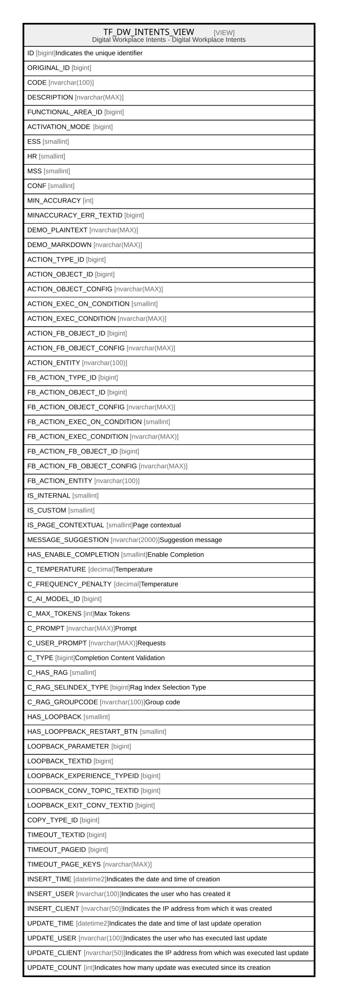

# TF_DW_INTENTS_VIEW

## Description

Digital Workplace Intents - Digital Workplace Intents  


<details>
<summary><strong>Table Definition</strong></summary>

```sql
-- Talentia Software - All right reserved
-- Type: VIEW                     Name: TF_DW_INTENTS_VIEW
-- Date: 09-04-2026 07:27:59 (UTC)
-- 
-- ChangeLogId: 00000000-0000-0000-0000-000000000000
-- ChangeSetId: 8d0dc1df-f2f6-4da6-94b5-20525b24c2f7
-- Original file name: C:\repos\Talentia-Software\hcm-core/DB/ProductDB/EDM\Schema\Views\TF_DW_INTENTS_VIEW.xml


CREATE VIEW [TF_DW_INTENTS_VIEW]
 AS 
( 
          SELECT ID,ORIGINAL_ID, CODE, DESCRIPTION, FUNCTIONAL_AREA_ID,
          ACTIVATION_MODE, ESS, HR, MSS, CONF, MIN_ACCURACY, MINACCURACY_ERR_TEXTID,
          DEMO_PLAINTEXT, DEMO_MARKDOWN,
          ACTION_TYPE_ID, ACTION_OBJECT_ID, ACTION_OBJECT_CONFIG, ACTION_EXEC_ON_CONDITION, ACTION_EXEC_CONDITION,
          ACTION_FB_OBJECT_ID, ACTION_FB_OBJECT_CONFIG, ACTION_ENTITY, FB_ACTION_TYPE_ID,
          FB_ACTION_OBJECT_ID, FB_ACTION_OBJECT_CONFIG, FB_ACTION_EXEC_ON_CONDITION, FB_ACTION_EXEC_CONDITION,
          FB_ACTION_FB_OBJECT_ID, FB_ACTION_FB_OBJECT_CONFIG, FB_ACTION_ENTITY, IS_INTERNAL, IS_CUSTOM,
          IS_PAGE_CONTEXTUAL, MESSAGE_SUGGESTION, HAS_ENABLE_COMPLETION, C_TEMPERATURE, C_FREQUENCY_PENALTY, C_AI_MODEL_ID, C_MAX_TOKENS, C_PROMPT, C_USER_PROMPT, C_TYPE,
          C_HAS_RAG, C_RAG_SELINDEX_TYPE, C_RAG_GROUPCODE,
          HAS_LOOPBACK, HAS_LOOPPBACK_RESTART_BTN, LOOPBACK_PARAMETER, LOOPBACK_TEXTID, LOOPBACK_EXPERIENCE_TYPEID, LOOPBACK_CONV_TOPIC_TEXTID, LOOPBACK_EXIT_CONV_TEXTID,
          COPY_TYPE_ID, TIMEOUT_TEXTID, TIMEOUT_PAGEID, TIMEOUT_PAGE_KEYS,
          INSERT_TIME, INSERT_USER, INSERT_CLIENT, UPDATE_TIME, UPDATE_USER, UPDATE_CLIENT, UPDATE_COUNT
          FROM TF_DW_INTENTS
          WHERE IS_CUSTOM = 1

          UNION ALL

          SELECT ID,ORIGINAL_ID, CODE, DESCRIPTION, FUNCTIONAL_AREA_ID,
          ACTIVATION_MODE, ESS, HR, MSS, CONF, MIN_ACCURACY, MINACCURACY_ERR_TEXTID,
          DEMO_PLAINTEXT, DEMO_MARKDOWN,
          ACTION_TYPE_ID, ACTION_OBJECT_ID, ACTION_OBJECT_CONFIG, ACTION_EXEC_ON_CONDITION, ACTION_EXEC_CONDITION,
          ACTION_FB_OBJECT_ID, ACTION_FB_OBJECT_CONFIG, ACTION_ENTITY, FB_ACTION_TYPE_ID,
          FB_ACTION_OBJECT_ID, FB_ACTION_OBJECT_CONFIG, FB_ACTION_EXEC_ON_CONDITION, FB_ACTION_EXEC_CONDITION,
          FB_ACTION_FB_OBJECT_ID, FB_ACTION_FB_OBJECT_CONFIG, FB_ACTION_ENTITY, IS_INTERNAL, IS_CUSTOM,
          IS_PAGE_CONTEXTUAL, MESSAGE_SUGGESTION, HAS_ENABLE_COMPLETION, C_TEMPERATURE, C_FREQUENCY_PENALTY, C_AI_MODEL_ID, C_MAX_TOKENS, C_PROMPT, C_USER_PROMPT, C_TYPE,
          C_HAS_RAG, C_RAG_SELINDEX_TYPE, C_RAG_GROUPCODE,
          HAS_LOOPBACK, HAS_LOOPPBACK_RESTART_BTN, LOOPBACK_PARAMETER, LOOPBACK_TEXTID, LOOPBACK_EXPERIENCE_TYPEID, LOOPBACK_CONV_TOPIC_TEXTID, LOOPBACK_EXIT_CONV_TEXTID,
          COPY_TYPE_ID, TIMEOUT_TEXTID, TIMEOUT_PAGEID, TIMEOUT_PAGE_KEYS,
          INSERT_TIME, INSERT_USER, INSERT_CLIENT, UPDATE_TIME, UPDATE_USER, UPDATE_CLIENT, UPDATE_COUNT
          FROM TF_DW_INTENTS
          WHERE IS_CUSTOM = 0 AND ID NOT IN (SELECT FACTORY.ORIGINAL_ID FROM TF_DW_INTENTS FACTORY WHERE FACTORY.ORIGINAL_ID IS NOT NULL)
         )

```

</details>

## Columns

| Name | Type | Default | Nullable | Comment |
| ---- | ---- | ------- | -------- | ------- |
| ID | bigint |  | false | Indicates the unique identifier |
| ORIGINAL_ID | bigint |  | true |  |
| CODE | nvarchar(100) |  | false |  |
| DESCRIPTION | nvarchar(MAX) |  | true |  |
| FUNCTIONAL_AREA_ID | bigint |  | true |  |
| ACTIVATION_MODE | bigint |  | false |  |
| ESS | smallint |  | false |  |
| HR | smallint |  | false |  |
| MSS | smallint |  | false |  |
| CONF | smallint |  | false |  |
| MIN_ACCURACY | int |  | false |  |
| MINACCURACY_ERR_TEXTID | bigint |  | true |  |
| DEMO_PLAINTEXT | nvarchar(MAX) |  | true |  |
| DEMO_MARKDOWN | nvarchar(MAX) |  | true |  |
| ACTION_TYPE_ID | bigint |  | true |  |
| ACTION_OBJECT_ID | bigint |  | true |  |
| ACTION_OBJECT_CONFIG | nvarchar(MAX) |  | true |  |
| ACTION_EXEC_ON_CONDITION | smallint |  | true |  |
| ACTION_EXEC_CONDITION | nvarchar(MAX) |  | true |  |
| ACTION_FB_OBJECT_ID | bigint |  | true |  |
| ACTION_FB_OBJECT_CONFIG | nvarchar(MAX) |  | true |  |
| ACTION_ENTITY | nvarchar(100) |  | true |  |
| FB_ACTION_TYPE_ID | bigint |  | true |  |
| FB_ACTION_OBJECT_ID | bigint |  | true |  |
| FB_ACTION_OBJECT_CONFIG | nvarchar(MAX) |  | true |  |
| FB_ACTION_EXEC_ON_CONDITION | smallint |  | true |  |
| FB_ACTION_EXEC_CONDITION | nvarchar(MAX) |  | true |  |
| FB_ACTION_FB_OBJECT_ID | bigint |  | true |  |
| FB_ACTION_FB_OBJECT_CONFIG | nvarchar(MAX) |  | true |  |
| FB_ACTION_ENTITY | nvarchar(100) |  | true |  |
| IS_INTERNAL | smallint |  | false |  |
| IS_CUSTOM | smallint |  | false |  |
| IS_PAGE_CONTEXTUAL | smallint |  | true | Page contextual |
| MESSAGE_SUGGESTION | nvarchar(2000) |  | true | Suggestion message |
| HAS_ENABLE_COMPLETION | smallint |  | true | Enable Completion |
| C_TEMPERATURE | decimal |  | true | Temperature |
| C_FREQUENCY_PENALTY | decimal |  | true | Temperature |
| C_AI_MODEL_ID | bigint |  | true |  |
| C_MAX_TOKENS | int |  | true | Max Tokens |
| C_PROMPT | nvarchar(MAX) |  | true | Prompt |
| C_USER_PROMPT | nvarchar(MAX) |  | true | Requests |
| C_TYPE | bigint |  | true | Completion Content Validation |
| C_HAS_RAG | smallint |  | true |  |
| C_RAG_SELINDEX_TYPE | bigint |  | true | Rag Index Selection Type |
| C_RAG_GROUPCODE | nvarchar(100) |  | true | Group code |
| HAS_LOOPBACK | smallint |  | true |  |
| HAS_LOOPPBACK_RESTART_BTN | smallint |  | true |  |
| LOOPBACK_PARAMETER | bigint |  | true |  |
| LOOPBACK_TEXTID | bigint |  | true |  |
| LOOPBACK_EXPERIENCE_TYPEID | bigint |  | true |  |
| LOOPBACK_CONV_TOPIC_TEXTID | bigint |  | true |  |
| LOOPBACK_EXIT_CONV_TEXTID | bigint |  | true |  |
| COPY_TYPE_ID | bigint |  | false |  |
| TIMEOUT_TEXTID | bigint |  | true |  |
| TIMEOUT_PAGEID | bigint |  | true |  |
| TIMEOUT_PAGE_KEYS | nvarchar(MAX) |  | true |  |
| INSERT_TIME | datetime2 |  | false | Indicates the date and time of creation |
| INSERT_USER | nvarchar(100) |  | false | Indicates the user who has created it |
| INSERT_CLIENT | nvarchar(50) |  | false | Indicates the IP address from which it was created |
| UPDATE_TIME | datetime2 |  | false | Indicates the date and time of last update operation |
| UPDATE_USER | nvarchar(100) |  | false | Indicates the user who has executed last update |
| UPDATE_CLIENT | nvarchar(50) |  | false | Indicates the IP address from which was executed last update |
| UPDATE_COUNT | int |  | false | Indicates how many update was executed since its creation |

## Referenced Tables

| Name | Columns | Comment | Type |
| ---- | ------- | ------- | ---- |
| [TF_DW_INTENTS](TF_DW_INTENTS.md) | 63 | Intents - Intents<br /> | BASIC TABLE |

## Relations



---

> Generated by [tbls](https://github.com/k1LoW/tbls)
