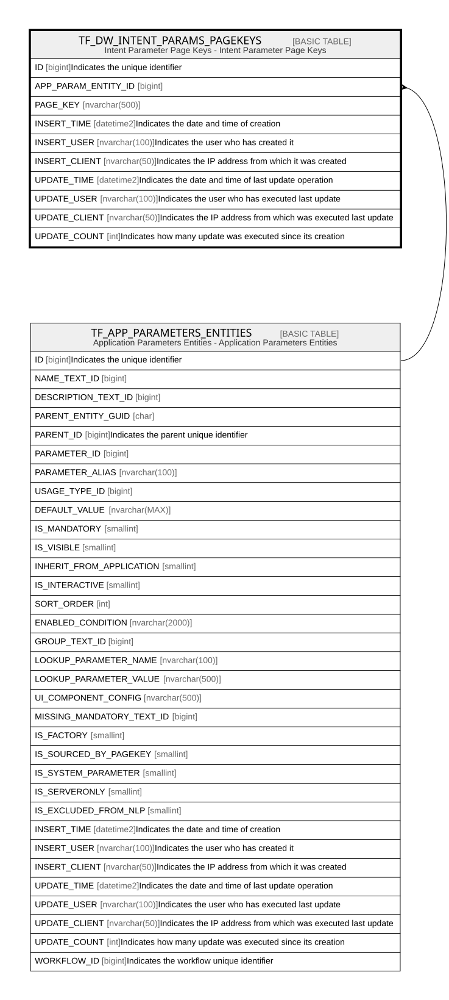

# TF_DW_INTENT_PARAMS_PAGEKEYS

## Description

Intent Parameter Page Keys - Intent Parameter Page Keys  

## Columns

| Name | Type | Default | Nullable | Parents | Comment |
| ---- | ---- | ------- | -------- | ------- | ------- |
| ID | bigint |  | false |  | Indicates the unique identifier |
| APP_PARAM_ENTITY_ID | bigint |  | false | [TF_APP_PARAMETERS_ENTITIES](TF_APP_PARAMETERS_ENTITIES.md) |  |
| PAGE_KEY | nvarchar(500) |  | false |  |  |
| INSERT_TIME | datetime2 | (sysutcdatetime()) | false |  | Indicates the date and time of creation |
| INSERT_USER | nvarchar(100) | (N'MAIN') | false |  | Indicates the user who has created it |
| INSERT_CLIENT | nvarchar(50) | (N'localhost') | false |  | Indicates the IP address from which it was created |
| UPDATE_TIME | datetime2 | (sysutcdatetime()) | false |  | Indicates the date and time of last update operation |
| UPDATE_USER | nvarchar(100) | (N'MAIN') | false |  | Indicates the user who has executed last update |
| UPDATE_CLIENT | nvarchar(50) | (N'localhost') | false |  | Indicates the IP address from which was executed last update |
| UPDATE_COUNT | int | ((0)) | false |  | Indicates how many update was executed since its creation |

## Constraints

| Name | Type | Definition |
| ---- | ---- | ---------- |
| PK_DW_INTENT_PARAM_PAGES | PRIMARY KEY | CLUSTERED, unique, part of a PRIMARY KEY constraint, [ ID ] |
| UQ_DW_INTENT_PARAM_PAGES | UNIQUE | NONCLUSTERED, unique, part of a UNIQUE constraint, [ APP_PARAM_ENTITY_ID, PAGE_KEY ] |
| FK_APPPARAMETERS_ENTITIES | FOREIGN KEY | FOREIGN KEY(APP_PARAM_ENTITY_ID) REFERENCES TF_APP_PARAMETERS_ENTITIES(ID) ON UPDATE NO_ACTION ON DELETE CASCADE |

## Indexes

| Name | Definition |
| ---- | ---------- |
| PK_DW_INTENT_PARAM_PAGES | CLUSTERED, unique, part of a PRIMARY KEY constraint, [ ID ] |
| UQ_DW_INTENT_PARAM_PAGES | NONCLUSTERED, unique, part of a UNIQUE constraint, [ APP_PARAM_ENTITY_ID, PAGE_KEY ] |

## Relations

---

> Generated by [tbls](https://github.com/k1LoW/tbls)
